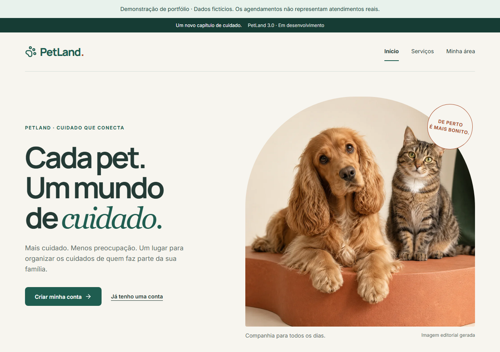

# PetLand 3.0

**O cuidado do pet, bem organizado.** Plataforma operacional de pet shop para o portfólio de Lucas Marques: conecta tutor, equipe e gestão da disponibilidade à conclusão do atendimento.

O tutor precisa de horário, preço e autonomia; a equipe precisa saber o que fazer e o contexto do animal; a gestão precisa ajustar escala/capacidade sem perder reservas e histórico. O PetLand reúne cadastro de pets, reserva com confirmação explícita, execução, comunicação e indicadores de uma loja.

**Stack:** React · TypeScript · Vite · TanStack Query · RHF/Zod · FastAPI · SQLAlchemy/psycopg · PostgreSQL 17 · Alembic · Nginx · Docker.

**Arquitetura:** Modular Monolith with Hexagonal Architecture and pragmatic DDD principles.



Captura final de `f3d70a2`, após os merges dos PRs 11/12, em demo separada com dados fictícios. [Case final](docs/case/README.md) · [Capturas, ações e proveniência](docs/case/media/final/capture.json).

[Assistir à jornada final — cerca de 4 minutos](docs/case/index.html#demo) · [Vídeo](docs/case/media/final/petland-final-demo.webm) · [Legendas](docs/case/media/final/petland-final-demo.vtt) · [Transcrição](docs/case/final-transcript.md) · [Roteiro](docs/case/presentation-script.md). Tutor → atendimento → escala/capacidade/impacto. [P08 histórico preservado](docs/case/historical-p08.html).

## Produto implementado

- Tutor: conta/confirmação, contato, pets, preços/tempos por porte, disponibilidade real, revisar/confirmar, cancelar/reagendar e histórico público.
- Equipe: painel diário, agenda pessoal/equipe, chegada/início/conclusão/falta, notas, extensão, transferência e contexto de cuidado com alertas críticos.
- Gestão: equipe por data, habilidades/expediente, pools físicos por serviço, prévia de impactos, indicadores por responsável/serviço, acessos e auditoria.
- Comunicação persistida: confirmação/alterações, lembrete configurável e aviso de pronto; SMTP local com tentativas/descartes rastreáveis.

Uma reserva contém **um pet e um serviço**; profissional atribuído automaticamente. Sem taxas, pagamentos, grupos atômicos ou multiempresa. [Produto e limites](docs/product/product-overview.md) · [Matriz de dores](docs/product/functional-gap-analysis.md).

**Estado:** candidata `3.0.0-rc.1`, schema `0007_product_operations`, staging local. **Clone `petland-3.0-final-case`: a `main` ainda contém o legado.** [Versão/SHAs e requisitos](docs/release/reproducibility.md). Documentação para revisão humana, sem declarar produção ou aceite final. Mailpit não entrega e-mail externo; backup permanece no host. [Gates](docs/release/candidate.json).

## Quick Start

Os comandos partem da raiz do clone. Escolha seu objetivo abaixo. Rede necessária na primeira construção/instalação; downloads dependem do host. Outra instalação no mesmo computador precisa de [portas livres e nome Compose próprio](docs/release/reproducibility.md#isolamento-e-portas).

### RUN THE APP

Git, Docker com Compose v2 ativo e Python 3.11+ no host. Imagens instalam Python 3.13/Node 22 e dependências pelos lockfiles; uv/Node/pnpm no host não são necessários neste caminho.

```sh
git clone --branch petland-3.0-final-case https://github.com/O-marqs/petland-2.0.git
cd petland-2.0
python scripts/dev.py init
python scripts/dev.py up
```

Aplicação: http://localhost:5173 · e-mails locais: http://localhost:8025 · API/Swagger: http://localhost:8000/api/docs. `init` gera credenciais privadas e preserva configuração existente; `up` inicia banco, migration job e aplicação saudáveis. Parar com `python scripts/dev.py down`, preservando volume. [Clean-start executado](docs/evidence/Reproducibility-review.md).

Comece por `/criar-conta`, confirme pelo Mailpit, entre e complete contato → pet → reserva. Loja começa sem expediente/equipe comerciais. Primeiro admin: `python scripts/dev.py bootstrap-admin --email administrador-sintetico@example.com`, aceitando convite local; equipe configura serviços, pessoas e horários. Não há senha default.

Backoffice: `/operacao`; gestão ADMIN: `/gestao`, acessos: `/gestao/acessos`. Para testar uma loja já configurada com cliente/funcionário/admin, use **RUN DEMO**.

### DEVELOP LOCALLY

Além de Git/Docker/Python launcher: **uv 0.12.18, Node linha 22 (mínimo 22.14), pnpm 10.34.5**. [Instalação e PATH isolado](docs/release/reproducibility.md#cinco-caminhos-requisitos-distintos). Use este modo para editar com reload; libere as portas dos containers API/web antes de iniciá-lo.

```sh
python scripts/dev.py init
python scripts/dev.py install
python scripts/dev.py db
python scripts/dev.py migrate
python scripts/dev.py api
# Em outro terminal, na mesma raiz:
python scripts/dev.py web
```

Aplicação/API/e-mails nas mesmas portas do modo Docker. uv cria a venv e obtém Python 3.13. [Configuração e solução de problemas](docs/runbooks/local.md).

### RUN TESTS

Ferramentas host de desenvolvimento e Docker ativo; banco de teste na porta 55433 é descartável. Execute em ambiente sintético: E2E cadastra contas e dados no banco de desenvolvimento.

```sh
python scripts/dev.py init
python scripts/dev.py install
python scripts/dev.py check
# Para E2E, com portas 5173/8000 livres:
python scripts/dev.py up
python scripts/dev.py e2e
python scripts/dev.py down
```

`check` cobre lint/format/tipos/arquitetura/contratos/build, Python com PostgreSQL real e React; `e2e` instala Chromium e usa a aplicação real. Admin sintético preexistente: [requisitos de fixture](docs/runbooks/identity.md#primeiro-administrador). Qualidade documental/pacote:

```sh
python scripts/check_documentation.py
python scripts/render_architecture.py --check
python -m unittest discover -s scripts -p test_release.py
python scripts/release.py check
```

### RUN DEMO

Git, Python launcher 3.11+, Docker e **uv 0.12.18**; não exige Node/pnpm no host para abrir a demonstração. Configuração/contas/banco/certificado próprios em staging, sem copiar `.env` ou arquivos do autor:

```sh
python scripts/dev.py staging-init
python scripts/dev.py staging-up
python scripts/dev.py seed-demo
```

Abra **https://localhost:8443/entrar** e consulte **localmente** `.local/staging/accounts.json`: `customer_a`/`customer_b` → `/app`; `employee` → `/operacao`; `admin` → `/gestao` e `/gestao/acessos`. Senhas são geradas. HTTPS usa CA local de teste; [orientação de certificado](docs/release/reproducibility.md#demo-para-conhecer-o-produto). E-mails: **http://localhost:8026**, sem entrega externa. [Roteiro pessoal dos três perfis](docs/runbooks/manual-acceptance.md).

Parar: `python scripts/dev.py staging-down`; retomar: `staging-up`. Dados, contas, certificados e volumes ficam preservados. Seed repetido preserva fixture/datas. Para reiniciar a demo, leia o nome em `.local/staging/active-db.txt` e execute `python scripts/dev.py reset-demo --confirm NOME_EXATO_DO_BANCO`; cria outro banco e preserva o anterior. [Reset/recuperação](docs/runbooks/operations-recovery.md). Não use remoção de volume para limpar a demo.

### RUN STAGING REHEARSAL

Demo iniciada, ferramentas host completas de desenvolvimento e Chromium. Este ensaio valida backup/restore e retorna à origem:

```sh
python scripts/dev.py install
pnpm --filter @petland/web exec playwright install chromium
python scripts/dev.py smoke-demo
python scripts/dev.py rehearse
```

Em Linux, use `playwright install --with-deps chromium` se faltarem bibliotecas. Relatório privado em `.local/staging/rehearsal.json`; nove checkpoints de perfis na origem/cópia/retorno. Backup continua no host; não representa recuperação após perda do computador. [Operação e limites](docs/runbooks/operations-recovery.md).

## Technical Highlights

| Implementado                                      | Por que importa                                                                                        |
| ------------------------------------------------- | ------------------------------------------------------------------------------------------------------ |
| Monólito modular, ports/adapters e DDD pragmático | Seis módulos, composição explícita, contratos públicos e testes de fronteiras.                         |
| OpenAPI/tipos gerados                             | Cliente tipado deriva de endpoints reais; CI detecta drift.                                            |
| Consistência PostgreSQL                           | Primeiro lock da loja, versões otimistas e GiST de pet/responsável.                                    |
| Snapshot + idempotência + transactional outbox    | Contrato/histórico preservados, replay sem duplicar e avisos no mesmo commit.                          |
| RBAC/contextual + Argon2id + sessão/CSRF          | Propriedade/papéis no servidor, revogação e notas privadas filtradas.                                  |
| CI e testes reais                                 | Arquitetura, PostgreSQL/migrations, React, E2E e jornadas HTTPS/SMTP.                                  |
| Performance e recuperação medidas                 | Carga 100 mil agendamentos/20 sessões, laboratório web e restore reconciliado, com limites explícitos. |

Referência funcional: **128 Python + 20 React**, E2E **15 pass + 1 skip previsto**. API Linux passa metas; Windows/WSL excede p95 de gestão/painel/reserva. Web: 9/9 amostras finais. Sem benchmark comparável do 2.0, carga máxima ou métricas de campo. [RNFs e fontes](docs/architecture/non-functional-requirements.md) · [Checks desta documentação](docs/evidence/Documentation-review.md).

## Escolha sua leitura

| Tempo / objetivo    | Caminho                                                                                                                                                                                                                                |
| ------------------- | -------------------------------------------------------------------------------------------------------------------------------------------------------------------------------------------------------------------------------------- |
| 30 segundos         | Abertura, captura e produto implementado neste README.                                                                                                                                                                                 |
| 5 minutos           | [Product Overview](docs/product/product-overview.md) + [Architecture Overview](docs/architecture/overview.md).                                                                                                                         |
| 10 minutos          | Escolher um caminho no Quick Start e executar; tempo de download/construção varia.                                                                                                                                                     |
| 15+ minutos         | [Case](docs/case/README.md), [UX atual](docs/ux/PetLand_3.0_UX_Final.md), ADRs e RNFs.                                                                                                                                                 |
| Technical deep dive | [ADRs](docs/adr/README.md), [Data Model](docs/architecture/data-model.md), [Security](docs/architecture/authorization.md), [RNFs](docs/architecture/non-functional-requirements.md), [Quality Report](docs/release/quality-report.md). |
| Run locally         | [Quick Start completo](docs/runbooks/local.md), [aceite manual](docs/runbooks/manual-acceptance.md) e [operação atual](docs/runbooks/operational-evolution.md).                                                                        |

[Portal documental](docs/README.md) · [Draw.io e sete diagramas](docs/architecture/diagrams/README.md) · [Design system](docs/ux/design-system.md).

## Material de portfólio e limites

```sh
# Player local: serve somente a pasta pública do case.
python scripts/portfolio_preview.py
```

Player: http://127.0.0.1:8780. Aceite humano de produto/leitor de tela e D10 (publicação/SMTP externo/off-host/SLO-RPO-RTO) pendentes. Reserva em grupo, serviço alterado na execução, férias por intervalo, ações em lote e console único de recepção continuam lacunas.

Pacote local com commit/inventário/hashes: [guia de revisão](docs/runbooks/release.md). **Licença geral ainda não definida**; notices de terceiros não licenciam o projeto. [Ausência e recomendação para decisão do autor](docs/release/reproducibility.md#pacote-e-licença).

Legado/tag baseline, plano/PDF originais e evidências preservados em [History / Evidence](docs/README.md#history--evidence). Nenhum MySQL migrado. Histórico de fases fica em implementation/evidence; README apresenta o produto.
