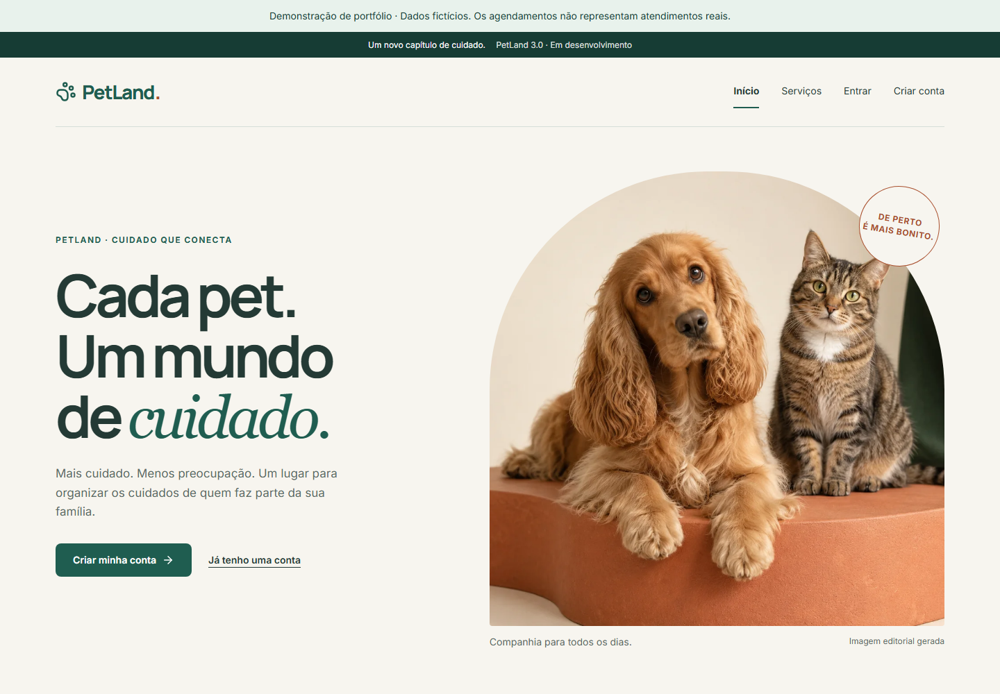

# PetLand 3.0

**O cuidado do pet, bem organizado.** Plataforma operacional de pet shop para o portfólio de Lucas Marques: conecta tutor, equipe e gestão da disponibilidade à conclusão do atendimento.

O tutor precisa de horário, preço e autonomia; a equipe precisa saber o que fazer e o contexto do animal; a gestão precisa ajustar escala/capacidade sem perder reservas e histórico. O PetLand reúne cadastro de pets, reserva com confirmação explícita, execução, comunicação e indicadores de uma loja.

**Stack:** React · TypeScript · Vite · TanStack Query · RHF/Zod · FastAPI · SQLAlchemy/psycopg · PostgreSQL 17 · Alembic · Nginx · Docker.

**Arquitetura:** Modular Monolith with Hexagonal Architecture and pragmatic DDD principles.



Captura do código funcional `2549523`, em demo separada com dados fictícios. [UX e oito telas atuais](docs/ux/PetLand_3.0_UX_Final.md) · [Proveniência](docs/ux/media/current/capture.json).

[Vídeo de três jornadas — 3 min 05 s](docs/case/index.html) · [WebM](docs/case/media/petland-3.0-demo.webm) · [Transcrição](docs/case/transcript.md). **Vídeo histórico P08**, anterior à revisão visual/operacional; capturas atuais permanecem separadas.

## Produto implementado

- Tutor: conta/confirmação, contato, pets, preços/tempos por porte, disponibilidade real, revisar/confirmar, cancelar/reagendar e histórico público.
- Equipe: painel diário, agenda pessoal/equipe, chegada/início/conclusão/falta, notas, extensão, transferência e contexto de cuidado com alertas críticos.
- Gestão: equipe por data, habilidades/expediente, pools físicos por serviço, prévia de impactos, indicadores por responsável/serviço, acessos e auditoria.
- Comunicação persistida: confirmação/alterações, lembrete configurável e aviso de pronto; SMTP local com tentativas/descartes rastreáveis.

Uma reserva contém **um pet e um serviço**; profissional atribuído automaticamente. Sem taxas, pagamentos, grupos atômicos ou multiempresa. [Produto e limites](docs/product/product-overview.md) · [Matriz de dores](docs/product/functional-gap-analysis.md).

**Estado:** candidata `3.0.0-rc.1`, schema `0007_product_operations`, staging local. PR #10 integrado em onboarding; `main` conserva o legado no snapshot de 02/10/2026. Documentação para revisão humana, sem declarar produção ou aceite final. Mailpit não entrega e-mail externo; backup permanece no host. [Gates](docs/release/candidate.json).

## Quick Start

Git, Docker com Compose v2 ativo e Python 3.11+ para o comando de desenvolvimento. Imagens instalam Python 3.13/Node 22 e dependências pelos lockfiles.

```sh
git clone --branch petland-3.0-portfolio-docs https://github.com/O-marqs/petland-2.0.git
cd petland-2.0
python scripts/dev.py init
python scripts/dev.py up
```

Aplicação: http://localhost:5173 · e-mails locais: http://localhost:8025 · API/Swagger: http://localhost:8000/api/docs. `init` gera credenciais privadas e preserva configuração existente; `up` inicia banco, migration job e aplicação saudáveis. Parar com `python scripts/dev.py down`, preservando volume.

Comece por `/criar-conta`, confirme pelo Mailpit, entre e complete contato → pet → reserva. Loja começa sem expediente/equipe comerciais. Primeiro admin: `python scripts/dev.py bootstrap-admin --email administrador-sintetico@example.com`, aceitando convite local; equipe configura serviços, pessoas e horários. Não há senha default.

Backoffice: `/operacao`; gestão ADMIN: `/gestao`, acessos: `/gestao/acessos`. [Teste pessoal dos perfis](docs/runbooks/manual-acceptance.md). Demo sintética separada em https://localhost:8443, TLS/backup/restore: [runbook operacional](docs/runbooks/operations-recovery.md).

## Technical Highlights

| Implementado                                      | Por que importa                                                                                        |
| ------------------------------------------------- | ------------------------------------------------------------------------------------------------------ |
| Monólito modular, ports/adapters e DDD pragmático | Seis módulos, composição explícita, contratos públicos e testes de fronteiras.                         |
| OpenAPI/tipos gerados                             | Cliente tipado deriva de endpoints reais; CI detecta drift.                                            |
| Consistência PostgreSQL                           | Primeiro lock da loja, versões otimistas e GiST de pet/responsável.                                    |
| Snapshot + idempotência + transactional outbox    | Contrato/histórico preservados, replay sem duplicar e avisos no mesmo commit.                          |
| RBAC/contextual + Argon2id + sessão/CSRF          | Propriedade/papéis no servidor, revogação e notas privadas filtradas.                                  |
| CI e testes reais                                 | Arquitetura, PostgreSQL/migrations, React, E2E e jornadas HTTPS/SMTP.                                  |
| Performance e recuperação medidas                 | Carga 100 mil agendamentos/20 sessões, laboratório web e restore reconciliado, com limites explícitos. |

Referência funcional: **128 Python + 20 React**, E2E **15 pass + 1 skip previsto**. API Linux passa metas; Windows/WSL excede p95 de gestão/painel/reserva. Web: 9/9 amostras finais. Sem benchmark comparável do 2.0, carga máxima ou métricas de campo. [RNFs e fontes](docs/architecture/non-functional-requirements.md) · [Checks desta documentação](docs/evidence/Documentation-review.md).

## Escolha sua leitura

| Tempo / objetivo    | Caminho                                                                                                                                                                                                                                |
| ------------------- | -------------------------------------------------------------------------------------------------------------------------------------------------------------------------------------------------------------------------------------- |
| 5 minutes           | README + vídeo histórico com transcrição.                                                                                                                                                                                              |
| 15 minutes          | [Case](docs/case/README.md) + [Product Overview](docs/product/product-overview.md) + [Architecture Overview](docs/architecture/overview.md).                                                                                           |
| Technical deep dive | [ADRs](docs/adr/README.md), [Data Model](docs/architecture/data-model.md), [Security](docs/architecture/authorization.md), [RNFs](docs/architecture/non-functional-requirements.md), [Quality Report](docs/release/quality-report.md). |
| Run locally         | [Quick Start completo](docs/runbooks/local.md), [aceite manual](docs/runbooks/manual-acceptance.md) e [operação atual](docs/runbooks/operational-evolution.md).                                                                        |

[Portal documental](docs/README.md) · [Draw.io e sete diagramas](docs/architecture/diagrams/README.md) · [Design system](docs/ux/design-system.md).

## Validar e preservar

Ferramentas host: Python 3.13/uv 0.12.18, Node 22/pnpm 10.34.5. [Instalação/problemas comuns](docs/runbooks/local.md).

```sh
python scripts/dev.py check
# Com aplicação iniciada:
python scripts/dev.py e2e
python scripts/check_documentation.py
python scripts/render_architecture.py --check
python scripts/release.py check
# Player local: serve somente a pasta pública do case.
python scripts/portfolio_preview.py
```

Player: http://127.0.0.1:8780. Aceite humano de produto/leitor de tela e D10 (publicação/SMTP externo/off-host/SLO-RPO-RTO) pendentes. Reserva em grupo, serviço alterado na execução, férias por intervalo, ações em lote e console único de recepção continuam lacunas.

Legado/tag baseline, plano/PDF originais e evidências preservados em [History / Evidence](docs/README.md#history--evidence). Nenhum MySQL migrado. Histórico de fases fica em implementation/evidence; README apresenta o produto.
