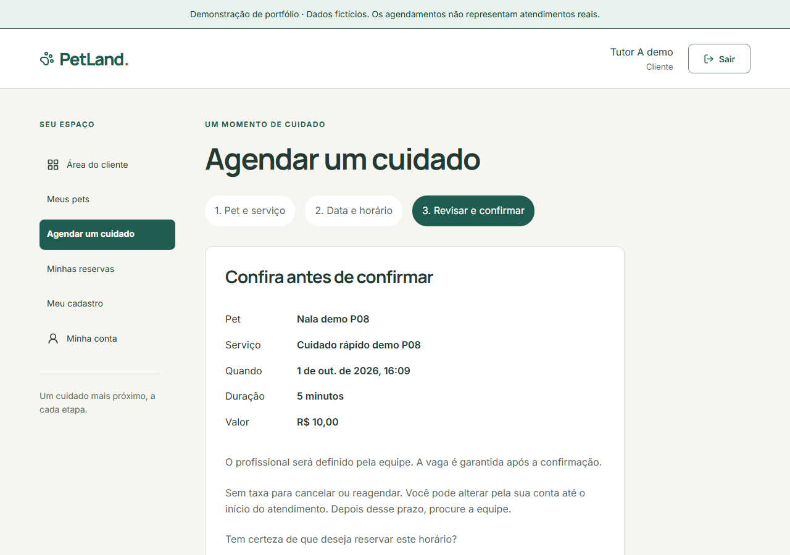

# PetLand 3.0

**O cuidado do pet, bem organizado.** Evolução de um sistema acadêmico Flask para um produto com agenda confiável, autorização por objeto e experiência própria para cliente, funcionário e administrador.

**Estado atual: P08 integrada — candidata 3.0.0-rc.1; primeiro acesso, identidade visual e navegação revisados.** Uma loja, dados fictícios e três perfis, com jornada individual de reserva/atendimento. A [matriz funcional](docs/product/functional-gap-analysis.md) registra dores cobertas, parciais e ausentes: escala coletiva, transferência independente, recursos físicos, lembretes e produtividade por pessoa ainda precisam evoluir. Demonstração isolada em HTTPS e backup autenticado com recuperação comprovada. Desenvolvimento começa sem expediente/equipe semeados; demo é iniciada explicitamente em outro banco. Aceite final e leitor de tela pendentes; publicação externa adiada por D10. Sem release estável/tag automática.

[Case: problema, antes/depois e escolhas de engenharia](docs/case/README.md) · [Vídeo de três jornadas, 3 min 05 s](docs/case/media/petland-3.0-demo.webm) · [Transcrição](docs/case/transcript.md) · [Qualidade e métricas](docs/release/quality-report.md)

[Revisão de UX e identidade](docs/ux/visual-review.md) · [Teste pessoal e escala por data](docs/runbooks/manual-acceptance.md) · [Evidências desta revisão](docs/evidence/Product-review.md). O vídeo e as capturas P08 abaixo representam a entrega histórica, anterior ao novo visual.



Cliente cadastra pet, confere resumo e confirma. Equipe registra chegada/início/conclusão e publica resumo, preservando notas internas. Administração consulta indicadores e verifica impacto antes de mudar expediente. [Notas da candidata](docs/release/3.0.0-rc.1.md), [diagramas](docs/architecture/release-diagrams.md) e [DER](docs/architecture/data-model.md). Capturas do “antes” são templates históricos isolados, identificados no case; não representam fluxo legado executado.

## Executar localmente

Requisitos: **Git**, **Docker com Compose v2** e **Python 3.11+** para o comando de desenvolvimento. O caminho somente Docker instala Python 3.13, Node 22 e dependências dentro das imagens.

```sh
git clone --branch petland-3.0-onboarding-fix https://github.com/O-marqs/petland-2.0.git
cd petland-2.0
python scripts/dev.py init
python scripts/dev.py up
```

`init` gera credenciais aleatórias em `.env` (ignorado pelo Git), preserva arquivo existente e não imprime senhas. `up` compila as imagens, inicia PostgreSQL, executa a migration como job único e espera API/web saudáveis. Portas publicadas exclusivamente no loopback.

- Aplicação: http://localhost:5173
- Catálogo público: http://localhost:5173/servicos
- Cliente: http://localhost:5173/app/perfil e http://localhost:5173/app/pets
- Equipe: http://localhost:5173/operacao/clientes e http://localhost:5173/operacao/servicos
- Agenda da equipe: http://localhost:5173/operacao/agenda e http://localhost:5173/operacao/reservas
- Equipe, expediente, tolerância e contato: http://localhost:5173/operacao/configuracoes
- Visão geral/auditoria (ADMIN): http://localhost:5173/gestao e http://localhost:5173/gestao/auditoria
- Agendar/acompanhar: http://localhost:5173/app/agendar e http://localhost:5173/app/reservas
- Galeria interativa: http://localhost:5173/design-system
- Cadastro/login: http://localhost:5173/criar-conta e http://localhost:5173/entrar
- Caixa de e-mail local: http://localhost:8025 (Mailpit, sem entrega externa)
- OpenAPI/Swagger local: http://localhost:8000/api/docs
- Processo: http://localhost:8000/api/v1/health/live
- Banco/schema: http://localhost:8000/api/v1/health/ready

Parar preservando o banco: `python scripts/dev.py down`. A configuração Compose desta entrega é de **desenvolvimento**, com Vite, não uma receita de produção.

Para confirmar cadastro/recuperar senha, abra a mensagem no Mailpit e siga seu link. Primeiro administrador: `python scripts/dev.py bootstrap-admin --email administrador-sintetico@example.com`, seguido da aceitação por e-mail. Não existe senha default nem cadastro público de ADMIN. [Fluxos de identidade](docs/runbooks/identity.md). Para clientes/pets/catálogo, consulte o [guia P03](docs/runbooks/catalogs.md).

Para testar começando com uma conta nova, siga o [roteiro de cliente e funcionário](docs/runbooks/manual-acceptance.md). Cadastro de acesso → confirmação do e-mail → cadastro de contato → pet → resumo/confirmar reserva. No staging HTTPS local, as mensagens ficam em http://localhost:8026; no desenvolvimento, em http://localhost:8025. As telas mostram a caixa correspondente e o próximo passo. Não há entrega externa de e-mail neste ambiente.

## Desenvolver e validar

Para rodar ferramentas no host: Python **3.13**, **uv 0.12.18**, Node **22.14+ da linha 22**, **pnpm 10.34.5**. O uv pode instalar Python 3.13 com `uv python install 3.13`; instale pnpm com `npm install --global pnpm@10.34.5`.

```sh
python scripts/dev.py init
python scripts/dev.py install
python scripts/dev.py db
python scripts/dev.py migrate
python scripts/dev.py api
# Em outro terminal:
python scripts/dev.py web
```

Não execute API/web no host simultaneamente com os serviços Compose nas mesmas portas. Para usar o host após `up`, execute `down` e depois `db`.

```sh
python scripts/dev.py check
# Com a aplicação iniciada:
python scripts/dev.py e2e
```

`check` verifica Ruff, formatação, mypy, dependências entre camadas, arquivos/segredos do estado ativo, ESLint, TypeScript, formatação web, contratos gerados, build, testes Python e React. O PostgreSQL de testes é separado, efêmero e usa a porta 55433; nenhum teste de migration usa o banco de desenvolvimento. `e2e` instala Chromium e testa navegação, comunicação real, falha/recuperação, formulário, reflow e acessibilidade automatizada em desktop e celular.

Medições com 100 mil agendamentos, laboratório mobile e roteiro de leitor de tela: [qualidade P06](docs/runbooks/quality.md).

## Demonstração e recuperação local

Esta rotina requer as ferramentas no host descritas em **Desenvolver e validar**, além do Docker ativo.

```sh
python scripts/dev.py staging-init
python scripts/dev.py staging-up
python scripts/dev.py seed-demo
pnpm --filter @petland/web exec playwright install chromium
python scripts/dev.py rehearse
```

Aplicação estática em **https://localhost:8443**, com certificado local de teste; credenciais aleatórias em `.local/staging/accounts.json`, ignorado pelo Git. A demo exibe seu caráter fictício. `rehearse` verifica os três perfis, criptografa backup, restaura em banco novo, confere todas as tabelas e retorna à origem preservada. Parar com `staging-down`, sem apagar volume. Não substitui backup fora da máquina ou um deploy público. [Acesso, certificados, reset, backup/restore e incidentes P07](docs/runbooks/operations-recovery.md).

Detalhes, comandos individuais e resolução de problemas: [execução local](docs/runbooks/local.md).

## Revisar a candidata e assistir ao case

```sh
python scripts/release.py check
# Depois de commit e árvore limpa, pacote local com hashes/gates:
python scripts/release.py bundle
# Player local com legendas; servir somente a pasta pública:
python scripts/portfolio_preview.py
```

Player em http://127.0.0.1:8780/, sem áudio, com WebVTT/transcrição e capítulos. Nenhum segredo ou banco acompanha o ZIP; staging e antes histórico exigem clone Git. [Revisão, regravação, empacotamento e promoção](docs/runbooks/release.md). CI do commit de cada candidata fica nos checks/descrição do PR; métricas P06/P07 conservam seus ambientes/datas, sem alegação de ganho percentual frente ao 2.0.

## Organização

```text
apps/api/                 FastAPI, bootstrap, módulos, Alembic e testes
apps/web/                 React, rotas, funcionalidades, layouts e UI
packages/api-contract/    OpenAPI e tipos gerados; cliente tipado
infra/                    Compose local, imagens e configuração PostgreSQL
scripts/                  Comandos multiplataforma e verificações
docs/                     Fontes oficiais, decisões, arquitetura e evidências
.github/workflows/        CI, sem deploy automático
```

O backend é um monólito modular com portas pequenas e composição explícita. `system` fornece saúde do ambiente; `identity` implementa contas, sessões, convites e autorização, com domínio e casos de uso independentes de HTTP, banco e SMTP. Os módulos customers, pets e catalog tratam cadastros, propriedade e ofertas, com colaboração por contratos públicos. A verificação de arquitetura cobre imports absolutos e relativos de `domain`, `application`, `infrastructure` e `presentation`.

No frontend, React Router carrega páginas sob demanda; TanStack Query gerencia dados reais de identidade e cadastros; React Hook Form/Zod validam os formulários reais. A galeria permanece separada como ferramenta de desenvolvimento. Manrope/Inter são hospedadas junto à aplicação. Os contratos têm apenas endpoints que realmente existem.

## Legado e continuidade

O histórico de [PetLand 2.0](https://github.com/O-marqs/petland-2.0) permanece intacto. A tag `legacy/petland-2.0-2024-11-24` aponta para `3cc3f898cde896b80fed587bf8c06f4aa46742f6`. A branch principal e o trabalho local anterior foram preservados; ambientes virtuais, caches e código antigo não integram o aplicativo ativo 3.0. Nenhum banco MySQL foi acessado ou migrado.

- [Índice da documentação e documentos oficiais integrais](docs/README.md)
- [Progresso, aceite e próximo card](docs/implementation/progress.md)
- [Resultados verificáveis e limitações P03](docs/evidence/P03.md)
- [Resultados verificáveis e limites P04](docs/evidence/P04.md)
- [Resultados verificáveis e limites P05](docs/evidence/P05.md)
- [Medições, regressão e limites P06](docs/evidence/P06.md)
- [Ensaio operacional e limites P07](docs/evidence/P07.md)
- [Histórico e limitações P02](docs/evidence/P02.md) e [histórico P01](docs/evidence/P01.md)
- [Decisões aprovadas e pendentes](docs/product/decisions.md)
- [Arquitetura e decisões](docs/architecture/README.md)
- [Orientações para próximas sessões](AGENTS.md)

Configuração inicial: [runbook da agenda](docs/runbooks/scheduling.md). Consistência e limites: [ADR-003](docs/adr/0003-scheduling.md).

Execução e gestão: [runbook P05](docs/runbooks/operations.md), [estados, privacidade e fórmulas](docs/adr/0012-p05-operations.md).

Fase atual: **P08 / PL3-21**, candidata e case autorizados após merge P07. Migração histórica dispensada por D08/D12; aceite final e leitor de tela pendentes. Provedor, backup fora do host e publicação continuam condicionados a D10. Não há merge ou publicação automática.

Incremento posterior autorizado: **operação diária**. Funcionário entra em `/operacao` com agenda pessoal/equipe, pendências e distribuição; `/operacao/escala` organiza pessoas/horários apenas em uma data, e `/operacao/capacidade` limita recursos físicos por serviço. Transferência preserva o contrato/histórico; alerta crítico pede leitura atual; cuidados anteriores acompanham o pet. Gestão em `/gestao` mostra concluídos e duração real por responsável final, sem ranking. Lembretes e aviso de pronto são rastreados no SMTP local. [Como testar](docs/runbooks/operational-evolution.md), [regras e limites](docs/adr/0016-operational-evolution.md), [matriz atualizada](docs/product/functional-gap-analysis.md).
