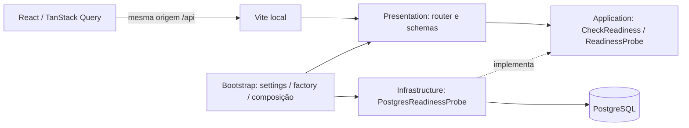

# Arquitetura da fundação

RF13; RNF05/07/09. Monorepo e monólito modular, FastAPI síncrono com psycopg/SQLAlchemy. Veja plano integral §§9–16 e ADR-001/002/005/007/011.

`system` é um módulo técnico mínimo com consulta operacional verdadeira. Não tem domínio comercial; portanto não possui pasta `domain` vazia ou entidade artificial. O verificador de arquitetura cobre os módulos futuros e tem um teste negativo com imports proibidos. Não há motor de agenda, users/pets ou permissões simulados.

O engine tem pool limitado, pre-ping, connect/pool/statement timeouts e descarte no lifespan. Endpoints de I/O bloqueante usam `def`. Falha do banco não derruba liveness. Readiness lê a revisão Alembic e exige correspondência exata; indisponibilidade, schema ausente, revisão incompatível ou permissão insuficiente resultam em 503 sem DSN.

O baseline `0001_foundation` deliberadamente contém zero DDL de negócio. Alembic cria seu marcador transacional `alembic_version`; a migration é executável/reversível e sua cadeia é exercitada no PostgreSQL. Tabelas de identidade serão criadas em P02; o DER do plano continua proposta para as próximas fases, sem antecipar D02–D07.

O usuário runtime `petland_app` não é superuser e só recebe CONNECT/USAGE/SELECT necessários à P01. A credencial de migrations é separada. O administrador local do container é exclusivo de desenvolvimento. Privilégios de escrita futuros devem ser revisados por tabela. Não há migration no startup da API.

O cliente HTTP usa tipos gerados de OpenAPI, cookies habilitados, abort/cancelamento e timeout. A consulta usa a revisão real da API/banco; os estados de falha não permanecem verdes por dados antigos. CSRF/mutações e tratamento de erros comerciais entrarão com os endpoints de P02/P04; P01 não implementa uma sessão fictícia.

## Limites de segurança atuais

Somente GETs públicos de saúde, respostas mínimas, request IDs internos, headers de não cache/nosniff e logs JSON por allowlist. URLs brutas, query strings, bodies, tokens e mensagens de exceção não são registrados. Swagger é local; staging/prod recusam origem HTTP, TLS PostgreSQL sem verificação e senha curta. Essas validações iniciais não equivalem a hardening/release de produção.

Referências técnicas consultadas: [lifespan FastAPI](https://fastapi.tiangolo.com/advanced/events/), [pool SQLAlchemy](https://docs.sqlalchemy.org/en/20/core/pooling.html), [Vite](https://vite.dev/guide/), [openapi-fetch](https://openapi-ts.dev/openapi-fetch/).
