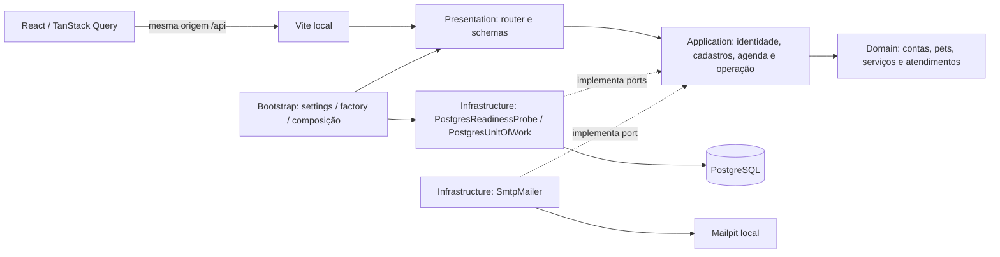

# Arquitetura implementada — candidata P08

**HISTORICAL — visão da candidata P08, com complementos incrementais.** Para o estado consolidado `2549523`, leia [Architecture Overview](overview.md), [RNFs](non-functional-requirements.md) e [diagramas atuais](diagrams/README.md). O conteúdo abaixo conserva a visão temporal, inclusive o proxy de desenvolvimento.

[Contexto, containers de staging e transação](release-diagrams.md), [DER/dicionário](data-model.md). O proxy Vite abaixo é de desenvolvimento; staging P07 usa Nginx/TLS e frontend estático, conforme ADR-014. A candidata P08 mantém as regras/containers e acrescenta documentação/artefatos de revisão, sem mudança de schema.

RF13; RNF05/07/09. Monorepo e monólito modular, FastAPI síncrono com psycopg/SQLAlchemy. Veja plano integral §§9–16 e ADR-001/002/003/005/007/011/012.

```mermaid
flowchart LR
  Browser[React / TanStack Query] -->|mesma origem /api| Proxy[Vite local]
  Proxy --> HTTP[Presentation: router e schemas]
  HTTP --> UC[Application: identidade, cadastros, agenda e operação]
  UC --> Domain[Domain: contas, pets, serviços e atendimentos]
  DBAdapter[Infrastructure: PostgresReadinessProbe / PostgresUnitOfWork] -. implementa ports .-> UC
  DBAdapter --> DB[(PostgreSQL)]
  Mail[Infrastructure: SmtpMailer] -. implementa port .-> UC
  Mail --> SMTP[Mailpit local]
  Bootstrap[Bootstrap: settings / factory / composição] --> HTTP
  Bootstrap --> DBAdapter
```

`system` é um módulo técnico mínimo com consulta operacional verdadeira. `identity` implementa contas, papéis, sessões, tokens e autorização; `customers`, `pets` e `catalog` preservam seus cadastros. `scheduling` concentra calendário, reservas e execução; gestão agrega leituras protegidas sem criar um módulo de BI. Domínio/aplicação dependem apenas de Python e ports; adapters concretos ficam em infraestrutura e são compostos no bootstrap. O verificador de arquitetura inclui testes negativos com imports proibidos.

O engine tem pool limitado, pre-ping, connect/pool/statement timeouts e descarte no lifespan. Endpoints de I/O bloqueante usam `def`. Falha do banco não derruba liveness. Readiness lê a revisão Alembic e exige correspondência exata; indisponibilidade, schema ausente, revisão incompatível ou permissão insuficiente resultam em 503 sem DSN.

O baseline `0001_foundation` contém zero DDL de negócio. `0002_identity` cria identidade; `0003_catalogs` acrescenta clientes/pets/ofertas; `0004_scheduling` acrescenta calendário, recursos, reservas, eventos, idempotência e outbox. `0005_operations` acrescenta execução, instantes reais, extensão e notas com visibilidade, preservando as exclusões de ocupação. A cadeia Alembic é exercitada no PostgreSQL com upgrade, repetição, downgrade e comparação com metadata. O downgrade P05 recusa descartar atendimentos/notas existentes; veja [ADR-012](../adr/0012-p05-operations.md).

O usuário runtime `petland_app` não é superuser e recebe privilégios por tabela: escrita de identidade, leitura/inserção de auditoria e nenhuma permissão DDL. A credencial de migrations é separada. O administrador local do container é exclusivo de desenvolvimento. Não há migration no startup da API.

O cliente HTTP usa tipos gerados de OpenAPI, cookies habilitados, abort/cancelamento e timeout. Antes de mutações, obtém CSRF vinculado à sessão e envia o header. Mutações não são repetidas automaticamente. A consulta de saúde usa a revisão real da API/banco; estados de falha não permanecem verdes por dados antigos. Identidade e gestão usam respostas reais da API, incluindo erros padronizados.

Scheduling consulta snapshots por contratos públicos dos demais módulos. Toda mutação crítica começa pelo lock da configuração; PostgreSQL mantém exclusões independentes de intervalos. Avisos são persistidos junto com a reserva e entregues fora da transação pelo worker. A interface permite repetir explicitamente uma confirmação com a mesma chave. Ver [ADR-003](../adr/0003-scheduling.md).

A migração aditiva `0007_product_operations` preserva dados e acrescenta contexto crítico do pet, transferências estruturadas e estado de comunicação programada. Escalas de datas e pools físicos são regras versionadas da configuração. Revalidação sob lock protege mudanças e reservas; consultas de gestão agregam concluídos por responsável final, sem converter contrato em receita. [ADR-016](../adr/0016-operational-evolution.md).

## Limites de segurança atuais

Sessões opacas, Argon2id, CSRF, autorização contextual, revogação, rate limit compartilhado, limites de body e auditoria são descritos no [ADR 004](../adr/0004-identity.md). URLs brutas, query strings, bodies, tokens e mensagens de exceção não são registrados. Swagger é local; staging/prod exigem HTTPS, TLS PostgreSQL verificado e SMTP com STARTTLS. Essas validações não equivalem a uma revisão completa ou release de produção.

Referências técnicas consultadas: [lifespan FastAPI](https://fastapi.tiangolo.com/advanced/events/), [pool SQLAlchemy](https://docs.sqlalchemy.org/en/20/core/pooling.html), [Vite](https://vite.dev/guide/), [openapi-fetch](https://openapi-ts.dev/openapi-fetch/).
