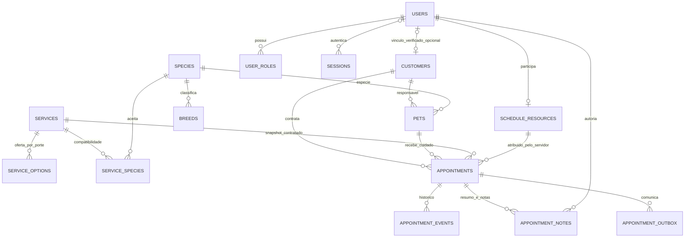

# Modelo de dados implementado

Revisão Alembic **`0007_product_operations`**. DER abaixo mostra as relações centrais, não todas as colunas/tabelas técnicas. Fonte: ORM dos módulos e migrations; schema de referência é PostgreSQL, nunca MySQL presumido.

## Dicionário operacional

| Estrutura | Identidade/valores | Invariantes e tratamento |
|---|---|---|
| users, user_roles | UUID, e-mail, hash Argon2id, papéis fixos | Conta verificada/ativa; último admin protegido; mudanças revogam sessões. Nenhum CPF público. |
| sessions, account_tokens, identity_rate_limits | Hashes de sessão/token, prazo e versão | Sessão opaca/HttpOnly; tokens de uso único; rate limit compartilhado. Sessão pré-autenticação pode não ter user. |
| customers, customer_claims | UUID, user_id opcional único, contato mínimo | Associação à conta por convite verificado; não fundir por nome. Endereço/telefone opcionais. |
| pets, species, breeds | UUID, owner, espécie/raça, porte, arquivo | FK/compatibilidade de referências; raça/nascimento podem ser desconhecidos. Arquivo preserva histórico. |
| services, service_options, service_species | UUID, Decimal BRL, minutos por porte, versão | Oferta deve ser ativa/compatível. Preço e tempo da contratação ficam no snapshot. |
| schedule_configuration | Singleton, configuração JSONB, versão | Loja começa desabilitada; fuso IANA, expediente/pausas/exceções e limites validados. Alteração revalida impacto sob lock. |
| schedule_resources | UUID, user_id único, serviços, calendário e versão | Conta apta/ativa e compatibilidade de serviço; cliente não escolhe profissional. Lista/calendário JSONB são validados pelo domínio. |
| appointments | UUID; customer/pet/service/resource; timestamptz, offer JSONB, status e versão | FK composta pet+customer protege vínculo. Intervalos de ocupação `[)` têm duas exclusões GiST; estados ocupantes incluem COMPLETED para conservar ocupação histórica. |
| appointment_events, appointment_notes | UUID, appointment, ator, instantes e visibilidade | Histórico preservado; notas append-only com INTERNAL/PUBLIC. Projeção cliente exclui nota interna/identidade operacional. |
| booking_idempotency | Chave composta ator+operação+UUID, assinatura e resposta | Mesmo pedido recupera snapshot; outro payload com mesma chave conflita. Não depende de memória do worker. |
| appointment_outbox | UUID, destinatário, tentativas, lease e entrega | Aviso persistido com a mutação; worker envia fora da transação. Falha SMTP conserva tentativa futura. |
| audit_events | UUID, ator opcional, ação/objeto e metadata allowlist | Escritas comerciais auditadas; runtime sem UPDATE da auditoria. Valores pessoais e credenciais não compõem logs técnicos. |

Instantes de chegada/início/conclusão pertencem ao servidor e respeitam ordenação. `reserved_until` registra extensão sem reescrever preço/horário original. Configuração e exclusões revalidam o pet e a pessoa. Não há entidade de pagamento, multiempresa ou prontuário veterinário nesta versão.

O restore P07 reconciliou **23 tabelas**, incluindo `alembic_version` e o manifesto privado de demo `petland_ops.demo_manifest`. O schema `petland_ops` pertence somente às ferramentas offline; não é uma API de negócio. [Prova P07](../evidence/P07.md), [reprodução](../runbooks/operations-recovery.md).

D08/D12 dispensam importação histórica; nenhum CPF/hash/reserva legado foi convertido. Política/custódia/retenção externas dependem de D10. [Baseline preservada](../migration/baseline.md).

Incremento operacional: `pets.allergies/handling_notes`; `appointment_events.previous_resource_id/resource_id` para transferência interna; `appointment_outbox.kind/scheduled_start_at/suppressed_at` para avisos programados/descartados. `schedule_configuration.data` guarda escala coletiva de datas, pools físicos e antecedência de lembrete. Mudança aditiva preserva as 23 tabelas, dados e exclusões; downgrade recusa descartar informação nova. [ADR-016](../adr/0016-operational-evolution.md).
