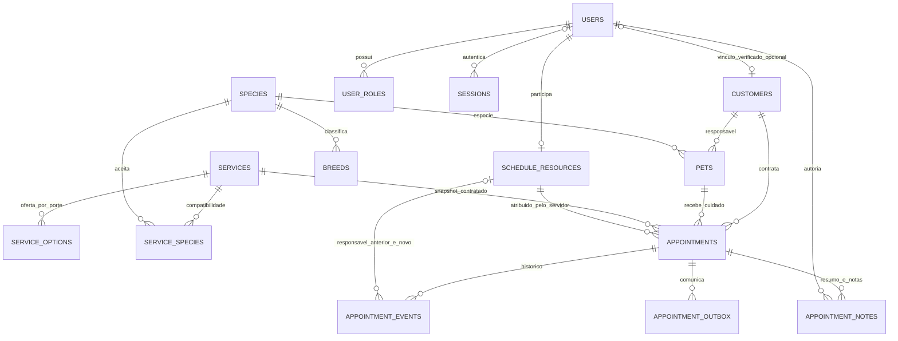

# Modelo de dados implementado

**CURRENT · código `2549523` · revisão Alembic `0007_product_operations`.** DER abaixo mostra relações centrais, não todas as colunas/tabelas técnicas. Fontes: [migrations](../../apps/api/migrations/versions), [metadata](../../apps/api/src/petland/shared/database.py) e ORM dos módulos. PostgreSQL, nunca MySQL presumido. [Arquitetura atual](overview.md).

## Dicionário operacional

| Estrutura                                      | Identidade/valores                                                             | Invariantes e tratamento                                                                                                                                              |
| ---------------------------------------------- | ------------------------------------------------------------------------------ | --------------------------------------------------------------------------------------------------------------------------------------------------------------------- |
| users, user_roles                              | UUID, e-mail, hash Argon2id, papéis fixos                                      | Conta verificada/ativa; último admin protegido; mudanças revogam sessões. Nenhum CPF público.                                                                         |
| sessions, account_tokens, identity_rate_limits | Hashes de sessão/token, prazo e versão                                         | Sessão opaca/HttpOnly; tokens de uso único; rate limit compartilhado. Sessão pré-autenticação pode não ter user.                                                      |
| customers, customer_claims                     | UUID, user_id opcional único, contato mínimo                                   | Associação à conta por convite verificado; não fundir por nome. Endereço/telefone opcionais.                                                                          |
| pets, species, breeds                          | UUID, owner, espécie/raça, porte, arquivo                                      | FK/compatibilidade de referências; raça/nascimento podem ser desconhecidos. Arquivo preserva histórico.                                                               |
| services, service_options, service_species     | UUID, Decimal BRL, minutos por porte, versão                                   | Oferta deve ser ativa/compatível. Preço e tempo da contratação ficam no snapshot.                                                                                     |
| schedule_configuration                         | Singleton, configuração JSONB, versão                                          | Loja começa desabilitada; fuso IANA, expediente/pausas/exceções e limites validados. Alteração revalida impacto sob lock.                                             |
| schedule_resources                             | UUID, user_id único, serviços, calendário e versão                             | Conta apta/ativa e compatibilidade de serviço; cliente não escolhe profissional. Lista/calendário JSONB são validados pelo domínio.                                   |
| appointments                                   | UUID; customer/pet/service/resource; timestamptz, offer JSONB, status e versão | FK composta pet+customer protege vínculo. Intervalos de ocupação `[)` têm duas exclusões GiST; estados ocupantes incluem COMPLETED para conservar ocupação histórica. |
| appointment_events, appointment_notes          | UUID, appointment, ator, instantes e visibilidade                              | Histórico preservado; notas append-only com INTERNAL/PUBLIC. Projeção cliente exclui nota interna/identidade operacional.                                             |
| booking_idempotency                            | Chave composta ator+operação+UUID, assinatura e resposta                       | Mesmo pedido recupera snapshot; outro payload com mesma chave conflita. Não depende de memória do worker.                                                             |
| appointment_outbox                             | UUID, destinatário, tentativas, lease e entrega                                | Aviso persistido com a mutação; worker envia fora da transação. Falha SMTP conserva tentativa futura.                                                                 |
| audit_events                                   | UUID, ator opcional, ação/objeto e metadata allowlist                          | Escritas comerciais auditadas; runtime sem UPDATE da auditoria. Valores pessoais e credenciais não compõem logs técnicos.                                             |

Instantes de chegada/início/conclusão pertencem ao servidor e respeitam ordenação. `reserved_until` registra extensão sem reescrever preço/horário original. Configuração e exclusões revalidam o pet e a pessoa. Não há entidade de pagamento, multiempresa ou prontuário veterinário nesta versão.

O restore P07 reconciliou **23 tabelas**, incluindo `alembic_version` e o manifesto privado de demo `petland_ops.demo_manifest`. O schema `petland_ops` pertence somente às ferramentas offline; não é uma API de negócio. [Prova P07](../evidence/P07.md), [reprodução](../runbooks/operations-recovery.md).

D08/D12 dispensam importação histórica; nenhum CPF/hash/reserva legado foi convertido. Política/custódia/retenção externas dependem de D10. [Baseline preservada](../migration/baseline.md).

Incremento operacional: `pets.allergies/handling_notes`; `appointment_events.previous_resource_id/resource_id` para transferência interna; `appointment_outbox.kind/scheduled_start_at/suppressed_at` para avisos programados/descartados. `schedule_configuration.data` guarda escala coletiva de datas, pools físicos e antecedência de lembrete. Mudança aditiva preserva as 23 tabelas, dados e exclusões; downgrade recusa descartar informação nova. [ADR-016](../adr/0016-operational-evolution.md).

## Inventário e cadeia de migrations

São **21 tabelas de aplicação**, **22 em `public` incluindo `alembic_version`**, e **23 na demo incluindo `petland_ops.demo_manifest`**. O número do ensaio de recovery não é contagem de entidades comerciais.

| Revisão                   | Estruturas / mudança                                                                                                               |
| ------------------------- | ---------------------------------------------------------------------------------------------------------------------------------- |
| `0001_foundation`         | Baseline técnica, sem DDL comercial.                                                                                               |
| `0002_identity`           | `users`, `user_roles`, `sessions`, `account_tokens`, `identity_rate_limits`, `audit_events`.                                       |
| `0003_catalogs`           | `customers`, `customer_claims`, `species`, `breeds`, `pets`, `services`, `service_options`, `service_species`.                     |
| `0004_scheduling`         | `schedule_configuration`, `schedule_resources`, `appointments`, `appointment_events`, `booking_idempotency`, `appointment_outbox`. |
| `0005_operations`         | `appointment_notes`, estados de execução, instantes reais e extensão; atualiza exclusões.                                          |
| `0006_hardening`          | Índices de ocupação/fila aberta/histórico do tutor e tempo de auditoria.                                                           |
| `0007_product_operations` | Colunas de cuidado, transferência e comunicação; nenhuma tabela nova.                                                              |

Migration `0003_catalogs` é o identificador da revisão, não o nome completo do arquivo. A chain é linear; readiness exige a revisão exata, sem auto-upgrade no startup. [Testes de migration](../../apps/api/tests/integration/test_migrations.py).

## Integridade garantida pelo banco

- UUIDs/PKs e FKs ligam reservas a tutor/pet/serviço/recurso e notas/eventos a reserva/ator; `schedule_resources.user_id` é único. E-mail normalizado e hashes de sessão/token têm unicidade; cliente tem `user_id` opcional único.
- FK composta `(pet_id, customer_id)` → `pets(id, customer_id)` impede associar reserva ao tutor de outro pet. FK composta raça/espécie impede raça incompatível; ofertas relacionam serviço/espécie e porte.
- CHECKs delimitam estados/porte/sexo/visibilidade, intervalos previstos/ocupados, extensão e ordenação dos instantes reais. CHECK singleton fixa `schedule_configuration.id = 1`.
- `btree_gist` sustenta `appointments_resource_overlap`: pessoa + `tstzrange(occupied_start_at, occupied_end_at, '[)')`; e `appointments_pet_overlap`: pet + `tstzrange(starts_at, COALESCE(reserved_until, ends_at), '[)')`. Ambas incluem BOOKED/ARRIVED/IN_PROGRESS/COMPLETED. CANCELLED/NO_SHOW liberam; adjacência exata é permitida pelo intervalo aberto à direita. Buffers ocupam pessoa; intervalo de cuidado/ extensão ocupa pet.
- Chave de `booking_idempotency` é `(actor_id, operation, key)`. Runtime pode inserir/ler, sem editar/apagar. `appointment_notes`, `appointment_events` e `audit_events` também são leitura/inserção, sem UPDATE/DELETE pelo papel runtime. Não são invioláveis para o migrator/administrador offline.

[ORM da agenda](../../apps/api/src/petland/modules/scheduling/infrastructure/models.py), [ORM pets](../../apps/api/src/petland/modules/pets/infrastructure/models.py), [grants P04](../../apps/api/migrations/versions/0004_scheduling_transactional_scheduling_and_calendar.py).

## Invariantes de domínio e transação

Loja aberta, aptidão/verificação/papel da pessoa, calendário individual/escala do dia, serviço ativo/compatível, política de prazo, duração/buffers e limite físico são revalidados pela aplicação. **Não são todos CHECKs SQL.** Pools não têm tabela/unidade física/FK/exclusion própria: o lock comum do estabelecimento serializa a revalidação e gravação. Versões detectam edição obsoleta; a validação pessimista conserva capacidade sob concorrência. Alergia exige reconhecimento da versão atual do perfil ao iniciar.

Configuração/personas/pet são protegidos ao mudar condições com reservas existentes; prévia não salva e o commit revalida. Idempotência compara assinatura do payload e recupera resposta armazenada; assinatura divergente conflita. Reserva, evento, auditoria, resposta idempotente e avisos fazem parte do mesmo commit. [Casos de uso](../../apps/api/src/petland/modules/scheduling/application/service.py) · [Operação](../../apps/api/src/petland/modules/scheduling/application/operations.py).

## JSONB deliberado, snapshots e história

| JSONB                                     | Semântica e limite                                                                                                                                                                                                                                                                          |
| ----------------------------------------- | ------------------------------------------------------------------------------------------------------------------------------------------------------------------------------------------------------------------------------------------------------------------------------------------- |
| `schedule_configuration.data`             | Configuração singleton; **versão dentro do JSON**, não coluna própria. Calendário semanal/exceções, fuso/políticas/contato, até 100 `staff_days`, até 32 `capacity_pools` (1–100 unidades), lembrete 0–10080 min. Valores/tipos/referências são validados no domínio, sem todas as FKs SQL. |
| `schedule_resources.calendar/service_ids` | Calendário opcional herda loja; IDs de habilidade são validados pela aplicação. Escala explícita por data substitui disponibilidade daquele dia, inclusive para pessoas omitidas.                                                                                                           |
| `appointments.offer`                      | Snapshot de nomes/preço/duração/termos contratados. Alterar catálogo não reescreve a contratação. Dados de contato/perfil atuais não viram snapshots históricos por implicação.                                                                                                             |
| `booking_idempotency.response`            | Snapshot da resposta da tentativa original; replay não é uma nova consulta do estado atual.                                                                                                                                                                                                 |
| `audit_events.metadata`                   | Allowlist de metadados, sem copiar payload/credenciais.                                                                                                                                                                                                                                     |
| `petland_ops.demo_manifest.payload`       | Proveniência offline do fixture sintético; fora do domínio/runtime de negócio.                                                                                                                                                                                                              |

JSONB evita tabelas artificiais para configuração pequena e coesa, mas depende de validação sob lock e não oferece integridade referencial automática para os IDs internos. Não equivale a armazenamento sem schema: contratos/domain explicitam sua estrutura.

`previous_resource_id/resource_id` em eventos são FKs nullable para histórico estruturado de transferência. Reserva mantém responsável **atual/final**; indicadores atribuem toda duração real a esse responsável, sem dividir esforço. Notas e eventos guardam autoria/tempo, mas não formam event sourcing completo. Reagendamento conserva evento/horários, sem before/after completo de todo payload. Histórico não pode reconstruir todos os calendários antigos para um denominador imutável de ocupação.

## Cuidado e comunicação

`allergies` e `handling_notes` são textos de até 1000 caracteres, separados de `care_notes`, no perfil atual. Detalhe operacional consulta três cuidados concluídos anteriores ao início previsto do atual, até cinco notas por cuidado. Projeção do tutor filtra notas internas/IDs/motivos operacionais. Não há entidade clínica/material/máquina estruturada.

Outbox tem `kind` (compatibilidade `legacy`), `scheduled_start_at` e `suppressed_at`, além de recipient/body privados, attempts/lease/available_at/delivered_at. Lembretes pendentes são descartados em alterações e rechecados contra BOOKED/mesmo horário futuro; conclusão enfileira aviso de pronto sem nota interna. `delivered_at` indica **aceitação SMTP**, não caixa externa/leitura. Claim persistido + envio fora da transação implica entrega at least once; duplicação residual é possível.

Downgrade 0007 recusa perder cuidado, transferência, novos avisos, escala/pools ou lembrete ativo. Em banco compatível vazio remove as chaves novas antes de remover colunas. Rollback de imagem não deve usar downgrade destrutivo. [Migration 0007](../../apps/api/migrations/versions/0007_product_operations.py) · [Processador](../../apps/api/src/petland/modules/scheduling/infrastructure/notifications.py).
