# Diagramas atuais — PetLand 3.0

Referência funcional: `2549523 / 0007_product_operations`.

Draw.io editável e SVG/Mermaid compartilham o modelo em [render_architecture.py](../../../scripts/render_architecture.py).
Coordenadas, labels, nós e relações são determinísticos; não é exportação via serviço externo.

`python scripts/render_architecture.py` regenera; `python scripts/render_architecture.py --check` detecta divergência.
Editar o modelo e regenerar preserva coerência. Edições manuais no Draw.io continuam editáveis, mas não são importadas pelo gerador.
Os diagramas L1–L3 são aproximações C4, não certificação formal. Setas de containers são comunicação; módulos indicam contratos públicos.

[Abrir arquivo com sete páginas](PetLand_3.0_Architecture.drawio)

## 01-System-Context

Uma loja · personas e dependências atuais

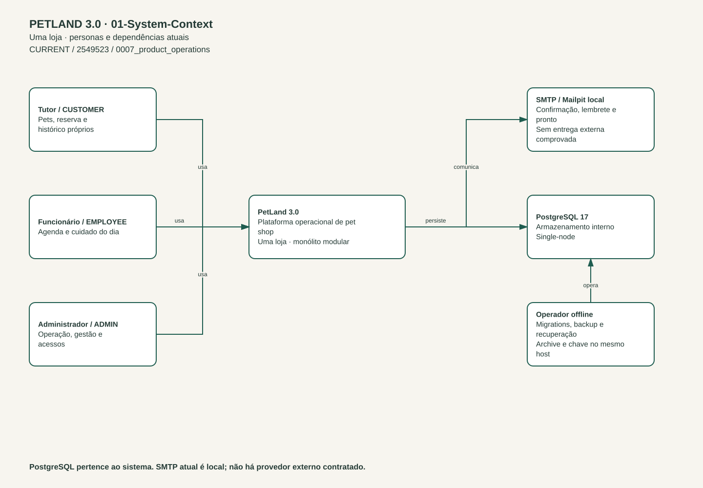

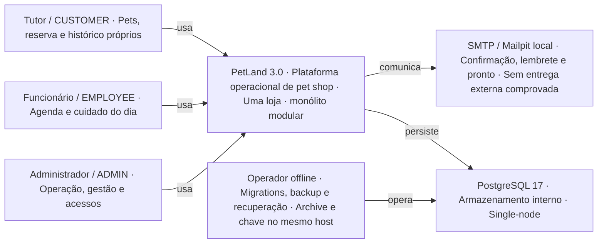

PostgreSQL pertence ao sistema. SMTP atual é local; não há provedor externo contratado.

## 02-Containers

Staging local · containers e processo de outbox

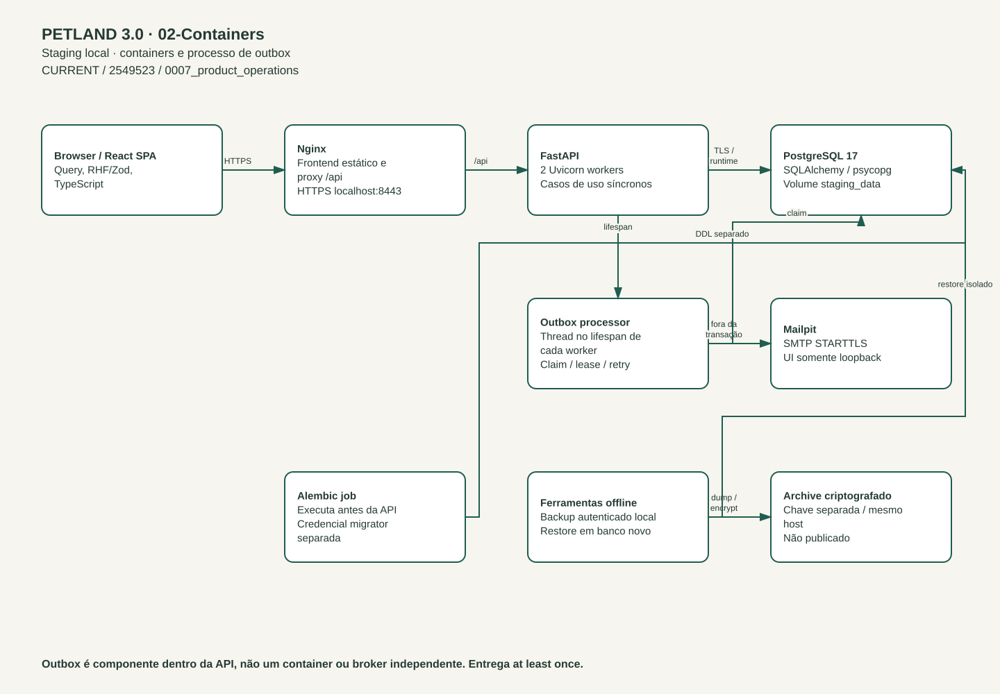

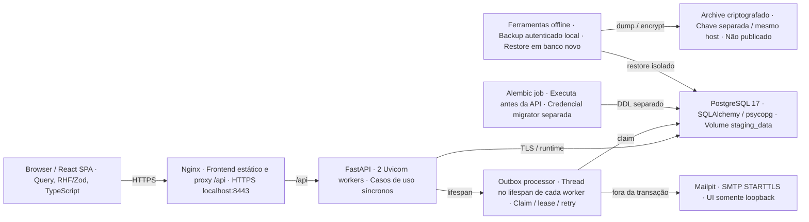

Outbox é componente dentro da API, não um container ou broker independente. Entrega at least once.

## 03-Backend-Modules

Composição, fronteiras e dependências internas

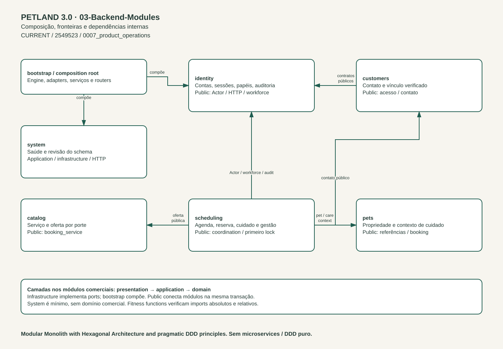

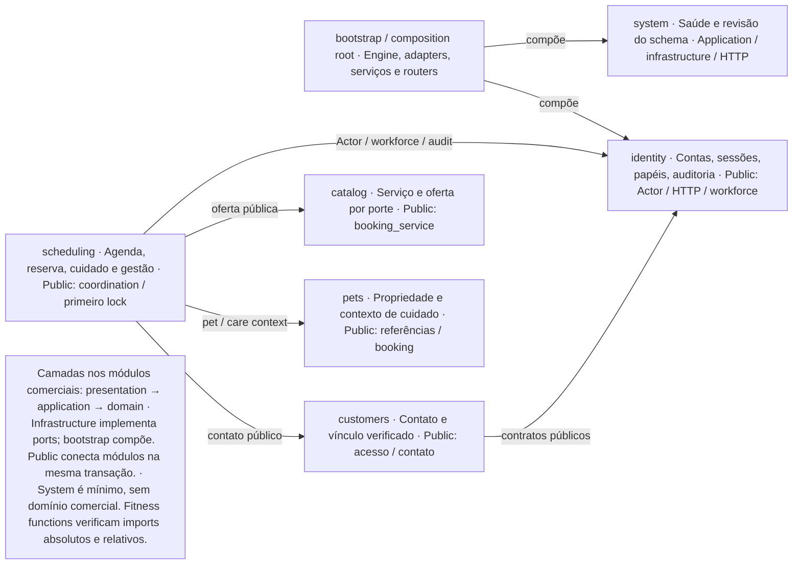

Modular Monolith with Hexagonal Architecture and pragmatic DDD principles. Sem microservices / DDD puro.

## 04-Booking-Transaction

Confirmação e garantias transacionais

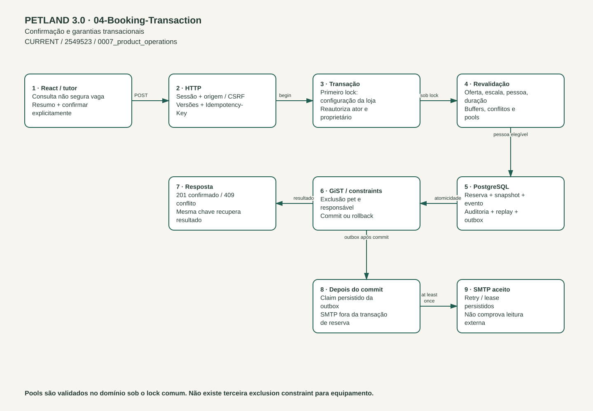

```mermaid
flowchart LR
  review["1 · React / tutor · Consulta não segura vaga · Resumo + confirmar explicitamente"]
  request["2 · HTTP · Sessão + origem / CSRF · Versões + Idempotency-Key"]
  lock["3 · Transação · Primeiro lock: configuração da loja · Reautoriza ator e proprietário"]
  validate["4 · Revalidação · Oferta, escala, pessoa, duração · Buffers, conflitos e pools"]
  write["5 · PostgreSQL · Reserva + snapshot + evento · Auditoria + replay + outbox"]
  integrity["6 · GiST / constraints · Exclusão pet e responsável · Commit ou rollback"]
  response["7 · Resposta · 201 confirmado / 409 conflito · Mesma chave recupera resultado"]
  worker["8 · Depois do commit · Claim persistido da outbox · SMTP fora da transação de reserva"]
  smtp["9 · SMTP aceito · Retry / lease persistidos · Não comprova leitura externa"]
  review -->|"POST"| request
  request -->|"begin"| lock
  lock -->|"sob lock"| validate
  validate -->|"pessoa elegível"| write
  write -->|"atomicidade"| integrity
  integrity -->|"resultado"| response
  integrity -->|"outbox após commit"| worker
  worker -->|"at least once"| smtp
```

Pools são validados no domínio sob o lock comum. Não existe terceira exclusion constraint para equipamento.

## 05-Security-Trust-Boundaries

Entradas não confiáveis e privilégios separados

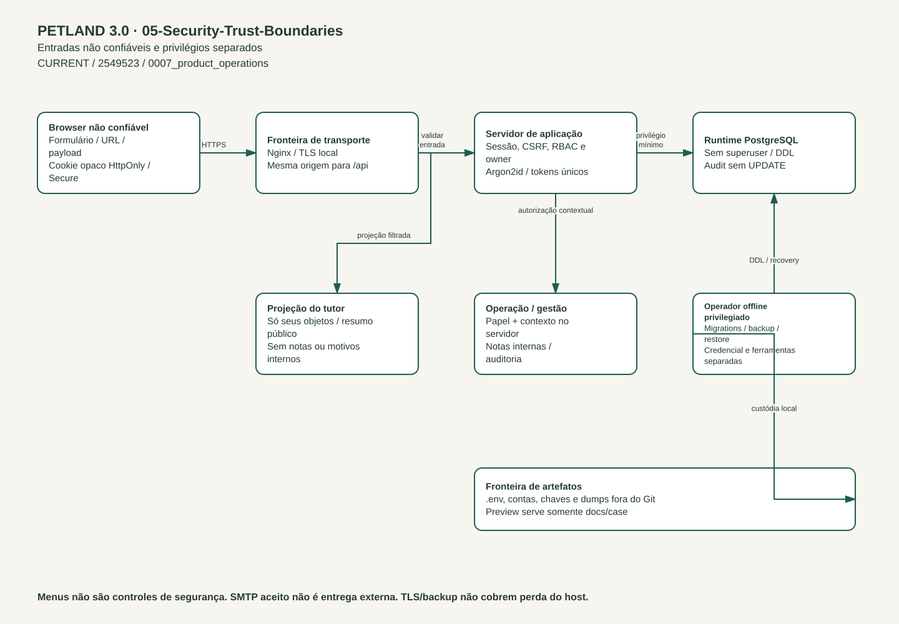

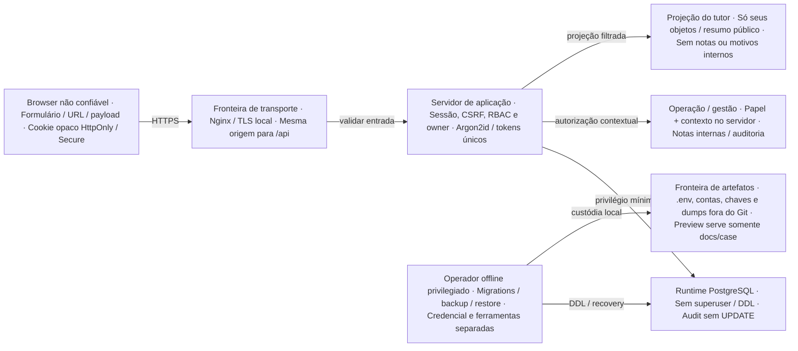

Menus não são controles de segurança. SMTP aceito não é entrega externa. TLS/backup não cobrem perda do host.

## 06-Data-Flow

Dados operacionais, projeções e comunicação

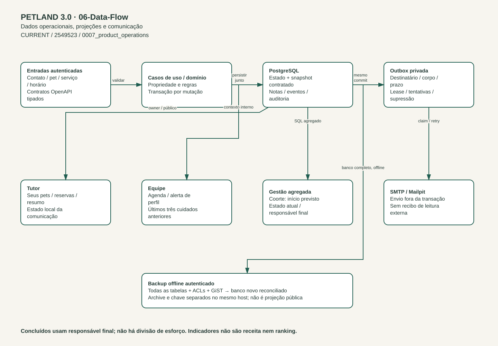

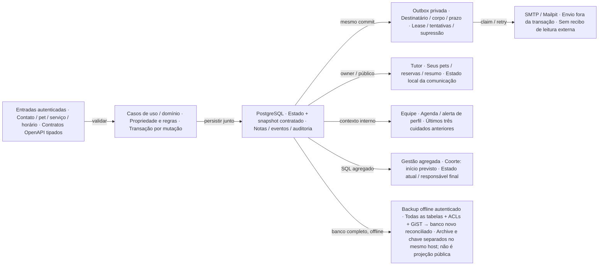

Concluídos usam responsável final; não há divisão de esforço. Indicadores não são receita nem ranking.

## 07-Deployment-Staging

CURRENT · máquina local / sem alta disponibilidade

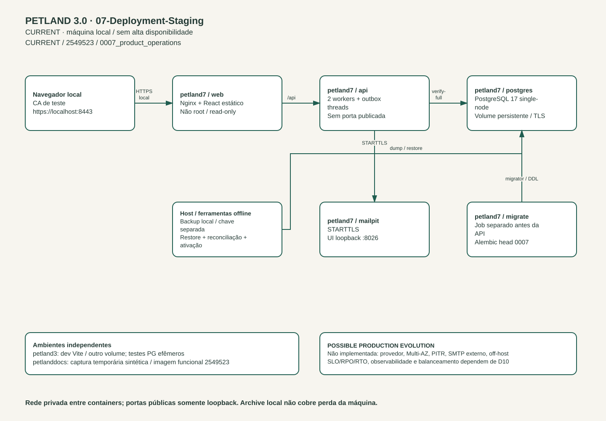

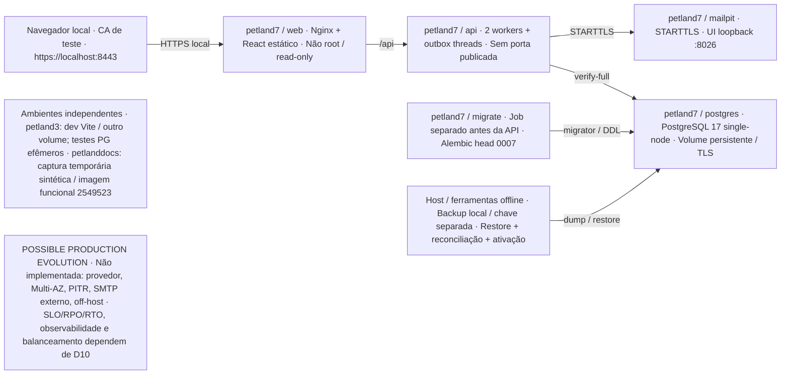

Rede privada entre containers; portas públicas somente loopback. Archive local não cobre perda da máquina.
