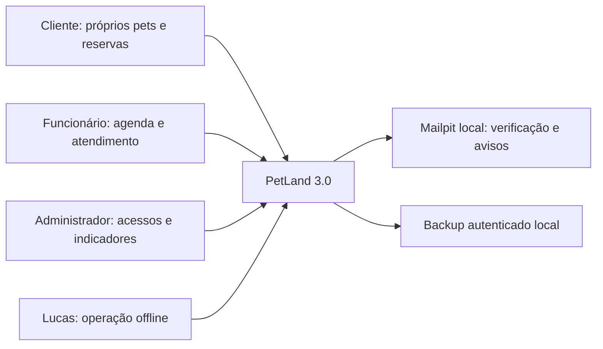
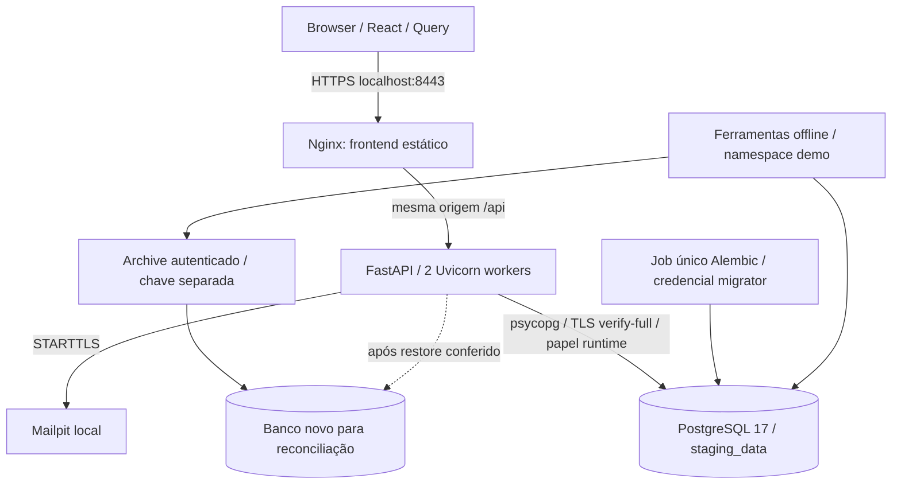
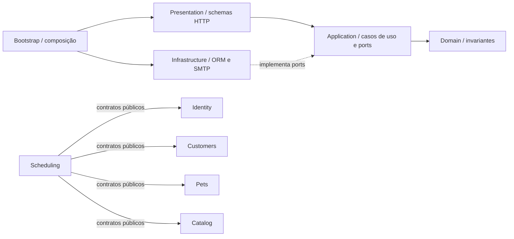

# Contexto e execução da candidata 3.0

Diagramas derivados do código P01–P08; não representam serviços externos já contratados. A demo é local e de uma loja, com dados fictícios.

## Contexto



## Containers de staging



API sem porta publicada. Web/API sem root, filesystem somente leitura e capabilities removidas. Migrations não são executadas por cada worker. Portas de banco/caixa são apenas loopback. `petland3` de desenvolvimento permanece separado de `petland7`. Chave e archive não entram em imagem, Git ou pacote de release. [ADR-014](../adr/0014-p07-operations.md).

## Módulos e direção de dependências



O diagrama não cria novos módulos: consultas de gestão ficam na agenda/operação. `system` implementa readiness. Domínio não importa FastAPI/SQLAlchemy, e application não depende de adapter concreto. O verificador de imports testa também violações negativas. [Arquitetura](README.md).

## Confirmação de reserva

```mermaid
sequenceDiagram
  actor Tutor as Cliente
  participant UI as React
  participant API as Caso de uso
  participant DB as PostgreSQL
  participant Worker as Outbox worker
  Tutor->>UI: Escolher pet, serviço e horário
  UI->>API: Consultar disponibilidade
  API-->>UI: Oferta/versionamento do servidor
  UI-->>Tutor: Resumo e confirmação explícita
  Tutor->>UI: Confirmar
  UI->>API: POST /me/appointments + sessão, CSRF, idempotência
  API->>DB: Transação / primeiro lock da configuração
  API->>API: Reautorizar ator e owner; revalidar oferta, calendário e recurso
  API->>DB: Reserva, snapshot, evento, auditoria, idempotência e outbox
  DB->>DB: Exclusões de intervalos de pet e recurso
  DB-->>API: Commit ou conflito
  API-->>UI: 201 ou erro 409
  API-->>Worker: Aviso disponível após commit
  Worker->>DB: Claim e tentativa de entrega fora da transação de reserva
  Note over Tutor,DB: Mesma chave recupera o mesmo resultado; não cria segunda reserva
```

Papéis, duração, preço e recurso não são escolhidos livremente pelo cliente. Conflito preserva as escolhas e pede novo horário; commit local não comprova envio SMTP. [ADR-003](../adr/0003-scheduling.md), [ADR-004](../adr/0004-identity.md).
