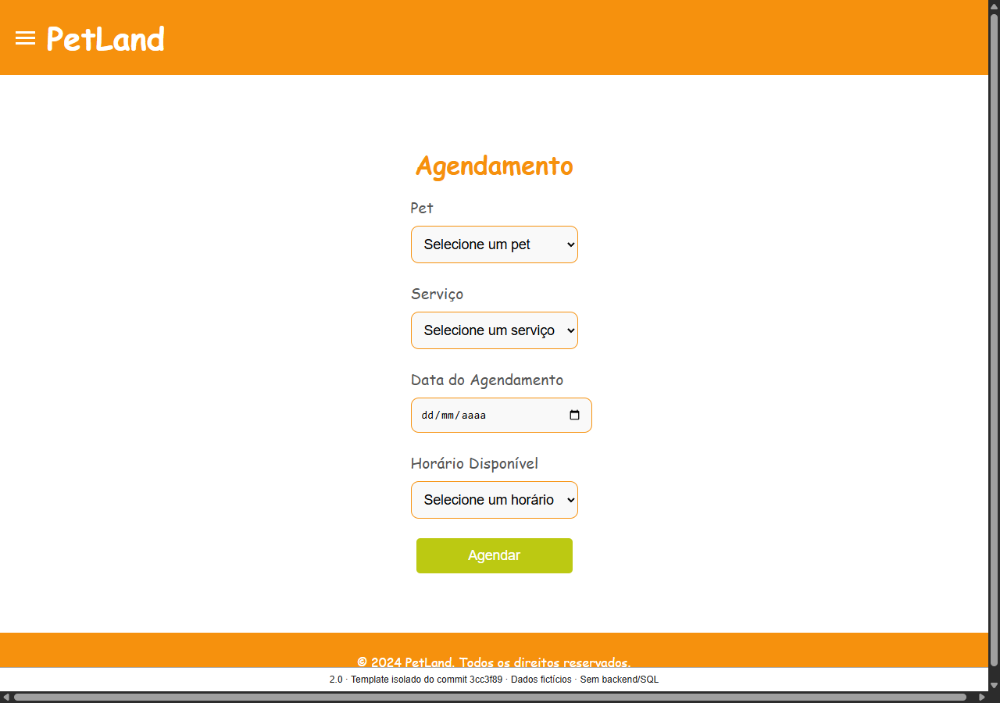

# PetLand 3.0 — o cuidado do pet, uma operação inteira

Case de produto e engenharia de **Lucas Marques**. Uma loja, três perfis, da disponibilidade ao cuidado concluído. **Apresentação final do escopo implementado; candidata `3.0.0-rc.1` para revisão humana, sem publicação em produção.**

[Abrir o case e assistir](index.html) · [Vídeo final, cerca de 4 minutos](media/final/petland-final-demo.webm) · [Roteiro usado](presentation-script.md) · [Transcrição](final-transcript.md) · [Legendas](media/final/petland-final-demo.vtt) · [Origem e ações reais](media/final/capture.json).


## Problem

Encontrar um horário é só o início. O tutor precisa de preço, duração e confirmação; a equipe precisa saber quem atender e quais cuidados o animal exige; a gestão precisa mudar a capacidade sem perder reservas. O PetLand foi reconstruído para conectar essas responsabilidades, com histórico e autoria.

O diagnóstico do 2.0 encontrou SQL junto a rotas/modelos, referências por CPF, contratos divergentes, verificações insuficientes de propriedade e disponibilidade por contagem de horários. Isso não comprovava uma reserva protegida sob concorrência. [Diagnóstico com evidências](../product/PetLand_3.0_Plano_Consolidado.md#21-evidências-do-código-e-escopo-auditado), [baseline preservada](../migration/baseline.md). Personas são hipóteses de produto, sem alegação de pesquisa com lojas reais.

## Before



**Template isolado** do commit `3cc3f898cde896b80fed587bf8c06f4aa46742f6`: links/forms inativos, scripts/fontes externas removidos, opções fictícias e aviso acrescentado. Não executamos o legado, acessamos MySQL ou comprovamos sua jornada. [Hashes e adaptações](media/before-provenance.json).

P03–P08 e snapshots posteriores permanecem preservados. O [player histórico P08](historical-p08.html), seu [manifesto](media/capture.json), [vídeo](media/petland-3.0-demo.webm) e [transcrição histórica](transcript.md) não são a demonstração final.

## Product decisions

- **Uma vaga real:** loja aberta, pessoa apta, escala da data, duração, bloqueios, recurso físico e ausência de conflito. O servidor atribui o profissional; o tutor escolhe cuidado e horário.
- **Confirmar é uma ação explícita:** o horário abre um resumo com preço/duração. Só a segunda confirmação cria a reserva; um snapshot conserva a oferta contratada.
- **Cuidado contínuo:** alergias/preferências acompanham o pet; a equipe reconhece as restrições atuais antes de iniciar. Nota interna e resumo público têm visibilidades distintas.
- **Mudar sem apagar:** chegada, execução, conclusão, falta, cancelamento, reagendamento e transferência preservam história. Escala de uma única data e capacidade física têm prévia de impacto.
- **Uma loja, sem taxas:** um pet e um serviço por reserva, três perfis e comunicação persistida. Sem escolha pública do profissional, grupos atômicos, pagamento ou multiempresa.

[Decisões D01–D12](../product/decisions.md) · [Produto implementado](../product/product-overview.md) · [Dores, cobertura e lacunas](../product/functional-gap-analysis.md).

## Architecture

**React/TypeScript → FastAPI → PostgreSQL 17.** Monólito modular com Hexagonal Architecture e DDD pragmático: seis módulos, domínio puro, casos de uso, ports pequenas, adapters e composição explícita. OpenAPI gera os tipos usados pelo cliente. Nginx/TLS serve o build estático no staging local; Alembic controla schema/migrations.

Uma loja não justificou serviços distribuídos. Fronteiras são verificadas por imports/testes; não foram criadas camadas vazias para demonstrar padrões. [Visão e diagramas](../architecture/overview.md), [transação de reserva](../architecture/diagrams/booking-transaction.svg), [DER/dicionário](../architecture/data-model.md), [ADRs](../adr/README.md).

## Final experience

Vídeo contínuo, sem áudio, aceleração ou cortes, com capítulos/legendas. Aplicação real do commit **`f3d70a2cce07d587351eadaa66864b7c1ae4444a`**, após merges dos PRs 11/12. Código funcional/infra/contrato conferidos contra esse SHA; ferramentas e apresentação pertencem a esta revisão. Ambiente HTTPS local **`petlandfinalcase`**, separado do staging pessoal, com PostgreSQL, identidades e SMTP reais da demo.

1. **Tutor:** conta demo verificada e contato preparado; início contextualizado → cadastrar Nala com alergia/preferência → catálogo → disponibilidade → resumo → confirmação → reserva persistida.
2. **Equipe:** painel diário → mesma reserva na agenda → contexto crítico → chegada → transferência com motivo → nota interna → início no horário real com reconhecimento das restrições → conclusão com resumo.
3. **Tutor e gestão:** histórico sem nota interna; aviso de pronto verificado no **Mailpit local**, sem entrega externa. Indicadores → salvar equipe em uma única data → alterar capacidade física → prévia bloqueada por reserva afetada → auditoria.

Preparação por APIs/ferramentas existentes: namespace/CA/contas próprios, banco novo com fixture fictício, serviço de **cinco minutos/R$ 40**, duas pessoas aptas, passo de um minuto, antecedência zero, lembrete de um minuto e exceção de expediente no dia. Reserva futura criada pela API comum do tutor para a prévia de impacto. Esses parâmetros encurtam o ensaio; não são recomendações comerciais. O relógio do host/servidor não foi alterado; nenhum comportamento foi simulado ou regra adicionada para filmar.

| Experiência final             | Captura real                                                      |
| ----------------------------- | ----------------------------------------------------------------- |
| Início do tutor               | [Dashboard](media/final/final-customer-dashboard.webp)            |
| Contratação informada         | [Resumo](media/final/final-booking.webp)                          |
| Trabalho de hoje              | [Painel operacional](media/final/final-operations-dashboard.webp) |
| Contexto do animal            | [Atendimento e alerta crítico](media/final/final-attendance.webp) |
| Exceção de equipe             | [Escala por data](media/final/final-roster.webp)                  |
| Limite físico                 | [Capacidade compartilhada](media/final/final-capacity.webp)       |
| Gestão e atribuição           | [Indicadores](media/final/final-management.webp)                  |
| Mudança com reserva existente | [Prévia bloqueada](media/final/final-impact.webp)                 |
| Tutor em 320 px               | [Histórico móvel](media/final/final-customer-mobile.webp)         |

## Engineering highlights

| Camada                                           | Implementação e motivo                                                                                                  |
| ------------------------------------------------ | ----------------------------------------------------------------------------------------------------------------------- |
| **React · OpenAPI**                              | React/TS, TanStack Query e RHF/Zod; tipos derivados dos endpoints reais, drift verificado na CI.                        |
| **FastAPI · Modular monolith · Hexagonal · DDD** | Casos de uso/autorização separados de HTTP/SQL; contratos públicos entre módulos.                                       |
| **PostgreSQL · Constraints · Concurrency**       | Exclusões GiST para pet/pessoa; lock da loja primeiro. Pools físicos verificados sob a mesma coordenação transacional.  |
| **Idempotency · Transactional outbox**           | Retentativa não duplica contratação; evento de comunicação persistido na transação. SMTP aceito não equivale a entrega. |
| **Security**                                     | Sessão opaca, CSRF, papéis/propriedade, identidades próprias e TLS local. Dados privados ausentes do payload público.   |
| **CI · Testing**                                 | PostgreSQL real, migrations, fronteiras, contratos, React, navegador, axe/reflow, carga e recuperação.                  |

[API](../architecture/api.md), [segurança/permissões](../architecture/authorization.md), [RNFs](../architecture/non-functional-requirements.md). O bloco visual no [case](index.html#engineering) resume essas relações; arquitetura aprofundada nos documentos.

## Quality evidence

A captura confere persistência, horário preservado na transferência, conclusão, ausência da nota privada no payload público, SMTP no Mailpit e prévia sem mutação. Desktop/mobile exercitam axe, reflow e ausência de erro JS. O player verifica links, duração, seek e legendas a 1280/320 px. [Evidência desta apresentação](../evidence/Final-case.md), [proveniência com hashes](media/final/capture.json).

A auditoria anterior passou **128 Python, 20 React e 15 E2E**, com um skip mobile previsto para o primeiro admin singleton. São resultados anteriores, não testes atribuídos às capturas. [Reprodução independente](../evidence/Reproducibility-review.md). [CI `31920b4`, tentativa 2](https://github.com/O-marqs/petland-2.0/actions/runs/37050291620/attempts/2): três jobs aprovados após falha de leituras na primeira tentativa; metas 400/800 ms preservadas. Axe não substitui leitor de tela/aceite humano.

## Results

A mesma reserva percorre tutor/equipe/gestão, com persistência e comunicação local. O backoffice responde o que fazer hoje, configura uma data específica, apresenta cuidado crítico e inspeciona impacto. Gestão consulta carga/conclusões/duração com atribuição pelo responsável final, sem ranking automático.

No laboratório CI anterior `31920b4`, tentativa 2, p95 da reserva **414,61 ms** (meta 800), dashboard **250,02 ms** e maior leitura **278 ms** (meta 400). A tentativa 1 teve dashboard 494,06 ms/auditoria 413,57 ms e falhou. Não houve benchmark comparável do 2.0, ganho percentual, medição de campo ou validação de escala produtiva. [Fontes e recortes](../architecture/non-functional-requirements.md), [auditoria](../evidence/Reproducibility-review.md).

## Trade-offs

Lock da loja simplifica atomicidade/ordem de locks e limita paralelismo de escrita. Responsável final permite medir operação, mas não divide crédito por transferências. Um serviço por reserva evita prometer grupos atômicos inexistentes. Outbox desacopla comunicação; SMTP aceito não comprova entrega/leitura. Números da demo não descrevem uma loja real.

## What I would do in real production

Concluir aceite dos três perfis/leitor de tela; decidir licença; definir provedor/domínio/SMTP externo; testar entrega, custódia de chaves/backup fora do host, retenção, observabilidade, SLO e RPO/RTO no ambiente alvo. D10 adia essas decisões. Dados reais/importação/implantação exigem escopo próprio. [Gates](../release/candidate.json), [runbook de promoção](../runbooks/release.md).

## What I intentionally did not build

Multiempresa, pagamentos, taxas, escolha pública de profissional, reservas atômicas para vários pets, recorrência, alteração de serviço durante execução, férias em lote e recepção em tela única. O modelo expõe lacunas; o case não as demonstra como entregues. D08/D12 dispensam importar o legado.

## Run it yourself

[Quick Start](../../README.md#quick-start) e [requisitos por caminho](../release/reproducibility.md). `main` ainda contém o legado; apresentação na branch `petland-3.0-final-case`.

Para abrir só o case público, da raiz com Python 3.11+:

```sh
python scripts/portfolio_preview.py --port 8780
```

Abra http://127.0.0.1:8780. Serve só `docs/case`, com ranges para seek, sem expor `.local`/raiz. [Comandos de regravação](presentation-script.md#regravar-sem-mudar-o-produto). O material não concede aceite, merge, tag ou release estável.
