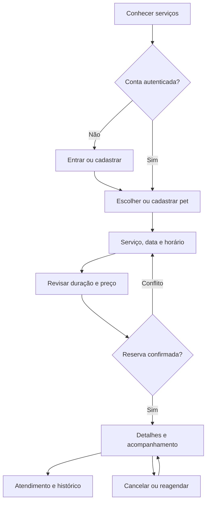
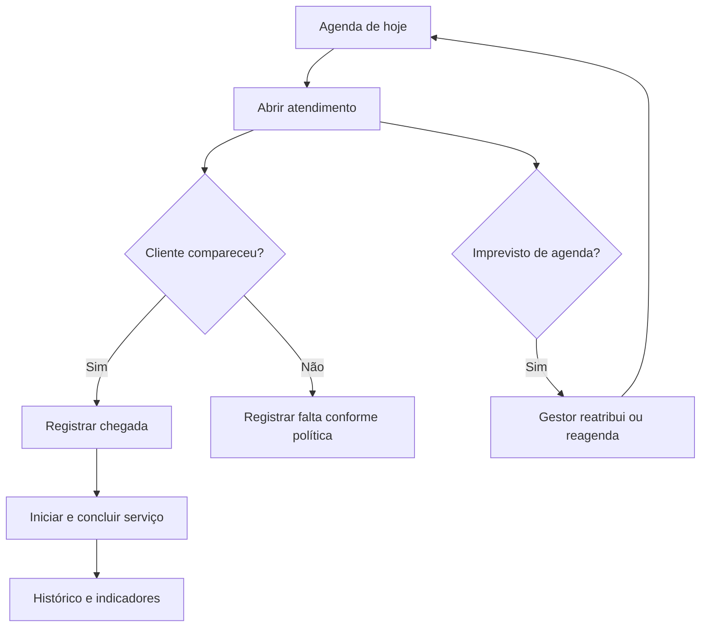
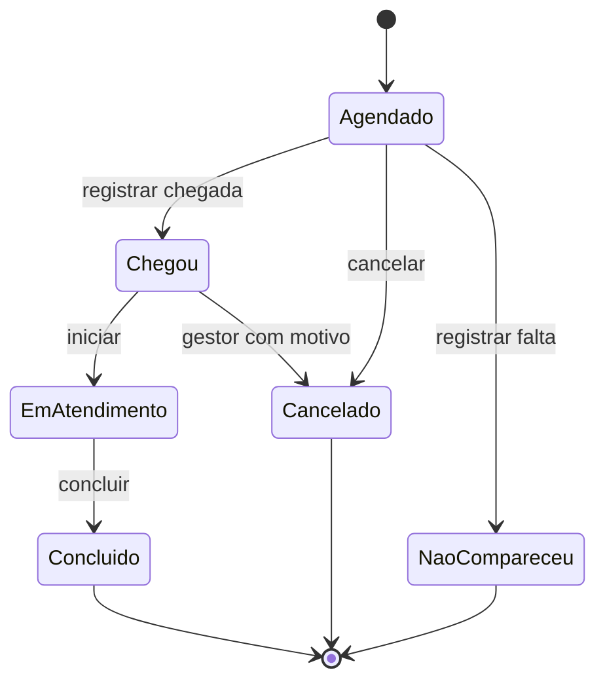
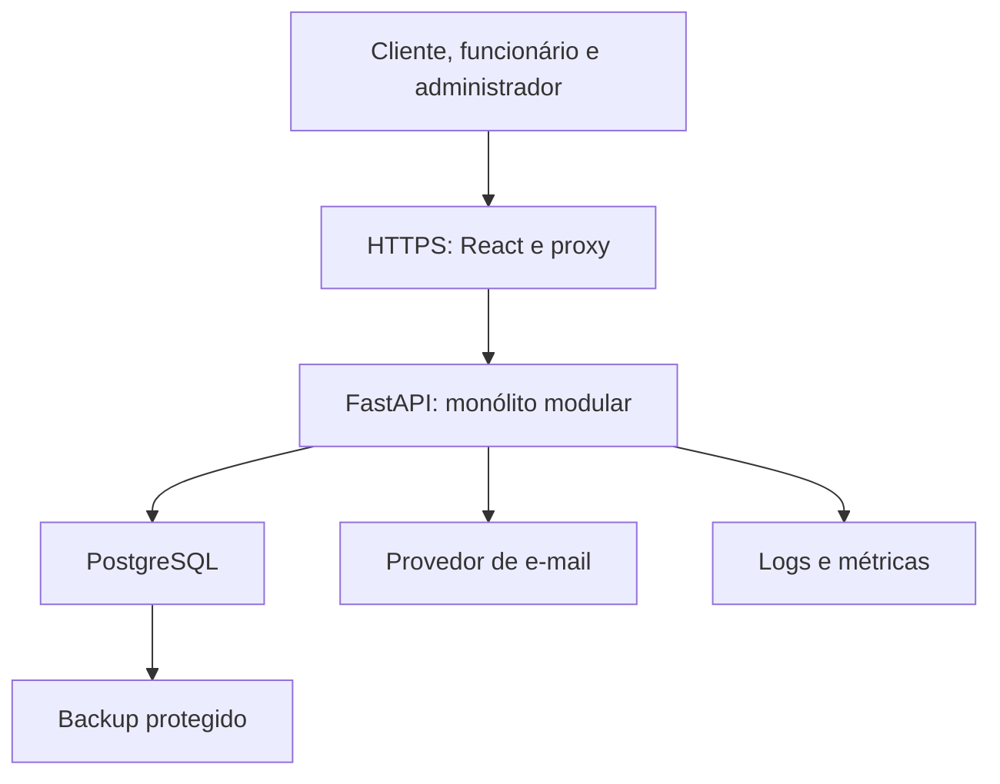
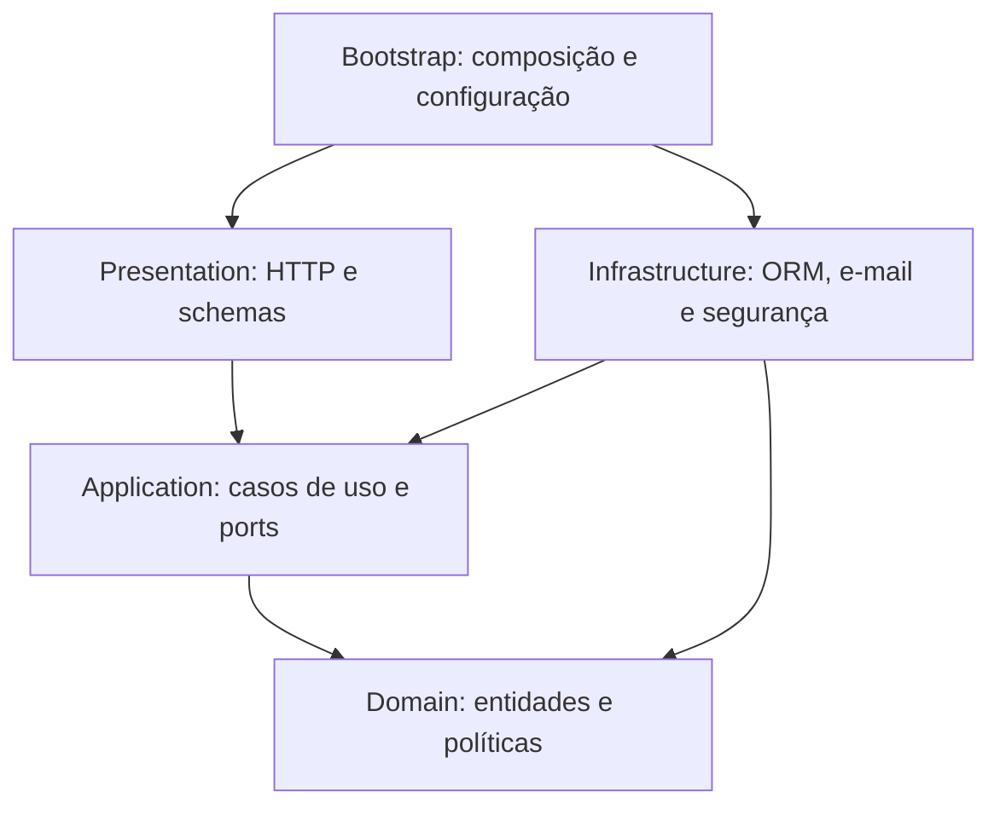
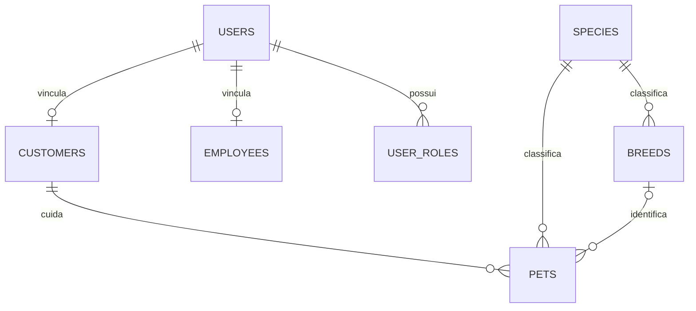
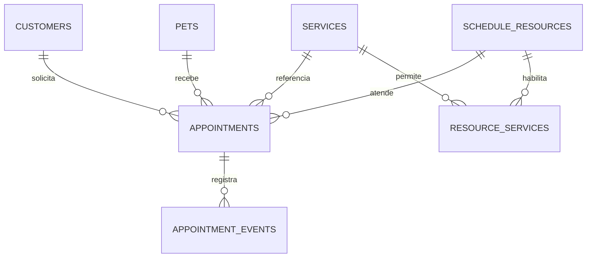
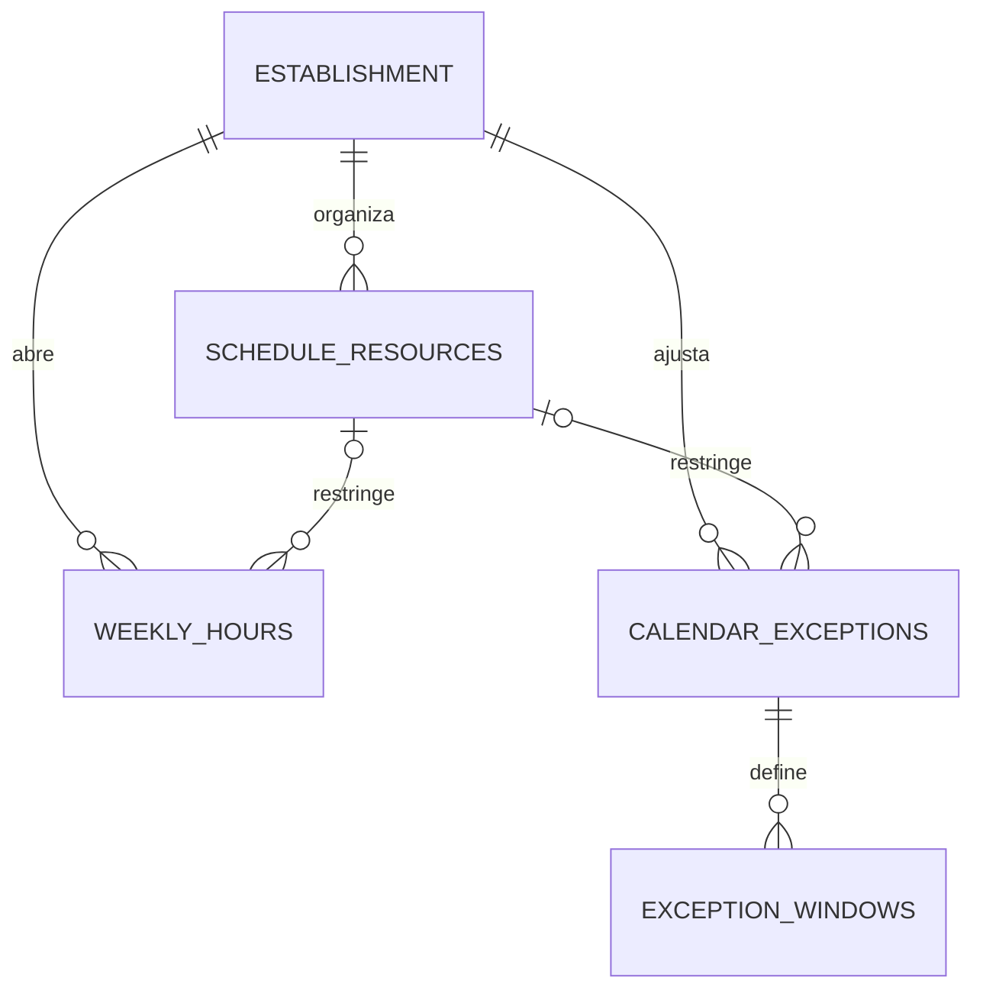
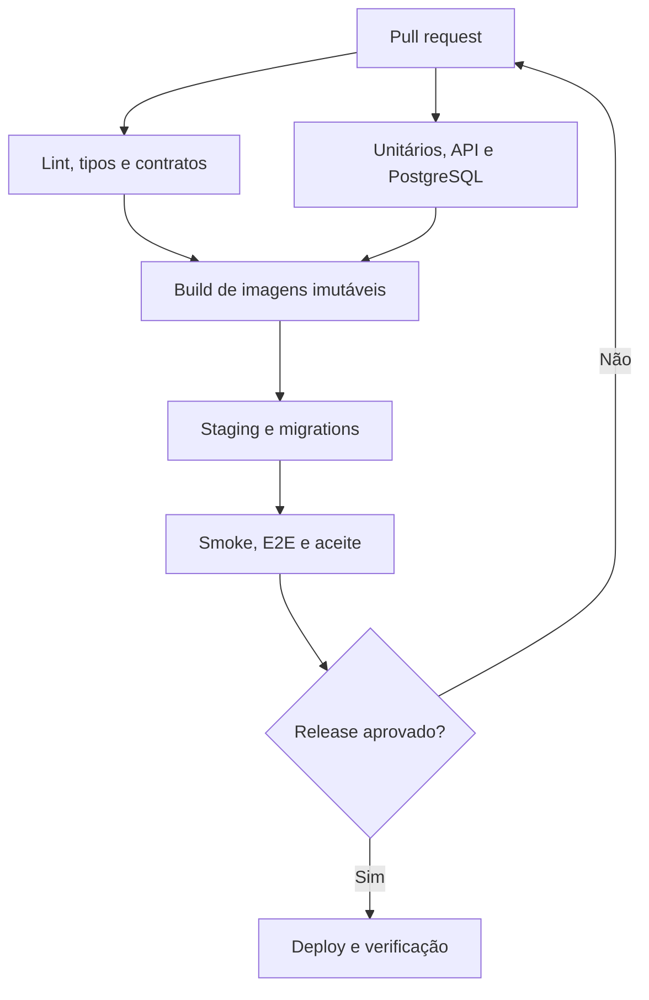

# PetLand 3.0 — Plano consolidado de produto, arquitetura e UX

**Status:** proposta para aprovação; nenhuma implementação autorizada por este documento.

**Autor do projeto:** Lucas Marques · **Análise:** 23/09/2026 · **Documento:** 1.0

**Legado analisado:** [O-marqs/petland-2.0](https://github.com/O-marqs/petland-2.0), branch `main`, commit [`3cc3f898cde896b80fed587bf8c06f4aa46742f6`](https://github.com/O-marqs/petland-2.0/tree/3cc3f898cde896b80fed587bf8c06f4aa46742f6), de 24/11/2024, mensagem `Final2`.

## 0. Decisão proposta

Construir o PetLand 3.0 como um **monólito modular para a operação de um estabelecimento**, com FastAPI, React/TypeScript, PostgreSQL, SQLAlchemy e Alembic. A unidade de valor do MVP é uma jornada completa e confiável: **cadastrar um pet → reservar disponibilidade real → executar o atendimento → consultar seu histórico**.

O principal ganho de engenharia não será a troca de Flask por FastAPI. Será tornar explícitos os limites de autorização, as regras de agenda, a integridade dos dados e os contratos entre módulos. O principal ganho de produto será reduzir a incerteza sobre o agendamento e dar à equipe uma agenda operacional utilizável.

O MVP proposto inclui três perfis e suas necessidades essenciais. Estoque, caixa, pagamentos, prontuário veterinário, resultado de exames, múltiplas lojas e automações de marketing ficam fora do primeiro lançamento. As evidências desses temas no legado serão preservadas na documentação, sem apresentá-los como funcionalidades concluídas.

**Convenções deste documento:** “existente” exige evidência no código; “proposta” é uma recomendação para o 3.0; “pendente” exige decisão de Lucas ou do responsável pela operação. Números de preço, duração e horários nos wireframes são exclusivamente dados de demonstração.

### Sumário

1. Método e limites da análise
2. Diagnóstico do legado
3. Inventário de funcionalidades e rotas
4. Inventário das 13 telas existentes
5. Visão do produto, personas e jornadas
6. Escopo e requisitos
7. Telas e navegação do 3.0
8. Identidade visual, UX e componentes
9. Modelo de domínio
10. Regras de negócio e concorrência
11. Arquitetura e monorepo
12. Modelo de dados
13. Contratos de API
14. Segurança
15. Qualidade e testes
16. Infraestrutura e operação
17. Migração e preservação do legado
18. Roadmap executável
19. Decisões para aprovação
20. Case de portfólio e rastreabilidade
21. Evidências do código
22. Referências técnicas

## 1. Método e limites da análise

- A árvore do commit contém **3.068 arquivos**. Foram excluídos da análise autoral os **2.998 arquivos de `.venv/`** e **14 arquivos de cache Python**. Restaram **56 arquivos**: código, templates, CSS, JS, testes, dois recursos de imagem e arquivos vazios de pacotes.
- Foram examinados `app.py`, todos os modelos e rotas, conexão com banco, módulo alternativo de autenticação, os 13 templates, os cinco scripts de interface, os seis CSS, os testes Python/JavaScript, a gravação Selenium e os dois scripts exploratórios.
- Os **23 arquivos Python** foram analisados sintaticamente, sem importar a aplicação ou executar seus módulos. Não foram encontrados erros de sintaxe Python nessa verificação. Isso não valida imports, integrações ou regras de negócio.
- Foram cruzados os nomes de templates, os registros de blueprints, os endpoints usados no JavaScript, os campos de formulários e as consultas SQL. Foram identificadas **25 declarações de rotas em blueprints registrados**, incluindo duas declarações para o mesmo caminho de logout; quatro rotas de serviço e duas de JWT não entram no aplicativo principal.
- Não há README, manifesto autoral de dependências, lockfile, DDL/dump SQL, migrations, Dockerfile, Compose ou workflow CI na árvore examinada. A existência de bibliotecas dentro de `.venv/` não comprova uso pela aplicação.
- A consulta às referências remotas retornou somente `main` e nenhuma tag. Não foi feita auditoria de todos os commits históricos, forks, bancos externos ou ambientes publicados.
- **Não foi executado o sistema nem a suíte legada.** Não há banco/DDL fornecido e o ambiente local de análise não contém as dependências Flask do projeto. Não foi utilizado o ambiente virtual versionado. Foram registrados obstáculos estáticos à execução, sem declarar testes aprovados ou funcionalidades funcionando em produção.
- Não houve alteração de arquivos, branches, commits ou configurações no repositório remoto; não houve conexão ao MySQL, migração, envio de e-mails ou deploy. Os documentos e desenhos são artefatos de planejamento.

### Classificação de evidência

| Marca | Significado |
|---|---|
| **I — implementada no código** | Existe lógica concreta para a operação. Não significa validação ponta a ponta. |
| **P — parcial** | Parte relevante existe, mas o fluxo tem lacunas, inconsistências ou bloqueios identificados. |
| **S — sugerida** | Há rascunho, arquivo órfão, placeholder ou código desconectado. |
| **N — não identificada** | Não encontrada no escopo inspecionado. Não é uma afirmação sobre sistemas externos. |
| **V — validar execução** | Marcador adicional: depende de schema, dados, ambiente, navegador ou teste dinâmico. |

## 2. Diagnóstico do legado

### 2.1 Arquitetura e tecnologias

O aplicativo é um monólito Flask com blueprints organizados por área, renderização Jinja/HTML e JavaScript imperativo. O prefixo `/api` contém tanto páginas HTML quanto operações JSON e formulários; não representa uma API REST uniforme. As rotas coordenam HTTP, autenticação, SQL e feedback visual. Os modelos misturam dados de domínio, `UserMixin`, persistência e mensagens de apresentação [E01, E02, E12].

| Elemento | Evidência de uso | Avaliação |
|---|---|---|
| Python + Flask | Imports e inicialização em `app.py` | Base adequada ao projeto original, sem factory/configuração por ambiente. |
| Flask-Login | `LoginManager`, `login_user`, `login_required` | Sessões presentes, porém sem modelo unificado de identidade/permissão. |
| MySQL Connector | Conexões e SQL parametrizado nos modelos | Consultas parametrizadas são um ponto positivo; integridade física desconhecida sem DDL. |
| bcrypt | Cadastro e validação de senha de cliente | Há hashing para clientes; não generalizar “todas as senhas em texto puro”. |
| HTML/Jinja/CSS/JS | 13 templates, estilos inline e arquivos estáticos | Interface server-rendered com cópia de navegação, estilos e validações. |
| JWT + Werkzeug | `utiils/auth.py` | Alternativa desconectada, não mecanismo ativo do `app.py`. |
| unittest/pytest/Jest/Selenium IDE | `Tests/` | Artefatos de teste presentes; estrutura e cobertura de integração insuficientes. |
| SQLAlchemy/Alembic no ambiente virtual | Metadados de dependências versionadas | Não há uso autoral identificado de ORM ou migrations. Não chamar o legado de SQLAlchemy. |

### 2.2 Achados por gravidade

Gravidade expressa risco caso esse código esteja exposto em um ambiente funcional. Não houve exploração de sistema publicado.

| ID | Gravidade | Achado e consequência | Evidência | Direção no 3.0 |
|---|---|---|---|---|
| L01 | Crítica | Exclusão de agendamento por ID aceita GET/POST sem autenticação, dono ou perfil; apaga o registro. | E03 | Cancelamento autenticado, autorização por objeto e evento histórico. |
| L02 | Alta | Perfil e atualização de pet consultam somente o ID; usuário autenticado pode alcançar objetos alheios se a operação chegar ao banco. | E04 | Filtro obrigatório por proprietário e teste entre dois clientes. |
| L03 | Alta | Criação de agendamento aceita IDs do formulário e não confirma propriedade do pet, compatibilidade, data, horário ou capacidade. | E05 | Caso de uso transacional que recalcula e valida tudo. |
| L04 | Alta | Capacidade só aparece em consulta de leitura; requisições concorrentes podem ultrapassar o limite. | E05, E06 | Lock transacional e restrições de sobreposição no PostgreSQL. |
| L05 | Alta | Login de funcionário compara a senha enviada diretamente com a coluna; não há hashing nessa função. | E07 | Identidade unificada e hash seguro; credenciais legadas de funcionários exigem redefinição. |
| L06 | Alta | Chave de sessão literal previsível, conexão configurada no código e `debug=True` no lançamento direto. | E01, E08 | Segredos externos, configuração validada e debug desabilitado em produção. |
| L07 | Alta | Sessão usa CPF para dois tipos de usuário e procura cliente antes de funcionário. O mesmo CPF pode resolver a identidade errada. | E01, E07, E09 | UUID de usuário único e associação explícita de perfis. |
| L08 | Alta | Rota operacional exige apenas login, sem autorização de funcionário; consulta todos os atendimentos da data. | E10 | Permissão operacional explícita e projeção mínima de dados. |
| L09 | Alta | Não há proteção CSRF identificada nas mutações por sessão; logout e exclusão aceitam GET. | E03, E11 | Token CSRF, validação de origem e ausência de mutação por GET. |
| L10 | Alta | `colaboradores_cpf` recebe CPF do cliente no agendamento; semântica conflita com o nome e com possível FK. | E05, E12 | Separar cliente, criador, recurso e operador. Validar significado antes de migrar. |
| L11 | Alta | Login consulta `colaboradores`, recarga da sessão consulta `funcionario`; `Funcionario(*row)` depende da ordem física de colunas e de construtor com campos de agenda. | E07 | Separar conta, funcionário e atendimento; mapeamento explícito. |
| L12 | Média | Falha de login retorna dict truthy; rota tenta `login_user` como se fosse um usuário. Cadastro retorna objeto, tupla ou dict. | E09 | Resultado/erros tipados; separar resposta HTTP de domínio. |
| L13 | Média | Dois conjuntos de colunas de agendamento: `pet_id/servico_id` e `pet_idPet/serviço_id`. | E12 | Modelo único, migrations e reconciliação com DDL real. |
| L14 | Média | Horários divergem: modelo 08h–17h; rota gera 09h–17h, com limite 2. Comparação entre string e tipo retornado por MySQL pode falhar. | E06 | Política única de agenda com intervalos, duração e timezone. |
| L15 | Média | `perfilPet.html` difere de `PerfilPet.html`; quebra em filesystem sensível a maiúsculas. | E04, E13 | Rotas React e build em Linux; nomes consistentes. |
| L16 | Média | `today_date` não é fornecido; não há bloqueio confiável de passado. Cadastro usa `const idade` e depois `idade--`, que lança erro no ramo correspondente. | E14, E15 | Validação backend, data derivada corretamente e testes de limites. |
| L17 | Média | CEP exige hífen mas digitação bloqueia caracteres não numéricos; regras de senha/CPF/telefone divergem entre scripts e testes. | E15, E16 | Normalização única, feedback de campo e contratos de validação. |
| L18 | Média | Campo CEP, complemento e nascimento são enviados pelo front mas ignorados no INSERT do cliente. | E09, E15 | Coletar apenas o necessário; não prometer persistência inexistente. |
| L19 | Média | Lista “meus agendamentos” limita a data futura/atual; não entrega histórico. Exclusão destrutiva elimina rastreabilidade. | E03, E12 | Histórico por pet e por cliente, com cancelados preservados. |
| L20 | Média | Erros de conexão retornam `None`, mas chamadores assumem conexão válida; fechamento também assume objeto válido. Retornos antecipados podem deixar conexão aberta. | E08, E09 | Session/UoW contextual, rollback e tradução consistente de erros. |
| L21 | Média | Prints de formulários, CPF e linha de funcionário; exceptions podem aparecer em flash. | E05, E07, E11 | Logs estruturados com redaction; erros públicos sem SQL/PII. |
| L22 | Média | Recuperação de senha é link sem rota; scripts simulam sucesso com timer. | E17 | Fluxo real de token e e-mail, com testes de expiração e uso único. |
| L23 | Média | Testes Python referenciam módulos inexistentes; JS testa cópias locais, Selenium grava ações sem asserts. | E18, E19 | Suíte reproduzível com testes do código realmente entregue. |
| L24 | Média | Navegação usa divs clicáveis e login sem labels; layouts fixos e várias páginas sem media query; fontes declaradas não carregadas. | E13, E20 | Semântica, navegação por teclado, tipografia hospedada e validação responsiva. |
| L25 | Baixa/Média | Código de serviços, JWT, telas alternativas e scripts estão desconectados; há duplicação de LoginManager e caminho `/api/logout`. | E01, E11, E21, E22 | Uma composição explícita, rotas únicas e inventário de decisões sobre rascunhos. |
| L26 | Média | Não há schema/migrations, setup, pipeline, configuração de testes ou dependências reproduzíveis autorais. | E23 | Base de engenharia e instalação validada a partir de clone limpo. |
| L27 | Média | Consulta pública `/cliente/<cpf>` não exige login, mas tenta serializar objeto `Cliente` diretamente. Não é possível afirmar vazamento JSON bem-sucedido. | E11 | Substituir por `/me` e endpoints administrativos autorizados; não expor CPF em URL. |

**Pontos a preservar como aprendizado:** decomposição inicial por entidades, uso de parâmetros SQL, hashing bcrypt para clientes, consultas de pets filtradas por cliente na listagem, referências espécie/raça/gênero e primeiro investimento em testes. O 3.0 deve demonstrar como esses fundamentos foram sistematizados.

### 2.3 Persistência observada

As entidades abaixo são inferidas das consultas, não de um schema físico comprovado:

| Tabela referenciada | Campos/relacionamentos observados | Limitação |
|---|---|---|
| `cliente` | CPF, nome, e-mail, telefone, endereço, hash de senha | CPF usado como identidade; unicidade de e-mail e constraints desconhecidas. |
| `colaboradores` / `funcionario` | CPF, nome, e-mail, senha, possível acesso | Nomes conflitantes; não concluir que ambas existem. |
| `pet` | ID, nome, idade, cliente, gênero, `animal_idanimal`, observação | `animal_idanimal` é usado como raça; `cliente_cpfl` no objeto tem grafia diferente da coluna `cliente_cpf1`. |
| `especie` | ID, descrição | Referência de catálogo. |
| `raca` | ID, descrição, `espécie_id` | Espécie deriva da raça na modelagem observada. |
| `genero` | ID, nome | Não há definição formal de valores admitidos. |
| `servico` | ID, nome | Preço, duração e ativação não identificados. |
| `agendamento` | ID, dia, hora, pet, serviço, `colaboradores_cpf` | Sem status/duração/auditoria encontrados no SQL autoral; colunas divergentes. |

Não foram identificados índices, FKs, tipos, collation, engine, volumes ou política de backup do banco real. Tudo isso deve ser obtido em uma etapa autorizada de descoberta de dados.

## 3. Inventário de funcionalidades e rotas

### 3.1 Funcionalidades

| Funcionalidade | Estado | O que foi comprovado / o que falta | Evidências |
|---|---|---|---|
| Cadastro de cliente | P + V | Formulário, INSERT e bcrypt; contratos de erro inconsistentes e validação majoritariamente no navegador. | E09, E15 |
| Login de cliente | P + V | Consulta por e-mail e verificação bcrypt; tratamento de credencial inválida incorreto. | E09 |
| Login de funcionário | P + V | Consulta por credenciais; recarga usa outra tabela e identidade sem discriminação. | E07 |
| Logout | I + V | `logout_user()` existe; caminho duplicado e GET mutável. | E11 |
| Página inicial autenticada | I + V | Navegação e conteúdo estático, sem indicadores do cliente. | E20 |
| Consultar/editar próprio perfil | I + V | Nome, telefone e endereço; e-mail/CPF bloqueados visualmente; entrada limitada. | E11, E24 |
| Cadastro de pet | P + V | INSERT associado ao cliente logado, seleção dinâmica de catálogos; falha no model pode virar flash de sucesso. | E04, E25 |
| Listar próprios pets | I + V | SQL filtra CPF do cliente; interface chama raça de espécie. | E13, E25 |
| Perfil/edição de pet | P + V | Query e UPDATE; conflito de nome do template e ausência de checagem de dono. | E04, E13 |
| Catálogos de espécies/raças/gêneros | I + V | Endpoints de leitura e queries; dependem de dados existentes. | E25 |
| Listar serviços para agendar | I + V | Consulta `id_servico, servico_nome` e select no formulário. | E12, E14 |
| Consultar horários | P + V | Consulta contagem por hora, limite fixo; tipos, duração e consistência não resolvidos. | E06 |
| Criar agendamento | P + V | INSERT concreto; ausência de invariantes e relação do cliente ambígua. | E05 |
| Consultar próximos agendamentos | I + V | JOINs e filtro de data; não é histórico completo. | E12 |
| Excluir agendamento | I + V | DELETE concreto; vulnerável e destrutivo. | E03 |
| Agenda operacional por data | I + V | Formulário, query de todos os atendimentos do dia e renderização; sem operação de status. | E10 |
| CRUD de serviços | S | Rotas escritas, blueprint comentado e modelo `Servico` ausente em arquivo vazio. | E21 |
| JWT alternativo | S | Blueprint e helpers desconectados, hash de cliente incompatível com mecanismo principal. | E22 |
| Recuperar/redefinir senha | S | Link, CSS e simulações JS; sem páginas/rotas/envio real identificados. | E17 |
| Pendentes/subserviços/edição de agenda | S | Tela órfã e chamadas a servidor localhost:3001 não presente; botão de editar sem implementação. | E26 |
| Resultado de exames | S | Apenas link `href="#"` em tela órfã. | E27 |
| Reagendamento, status, check-in e histórico de alterações | N | Não encontrados casos de uso, campos ou rotas correspondentes. | E23 + inventário das rotas |
| Gestão de funcionários/clientes, permissões administrativas | N | `acesso_id` é indício de campo, sem política ou jornada de administrador. | E07, E23 |
| Preço, duração, restrições de serviço e gestão de capacidade | N/P | Limite numérico de agenda é parcial; gestão e demais conceitos não identificados. | E06, E12 |
| Pagamento, estoque, relatórios, notificações externas | N | Nenhuma integração ou fluxo autoral identificado. | E23 |

### 3.2 Superfície HTTP do aplicativo principal

Todos os caminhos abaixo recebem `/api` antes do caminho mostrado. “Login” significa presença do decorator; não confirma autorização por perfil/objeto.

| Blueprint | Caminho | Métodos declarados | Proteção/observação |
|---|---|---|---|
| Cliente | `/tela_login`, `/tela_cadastro` | GET | Públicas. |
| Cliente | `/cliente/login`, `/cliente/cadastrar_cliente` | POST | Públicas; JSON e redirecionamentos HTML. |
| Cliente | `/tela_inicial`, `/cliente/perfil` | GET | Login. |
| Cliente | `/cliente/editar_cliente` | GET, POST | Login; tenta ler JSON também no GET. |
| Cliente | `/cliente/<cpf_cliente>` | GET | Sem login; serialização do objeto precisa ser validada. |
| Cliente e funcionário | `/logout` | GET | Duas regras coincidentes; login. |
| Funcionário | `/telalogin_funcionario` | GET | Pública. |
| Funcionário | `/funcionario/login` | POST | Pública. |
| Funcionário | `/buscar_agendamentos` | GET, POST | Login; busca por data ocorre no POST. |
| Pets | `/meus_pets`, `/pet/perfil_pet/<int:id_pet>` | GET | Login; só listagem aplica proprietário. |
| Pets | `/pet/cadastrar`, `/pet/editar_pet` | GET, POST | Login; edição aceita ID fornecido pelo cliente. |
| Pets | `/obter_especies`, `/racas`, `/obter_generos` | GET | Login; `especie_id` é query param de raças. |
| Pets | `/agendamento_pets` | GET | Login; compõe formulário com pets e serviços. |
| Agenda | `/get_available_times/<data_agendamento>` | GET | Login. |
| Agenda | `/submit_agendamento` | POST | Login; formulário. |
| Agenda | `/meus_agendamentos` | GET | Login; filtro por CPF em coluna ambígua. |
| Agenda | `/apagar_agendamento/<int:agendamento_id>` | GET, POST | Sem login. |

Não há rota `/` identificada. `/recuperar-senha`, `/get_available_hours/{date}` e `/api/agendamentos` usados em partes da UI não correspondem a rotas desse aplicativo. Rotas de serviços e JWT constam do inventário de rascunhos, não da superfície registrada.

## 4. Inventário completo das telas 2.0

Decisões abaixo são **propostas para reconstrução no 3.0**, sem remoção de arquivos do legado nesta fase.

| Template | Objetivo/perfil e funcionalidades | Problemas fundamentados | Decisão e destino |
|---|---|---|---|
| `telalogin_cliente.html` | Cliente: entrar, cadastrar, recuperar senha. | Sem labels; recuperação sem rota; sem media queries; erro via HTML/redirecionamento [E17, E20]. | **Unificar** com login de funcionário em `/entrar`; recuperar senha real. |
| `telalogin_funcionario.html` | Funcionário: autenticação separada. | JS busca `flash-message` inexistente; mesma recuperação quebrada; backend inconsistente [E07, E28]. | **Unificar** acesso; destino por permissões, sem escolher privilégio no login. |
| `telacadastro_cliente.html` | Público: cadastro extenso de cliente. | Coleta excessiva, campos ignorados, CEP e idade com defeitos, regras só no front [E15]. | **Substituir** por cadastro mínimo e verificação de e-mail; complemento de perfil quando necessário. |
| `telainicial.html` | Cliente: menu e apresentação da loja. | Pouca informação útil após login; HTML com estrutura irregular; sem adaptação explícita [E20]. | **Substituir** por dashboard com próximo atendimento, pets e ação principal. Conteúdo institucional vai à área pública. |
| `telainicialCliente.html` | Aparente início alternativo: agendamento/exames. | Órfão, links `#`, exame sem implementação [E27]. | **Unificar** intenção com início do cliente; preservar evidência do rascunho. Exames fora do MVP. |
| `addPet.html` | Cliente: nome, espécie, raça, gênero, idade, observação. | Campos em duas colunas sem media query; menu sem implementação local; erros de catálogos só no console; validação fraca [E25, E29]. | **Substituir** por formulário compartilhado criar/editar, responsivo e com raça desconhecida permitida. |
| `meuspets.html` | Cliente: cards dos pets e criação. | Raça rotulada como espécie, div clicável sem teclado, vazio pouco orientado [E13]. | **Manter conceito**, reconstruir lista com links semânticos, estados vazios e resumo. |
| `PerfilPet.html` | Cliente: dados do pet e edição de nome/observação. | Rota chama outro nome de arquivo; acesso sem dono; formulário bloqueia demais os dados [E04, E13]. | **Unificar** perfil + edição + histórico em rota do pet e formulário compartilhado. |
| `alterarPerfil.html` | Cliente: editar nome/endereço/telefone. | Campos pessoais expostos sem necessidade contextual, cancelamento recarrega tudo, alertas genéricos [E24]. | **Manter conceito**, reduzir campos e separar segurança da conta. |
| `telagendamento.html` | Cliente: pet, serviço, data, horário. | Sem duração/preço/resumo, disponibilidade incompleta, variável de data ausente e função JS obsoleta [E06, E14]. | **Substituir** por fluxo em 3 etapas com revisão e tratamento de conflito. |
| `meusagendamentos.html` | Cliente: próximos atendimentos e exclusão. | Sem histórico/status/detalhes; botão destrutivo sem explicação [E03, E12]. | **Substituir** por lista Próximos/Histórico e detalhe com cancelar/reagendar segundo política. |
| `agendamentos_funcionario.html` | Funcionário: pesquisar todos os atendimentos por data. | Abre vazia sem carregar hoje; “Início” aponta ao login; sem fila/status/detalhes [E10]. | **Unificar** dashboard operacional e agenda em `/operacao/agenda`, com dia atual como padrão. |
| `AgendamentosPendentes.html` | Aparente lista alternativa: pet/data/serviço/subserviço. | Órfã; CSS/JS relativos; backend localhost:3001 não existe no repo; edição sem handler [E26]. | **Unificar** ideia de lista no módulo de agenda; não portar esse endpoint fictício. |

**Telas não encontradas:** templates de recuperação/nova senha, `editar_cliente.html` (referenciado em retornos residuais), dashboard administrativo, gestão de serviços/funcionários, histórico e relatórios. CSS ou links isolados não são contabilizados como telas completas.

## 5. Visão de produto, personas e jornadas

### 5.1 Visão

“O cuidado do pet organizado, do agendamento ao atendimento.” O produto oferece uma agenda confiável para o tutor e uma operação clara para a equipe. Não se posiciona inicialmente como ERP de varejo nem sistema clínico veterinário.

Personas são **hipóteses de descoberta**, não resultado de entrevistas já realizadas.

| Persona | Necessidade e contexto | Problema a resolver | Objetivo mensurável proposto |
|---|---|---|---|
| Tutor, geralmente no celular | Cadastrar um ou mais pets, entender serviços, escolher horário, acompanhar/cancelar. | Não saber se há vaga, se o pedido foi confirmado ou como mudar. | Concluir reserva de pet já cadastrado em até 3 minutos em teste de usabilidade, sem ajuda. |
| Atendente/operador, desktop ou tablet | Ver dia atual, localizar pet/tutor, registrar chegada e evolução. | Buscar por data toda vez, ausência de fila/status, atendimento sem contexto. | Abrir próximo atendimento e registrar sua ação em até 2 interações relevantes. |
| Gestor/administrador | Configurar catálogo, equipe e agenda; enxergar ocupação e exceções. | Agenda fictícia, configuração espalhada, alterações sem histórico. | Explicar por que um horário está indisponível e alterar capacidade sem invalidar reservas silenciosamente. |

Não criar personas artificiais para cada cargo. “Recepção” e “execução” podem começar como o mesmo perfil funcionário; separar permissões quando a operação justificar.

### 5.2 Jornada atual observada

| Perfil | Caminho pretendido no código | Rupturas observadas |
|---|---|---|
| Cliente novo | Cadastro → tentativa de login automático → cadastrar pet → início → agendar → próximos. | Cadastro pode quebrar na idade; erro retorna objeto incompatível; dados coletados se perdem; confirmação depende de flash não uniformemente renderizado. |
| Cliente recorrente | Login → início → meus pets/perfil/agenda → excluir agendamento. | Perfil de pet pode não renderizar em Linux; histórico ausente; exclusão não é cancelamento de negócio. |
| Funcionário | Login próprio → página vazia → escolher data → listar atendimentos. | Sessão pode não recarregar; qualquer usuário autenticado pode acessar a consulta; não existe registro de execução. |
| Administrador | Não há jornada identificada. | Campo `acesso_id` não demonstra administração. |

### 5.3 Jornada proposta do cliente



O cadastro não força o preenchimento de endereço/nascimento se não há necessidade aprovada. A pessoa pode explorar serviços antes de entrar. A interface preserva escolhas ao autenticar, mas não preserva uma promessa de vaga: consulta e confirmação continuam distintas.

| Etapa | Necessidade/sentimento provável | Ponto de contato | Resposta do produto |
|---|---|---|---|
| Descobrir | Confiança e clareza | Landing/catálogo | Descrição real, espécies atendidas, preço e duração segundo política aprovada. |
| Preparar | Evitar repetição | Cadastro e pet | Formulários curtos, raça desconhecida e nascimento estimado quando necessário. |
| Reservar | Certeza sobre horário | Assistente de agendamento | Disponibilidade do servidor, revisão e confirmação com identificador. |
| Acompanhar | Saber o que acontecerá | Dashboard/detalhe | Próxima reserva, endereço/contato da loja, status e ações permitidas. |
| Alterar | Resolver imprevisto | Detalhe + diálogo | Política visível antes de confirmar; tentativa falha de reagendar preserva reserva original. |
| Retornar | Repetir cuidado com contexto | Histórico do pet | Serviços realizados e resumo autorizado; observações internas não expostas automaticamente. |

### 5.4 Jornada da operação e gestão



O funcionário vê primeiro o trabalho de hoje, os atendimentos em andamento e avisos necessários ao cuidado. O gestor começa com a mesma agenda, com capacidades adicionais: cadastrar cliente assistido, reservar em nome dele, manter serviços/equipe, bloquear horários e examinar indicadores. Uma única base operacional evita dashboards desconectados.

**Pesquisa antes de P01:** validar com Lucas e, se disponível, um operador real: um atendimento consome um profissional ou uma vaga de equipe? Há serviços paralelos para o mesmo pet? Quem pode alterar reservas? Como são precificados porte/pelagem? Quais dados pessoais são realmente necessários? As respostas alimentam as decisões D01–D12, sem exigir um grande projeto de pesquisa.

## 6. Escopo e requisitos

### 6.1 Obrigatório proposto para a primeira versão 3.0

| ID | Capacidade/requisito funcional | Aceite principal | Etapa |
|---|---|---|---|
| RF01 | Identidade única, cadastro cliente, login/logout, sessão, recuperação e verificação de e-mail. | Credencial inválida não autentica; papel não é selecionável pelo visitante; reset de uso único. | P02 |
| RF02 | Perfil do cliente e cadastro assistido mínimo pela equipe autorizada. | Conta vinculada somente após verificação; busca operacional não expõe base pública. | P03 |
| RF03 | Criar, consultar, editar e arquivar pets próprios; referências de espécie/raça. | Cliente B não lê/altera pet de A; arquivar não destrói histórico. | P03 |
| RF04 | Catálogo de serviços com duração, preço, ativação e compatibilidade por espécie quando configurada. | Alteração não reescreve preço/duração das reservas existentes. | P03 |
| RF05 | Horários semanais, exceções, unidades de capacidade e serviços atendidos por unidade. | Configuração explica vagas e detecta reservas impactadas antes de aplicar. | P04 |
| RF06 | Consultar vagas reais e reservar um pet/um serviço por agendamento. | Última vaga concorrente nunca gera overbooking; intervalo inteiro cabe na disponibilidade. | P04 |
| RF07 | Reagendar/cancelar conforme política aprovada, com autoria e motivo quando exigido. | Operação atômica; reserva original mantida se a mudança falhar. | P04/P05 |
| RF08 | Operação: agenda diária/semanal, detalhe, chegada, início, conclusão e falta. | Transições válidas e permissões conferidas no backend. | P05 |
| RF09 | Histórico do pet/cliente e trilha de alteração do agendamento. | Atendimento cancelado permanece consultável; notas internas são protegidas. | P05 |
| RF10 | Administração de clientes, funcionários, permissões fixas, serviços e estabelecimento. | Ações administrativas auditadas; último administrador ativo protegido. | P05 |
| RF11 | Resumo administrativo de volume, ocupação, cancelamentos e faltas, sem alegar receita recebida. | Fórmulas documentadas e filtros consistentes; sem módulo BI separado. | P05 |
| RF12 | Landing enxuta, catálogo público, identificação e contato do estabelecimento. | Dados consistentes com configuração; não exige login para conhecer serviços. | P03/P06 |
| RF13 | Contratos OpenAPI, design system, Docker, migrations, CI e documentação executável. | Instalação limpa e pipeline verificam a jornada central. | P01–P08 |

**Limite de escopo:** uma reserva inclui um pet, um serviço e uma unidade de capacidade. Vários pets do mesmo cliente geram reservas independentes. Combos com várias etapas/recursos não são simulados como se fossem um único serviço arbitrário; precisam de decisão posterior.

### 6.2 Desejável após estabilizar o núcleo

Foto do pet com upload seguro; exportação CSV dos indicadores; página de detalhes rica do serviço; confirmação por e-mail de agendamento; lembretes simples; visão de agenda mais avançada; testes de acessibilidade com usuários; MFA para administradores; pequenas melhorias de relatórios. Se o deploy real exigir algum desses itens, reclassificá-lo antes de lançar.

### 6.3 Futuro, com descoberta própria

Pagamentos/sinal, caixa/estoque, pacotes/assinaturas, lista de espera, WhatsApp, avaliações/fidelidade, multiunidade/multitenancy, múltiplos tutores por pet, transferência de propriedade com aprovação, prontuário/exames, serviços multietapa e alocação simultânea de profissional + equipamento. Nenhum exige microsserviços antecipadamente.

### 6.4 Requisitos não funcionais propostos

| ID | Requisito | Meta inicial e como verificar |
|---|---|---|
| RNF01 | Integridade/autorização | Nenhuma violação conhecida das invariantes críticas; matriz completa de acesso entre perfis/objetos. |
| RNF02 | Desempenho | Hipótese de ensaio: 100 mil agendamentos e 20 sessões concorrentes; leitura comum p95 ≤ 400 ms, reserva p95 ≤ 800 ms na API, excluindo e-mail. Registrar máquina, dataset e método; calibrar após benchmark. |
| RNF03 | UX/performance web | Meta LCP ≤ 2,5 s, INP ≤ 200 ms, CLS ≤ 0,1 em cenário móvel documentado; antes de tráfego real medir laboratório, sem chamar isso de métricas de campo. |
| RNF04 | Acessibilidade | WCAG 2.2 AA como alvo, com teclado, leitor de tela e contraste; auditoria automatizada é complementar. |
| RNF05 | Operabilidade | Correlation ID, logs sem segredos/PII desnecessária, health/readiness e restauração de backup ensaiada. |
| RNF06 | Confiabilidade | Nenhuma confirmação de reserva antes do commit; erro de rede permite repetição idempotente; falha no reagendamento não perde reserva. |
| RNF07 | Portabilidade/DX | Setup documentado, comandos únicos, dependências travadas; nenhuma dependência de `.venv` versionada. |
| RNF08 | Privacidade | Coleta mínima, campos sensíveis fora de logs/URLs, retenção aprovada por finalidade; demonstração inteiramente sintética. |
| RNF09 | Manutenibilidade | Domínio sem imports de FastAPI/ORM; módulos com contratos explícitos, lint de imports e testes de regras. |
| RNF10 | Recuperação | Proposta inicial para demo: RPO 24 h e RTO 4 h, sujeitos ao ambiente/ensaio. Produção exige aprovação da perda tolerável e capacidade de recuperação. |

As metas são critérios para o novo projeto, não métricas medidas no 2.0 nem promessas de SLA comercial.

## 7. Telas e navegação do PetLand 3.0

### 7.1 Inventário alvo

| Área / rota conceitual | Objetivo e conteúdo | Priorização/unificação |
|---|---|---|
| Pública `/` | Proposta, serviços resumidos, funcionamento, localização e contato. | MVP; landing enxuta. |
| Pública `/servicos` | Catálogo com descrição, duração e preço/condições aprovadas. | MVP; detalhe pode ser expansão do card, sem página extra. |
| `/entrar`, `/criar-conta` | Identidade única; preservar destino interno seguro. | MVP; elimina dois logins. |
| `/recuperar-acesso`, `/redefinir-senha` | Solicitar recuperação e consumir token. | MVP; não unir em formulário que exija conhecer o token antecipadamente. |
| `/verificar-email`, `/aceitar-convite` | Verificação da conta e primeiro acesso da equipe. | MVP; estados de sucesso, expiração e reenvio. |
| Cliente `/app` | Próximo agendamento, pets, atalhos e aviso útil. | MVP; dashboard sem gráficos decorativos. |
| `/app/pets` | Lista, busca simples quando necessário e adicionar pet. | MVP. |
| `/app/pets/novo`, `/app/pets/:id/editar` | Formulário compartilhado criar/editar. | MVP; mesmos componentes e validações. |
| `/app/pets/:id` | Resumo, observações compartilháveis e aba Histórico. | MVP; histórico não vira tela independente redundante. |
| `/app/agendar` | Pet/serviço → horário → revisão. | MVP; 3 etapas, não 3 aplicações separadas. |
| `/app/agendamentos` | Abas Próximos e Histórico, filtro por pet/status. | MVP. |
| `/app/agendamentos/:id` | Status, resumo, orientações, eventos visíveis e ações. | MVP; reagendar reutiliza assistente, cancelar usa diálogo. |
| `/app/conta` | Dados necessários, senha, sessões e preferências básicas. | MVP; conta e perfil no mesmo lugar. |
| Operação `/operacao/agenda` | Hoje/semana, busca, filtros, fila e indicadores pequenos. | MVP; une dashboard operacional + agenda + busca histórica por período. |
| `/operacao/atendimentos/:id` | Dados necessários, alertas de cuidado, status, notas e linha do tempo. | MVP; drawer em desktop e página no mobile, mesma rota. |
| `/operacao/novo-agendamento` | Agendamento assistido, busca/criação mínima de cliente e pet. | MVP; mesmos casos de uso de reserva. |
| Administração `/gestao` | Ocupação, realizados, faltas/cancelamentos, links para agenda. | MVP; une dashboard + relatório básico. |
| `/gestao/clientes` e `/:id` | Buscar cliente, contato, pets e histórico autorizado. | MVP; edição inline/painel. |
| `/gestao/equipe` | Convites, estado ativo/inativo e perfis fixos. | MVP; sem construtor genérico de RBAC. |
| `/gestao/servicos` | Lista e edição de preço/duração/ativação/espécies. | MVP; painel de edição. |
| `/gestao/agenda` | Horários, exceções, recursos/capacidade e impacto de alterações. | MVP; unifica três sugestões de configuração. |
| `/gestao/estabelecimento` | Nome, contato, timezone e políticas aprovadas. | MVP; navegação de configurações compartilhada. |
| `/gestao/auditoria` | Consulta paginada de ações de gestão e segurança, acesso restrito. | MVP enxuto; eventos do atendimento ficam no seu próprio detalhe. |
| `/gestao/relatorios` | Exportações e análises adicionais. | Desejável/futuro; evitar duplicar resumo MVP. |
| Sistema 403/404/indisponível | Orientar retorno, suporte e nova tentativa segura. | MVP; não expor detalhes técnicos. |

### 7.2 Navegação por perfil

- **Cliente móvel:** barra inferior Início, Pets, Agendamentos e Conta; ação “Agendar” destacada no conteúdo, sem quinto item redundante. Desktop usa navegação superior equivalente.
- **Funcionário:** sidebar compacta Agenda e Atendimento assistido; busca contextual e data persistidas na URL. Conta e sair em menu de usuário.
- **Administrador:** Agenda, Visão geral, Clientes, Equipe, Serviços e Configurações; Auditoria em Configurações. Ao operar um atendimento, usa o mesmo layout funcional da equipe.
- **Vários perfis na mesma conta:** seletor de área apenas para permissões já concedidas pelo servidor. Alterar a área visual não concede privilégio.
- Não esconder a restrição somente no menu. O backend retorna ações permitidas para orientar a UI e continua validando cada comando.

## 8. Direção de UX/UI e design system

### 8.1 Identidade

Direção: **cuidado acolhedor, operação clara**. Fundo marfim, verde profundo como base de confiança e terracota para dar personalidade e conexão com a cor quente do legado. Formas suaves inspiradas em etiquetas de identificação de pets; ícones de linha consistentes; fotografias reais somente quando licenciadas e necessárias. Não usar patas como decoração repetida em todas as superfícies.

O cliente recebe uma composição mais espaçosa e humana. A operação usa maior densidade de informação e hierarquia temporal. A administração prioriza comparação, filtros e formulários. A identidade permanece compartilhada; não são três marcas diferentes.

| Token | Cor proposta | Uso |
|---|---|---|
| `brand-700` | `#1F5D50` | Ação principal e marca. |
| `brand-900` | `#163C34` | Hover/press e áreas escuras pontuais. |
| `brand-50` | `#E8F2EC` | Seleção, contexto e blocos suaves. |
| `accent-600` | `#A94F2D` | Destaque secundário e links editoriais. |
| `accent-50` | `#FAE9DD` | Superfícies acolhedoras. |
| `canvas` / `surface` | `#F7F5EF` / `#FFFFFF` | Fundo geral e cartões. |
| `text` / `muted` | `#243A35` / `#596B65` | Texto principal e secundário. |
| `border` | `#D5DED8` | Separação decorativa; não usar sozinho como limite essencial de input sem contraste suficiente. |
| `control-border` | `#71867C` | Contornos funcionais e controles. |
| `danger` / `warning` / `info` | `#B42318` / `#8A5600` / `#235B87` | Estados com texto/ícone além de cor. |

Pares de texto/ação devem ser medidos na implementação. A proposta dos wireframes não substitui auditoria de contraste, foco e componentes interativos.

### 8.2 Tipografia e geometria

- **Manrope** em marca/títulos e **Inter** no corpo/dados, com arquivos locais e fallback `system-ui`. Confirmar licenças dos arquivos escolhidos. O caderno conceitual usa fontes disponíveis no ambiente de desenho como aproximação, não uma validação das fontes finais.
- Escala de texto: 12 auxiliar, 14 metadado, 16 corpo/formulário, 20 subtítulo, 28 título de tela e 40–48 hero desktop. Evitar texto principal abaixo de 16 no mobile.
- Espaçamento base 4: 4/8/12/16/24/32/48/64. Controles com altura 44–48 px; ritmo mais compacto em tabelas sem reduzir alvo interativo.
- Raio 8 em controles, 12 em cartões e 20 em blocos de destaque. Sombras discretas, bordas claras, sem glassmorphism.
- Grid mobile de 4 colunas com margens 16; tablet 8 colunas/margens 24; desktop 12 colunas, conteúdo máximo 1280 px e gutters 24. Agenda operacional pode ocupar largura útil maior, documentada como exceção.
- Breakpoints guiados pelo conteúdo: aproximadamente 640/960/1280 px. Formulário em uma coluna no celular e duas apenas quando a relação entre campos justificar.

### 8.3 Componentes compartilhados

| Grupo | Componentes | Contrato de comportamento |
|---|---|---|
| Fundação | Button, IconButton, Link, Text, Heading, Badge, Divider | Variações controladas; foco visível; carregamento sem alterar largura. |
| Formulários | Field, Input, PasswordInput, Select/Combobox, Textarea, Checkbox, DateField, TimeSlotPicker | Label real, help/error vinculados, obrigatório explícito e erros preservados até correção. |
| Feedback | Alert, Toast, InlineError, ErrorSummary, Skeleton, EmptyState, RetryPanel | Sucesso só após confirmação do servidor; toast não é único registro de erro importante. |
| Navegação | PublicHeader, CustomerNav, StaffSidebar, AreaSwitcher, Breadcrumbs, Tabs | Estado ativo sem depender só de cor, skip link e retorno ao contexto. |
| Sobreposições | Dialog, ConfirmDialog, Drawer | Foco contido e restaurado, Escape, título acessível; virar página em mobile quando necessário. |
| Domínio | PetCard, ServiceCard, AppointmentCard, StatusBadge, Timeline, AvailabilitySummary | Vocabulário de negócio único; não expor nomes de tabelas ou erros SQL. |
| Dados | FilterBar, SearchField, Pagination, DataTable, DayAgenda, MetricCard | Ordenação e filtros na URL, paginação do servidor, tabela com alternativa móvel por linhas/cartões. |
| Agenda | BookingStepper, BookingReview, ConflictPanel, CalendarRulesEditor, ImpactPreview | Não depender de drag-and-drop; preço/duração da revisão vêm da API. |

### 8.4 Estados e microcopy

| Situação | Comportamento e texto indicativo |
|---|---|
| Primeiro acesso sem pet | “Vamos conhecer seu pet?” + Cadastrar pet; explicar por que isso ajuda na reserva. |
| Sem horários na data | Manter escolhas; “Não há horários disponíveis nesta data” + próxima data consultável. Não mostrar erro de sistema. |
| Horário ocupado durante confirmação | “Esse horário acabou de ser reservado. Escolha uma das opções atualizadas.” Manter pet/serviço. |
| Erro no servidor | “Não foi possível concluir agora.” Botão tentar novamente com a mesma chave idempotente quando aplicável. |
| Conexão perdida após enviar | Estado “Verificando sua reserva”; consultar resultado/repetir com mesma chave. Não emitir segunda reserva. |
| Sessão expirada | Solicitar entrada novamente, preservar apenas rascunho não sensível e destino interno permitido. |
| Falha de validação | Resumo no topo e mensagem junto ao campo, foco no primeiro erro; não sumir em 2 segundos. |
| Cancelamento | Mostrar pet, serviço, data e consequência; confirmar explicitamente; manter histórico após sucesso. |
| Salvamento | Indicador ocupado e botão sem múltiplos envios; não bloquear teclado ou apagar valores digitados. |

### 8.5 Acessibilidade e responsividade

Alvo WCAG 2.2 AA: HTML semântico, contraste de texto de 4,5:1 (3:1 para texto grande), foco discernível, ordem lógica, labels, erros identificados e navegação por teclado. Adotar alvos de toque de 44 px como regra de produto. Informar status também por texto/ícone, respeitar redução de movimento e oferecer lista como alternativa ao calendário visual. Testar reflow/zoom e leitor de tela, incluindo diálogos e mudança de etapas [T08].

Não produzir dark mode no MVP: ele dobra combinações visuais antes de o produto estabilizar. Notas de cuidado, preços, confirmação e ação principal devem continuar visíveis em telas estreitas; detalhes secundários podem ser revelados progressivamente.

### 8.6 Wireframes conceituais

O arquivo **`PetLand_3.0_Caderno_UX.pdf`** complementa este plano com desenhos de identidade, jornada, área pública, dashboard do cliente, agendamento, perfil do pet, operação, atendimento, gestão/configuração e estados móveis. São propostas de composição, não capturas de produto implementado.

| Tela-chave | Hierarquia e interação a preservar no desenho |
|---|---|
| Dashboard cliente | Saudação → próximo atendimento → Agendar → pets → acesso ao histórico. |
| Agendamento | Progresso 1/3 → seleção contextual → vagas por data → resumo fixo desktop / colapsável mobile → confirmar. |
| Perfil do pet | Nome/espécie/raça → editar → próximo cuidado → histórico; notas internas ficam fora da área cliente. |
| Agenda operacional | Hoje/data → filtros → linha temporal/fila → detalhe; atenção maior aos próximos e em atendimento. |
| Detalhe operacional | Status e próximo comando → pet/serviço → cuidados necessários → timeline → notas com visibilidade explícita. |
| Configuração agenda | Semana → recursos → exceções → prévia das reservas afetadas → salvar com confirmação contextual. |

## 9. Modelo de domínio

### 9.1 Linguagem e limites dos módulos

| Módulo | Responsabilidade | Fora de sua responsabilidade |
|---|---|---|
| `identity` | Conta, credencial, sessão, papéis fixos, convites e tokens de acesso. | Dados de pet e regras da agenda. |
| `customers` | Cadastro do tutor/cliente, contato e vínculo opcional com uma conta. | Senhas, papéis e reservas. |
| `workforce` | Perfil do funcionário, atividade/inatividade e vínculo com conta. | Gerar horários por conta própria. |
| `pets` | Identidade do pet, tutor, espécie/raça e informações de cuidado. | Preço de serviço e autenticação. |
| `catalog` | Serviços ofertados, duração, preço, ativação e elegibilidade. | Reservar capacidade ou alterar históricos. |
| `scheduling` | Agenda, capacidade, disponibilidade, reservas e execução do atendimento. | Cadastro de credenciais; persistência direta de dados internos de outro módulo. |
| `establishment` | Dados da loja, timezone e políticas aprovadas. | Cálculo de reserva; telas específicas de cada perfil. |
| `audit` | Registro técnico de ações relevantes e consulta restrita. | Event sourcing de todo o sistema ou motor de autorização. |

“Atendimento” é a execução de um agendamento no MVP, não um agregado independente com ciclo de vida duplicado. Isso permite registrar chegada, início, conclusão e notas sem manter duas máquinas de estado que podem divergir. Se surgirem atendimentos clínicos, várias sessões ou itens de consumo, reavaliar essa fronteira em ADR.

### 9.2 Agregados e entidades

| Agregado/raiz | Elementos e responsabilidade | Invariantes centrais |
|---|---|---|
| `User` | Identidade e estado da conta; papéis associados. | E-mail normalizado único; conta desativada não inicia/continua sessão autorizada; papel nunca vem do cadastro público. |
| `Customer` | Contato do tutor e vínculo opcional a `User`. | Um vínculo deve ser verificado; não fundir cadastros só porque nome/e-mail coincidem. |
| `Employee` | Colaborador ativo vinculado a `User`. | Desativar exige tratar recursos e reservas futuras; histórico permanece. |
| `Pet` | Tutor, nome, espécie, raça opcional, nascimento conhecido/estimado, sexo informado e cuidados. | Tutor obrigatório; raça deve pertencer à espécie; nascimento não futuro; pet arquivado não recebe nova reserva. |
| `Service` | Descrição, preço, moeda, duração, preparação/limpeza e espécies atendidas. | Valores não negativos, duração positiva; inativação impede novas reservas sem apagar antigas. |
| `ScheduleResource` | Uma unidade indivisível de capacidade; serviços permitidos e eventual vínculo ao profissional. | Unidade só pode atender uma reserva sobreposta; pessoa não representa duas capacidades simultâneas. |
| `CalendarPolicy` | Horários semanais e exceções de loja/recurso. | Janelas válidas, sem sobreposição no mesmo escopo; mudança não invalida reservas silenciosamente. |
| `Appointment` | Pet, cliente, serviço, recurso, intervalos, status, snapshots e versão. | Reserva coerente, transições válidas, dados históricos preservados, autoria de comandos. |

Referências de outro agregado são IDs e snapshots de leitura. Não carregar a árvore inteira cliente → todos os pets → todos os agendamentos para alterar um nome. Espécie e raça são referências controladas; não precisam de serviços de domínio complexos.

### 9.3 Value Objects e serviços de domínio

| Elemento | Semântica e uso |
|---|---|
| `Money` | `Decimal` + moeda; arredondamento explícito; nunca float. No MVP, moeda da loja fixada em BRL após aprovação. |
| `TimeInterval` | Instantes de início/fim, `end > start`, semântica `[início, fim)` para permitir serviços consecutivos. |
| `ServiceDuration` | Minutos de execução e buffers; evita tratar duração como mero horário final digitado. |
| `EmailAddress` | Normalização acordada e validação; preservar o valor de apresentação quando necessário. Não aplicar regras arbitrárias de equivalência de provedores. |
| `PetBirthInformation` | Data exata, estimada ou desconhecida; se estimada, guardar precisão e referência da estimativa. Não converter idade legada em aniversário exato. |
| `Actor` | ID, permissões e contexto autenticado fornecidos à aplicação; sem objeto FastAPI/Flask no domínio. |
| `AvailabilityPolicy` | Calcula janelas elegíveis com horário da loja, recurso, serviço, intervalos ocupados e política temporal. Função pura sobre dados já obtidos. |
| `AppointmentPolicy` | Permissões contextuais e limites aprovados de cancelamento/reagendamento/transição. |

Não transformar todo `str`, toda PK ou toda tabela em classe complexa. VOs são usados onde evitam erros de negócio recorrentes. Um formato simples de telefone pode ser validado na fronteira enquanto não houver comportamento que justifique um VO.

### 9.4 Casos de uso e transações

| Caso de uso | Coordenação | Transação |
|---|---|---|
| Registrar cliente | Criar conta limitada + perfil; emitir verificação. | Conta/perfil/token no mesmo commit; envio de e-mail fora da transação. |
| Cadastrar pet | Autorizar tutor, validar referências, persistir. | Uma transação; falha não retorna sucesso. |
| Criar agendamento | Autorizar objeto, ler oferta, revalidar agenda, alocar recurso, registrar snapshot/evento/idempotência. | Uma transação atômica, detalhada na seção 10. |
| Reagendar | Validar versão e política, reservar novo intervalo, registrar mudança. | Uma transação; rollback integral preserva o anterior. |
| Cancelar | Validar ator/status/política, mudar status, registrar motivo. | Uma transação; não apagar linha. |
| Registrar chegada/início/conclusão/falta | Validar estado e permissão, capturar horário real, evento e versão. | Uma transação por comando. |
| Alterar disponibilidade/recurso | Calcular impacto, confirmar versão da configuração e revalidar reservas impactadas. | Mesmo protocolo de lock da reserva; alterações conflitantes são rejeitadas ou resolvidas explicitamente. |
| Desativar funcionário/serviço/pet | Validar dependências, manter histórico e tratar reservas futuras. | Transação curta; operações em lote extensas exigem etapa própria. |

O monólito pode coordenar mais de um agregado na mesma transação quando a invariante exigir. DDD não obriga transações distribuídas dentro de um único PostgreSQL.

### 9.5 Eventos necessários

`AppointmentBooked`, `AppointmentRescheduled`, `AppointmentCancelled`, `AppointmentCheckedIn`, `AppointmentStarted`, `AppointmentCompleted`, `AppointmentNoShow`, `ScheduleChanged` e alterações de papéis/estado de conta. São fatos de negócio com ator, instante UTC, referência e versão.

No MVP, persistir eventos do agendamento junto da mudança e auditoria de gestão na mesma transação. Não criar Kafka, RabbitMQ, barramento genérico ou event sourcing. Entrega confiável de notificações assíncronas, se priorizada depois, poderá usar outbox transacional e um processo simples; não prometer entrega durável com tarefa em memória.

## 10. Regras de negócio e concorrência

### 10.1 O que vem do legado e o que não deve virar política automática

| Regra observada | Evidência | Tratamento proposto |
|---|---|---|
| Pets listados pelo CPF do cliente | E25 | Preservar isolamento, usando ID interno e autorização uniforme em todas as operações. |
| Cadastro tenta impedir CPF repetido | E09 | Preservar análise de duplicidade histórica, reavaliar necessidade do CPF e usar constraint para identidade. |
| Idade mínima de 18 anos no navegador | E15 | Decisão comercial/legal não confirmada; não transportar sem aprovação. |
| Serviços começam em horas cheias e limite 2 | E06 | Evidência de tentativa de capacidade, não política válida comprovada. Substituir por configuração aprovada. |
| Só mostrar reservas de hoje em diante | E12 | Manter aba Próximos e acrescentar Histórico, sem apagar registros. |
| Nome/observação do pet editáveis | E13 | Ampliar edição com validação e autoria; mudanças que afetem elegibilidade exigem checar reservas futuras. |
| Senhas com regras diferentes conforme a tela | E15–E17 | Política única de segurança; não manter inconsistências. |

### 10.2 Catálogo de regras do 3.0

Cada linha define condição, invariante, exceção/decisão e testes. “Dxx” remete à seção de aprovação.

| ID | Regra, condições e invariante | Exceções/decisões | Casos de teste essenciais | Módulos impactados |
|---|---|---|---|---|
| RB01 | Cliente só consulta/altera pets e reservas vinculados ao seu `customer_id`; ID recebido não prova acesso. | Equipe com permissão operacional/gestão usa escopo próprio auditado. | A acessa A; B recebe 404 para A; ID inexistente não revela diferença; lista também filtra. | identity, customers, pets, scheduling |
| RB02 | Pet ativo tem nome não vazio, espécie válida e raça compatível se conhecida. Sexo/nascimento podem ser desconhecidos. | Campos adicionais/obrigatórios dependem D06. | Nome vazio, raça de outra espécie, data futura, pet sem raça, Unicode válido. | pets, catalog |
| RB03 | Arquivar pet preserva histórico e impede nova reserva. | Pet com reserva futura exige cancelar/reagendar/tratar antes; não cancelar implicitamente. | Com/sem reserva futura; concorrência arquivo × reserva; histórico segue legível. | pets, scheduling |
| RB04 | Serviço ativo possui preço aprovado não negativo e duração positiva; só recursos habilitados podem executá-lo. | Preço por porte/raça, combos e espécie dependem D05/D06. | Duração 0/negativa, valor negativo, recurso incompatível, serviço inativo. | catalog, scheduling |
| RB05 | Reserva guarda nome/preço/duração do serviço e política aplicável como snapshot. | Alteração comercial de reserva existente exige fluxo explícito; não recalcular silenciosamente. | Editar serviço e conferir reserva antiga intacta; preço divergente na revisão gera conflito. | catalog, scheduling |
| RB06 | Todo intervalo ocupado deve caber no funcionamento da loja e disponibilidade do recurso, incluindo buffers. | Funcionamento especial é exceção configurada, não bypass de administrador. | Fecha às 18h e serviço termina 18h01; intervalo cruza almoço; feriado fechado; exceção aberta. | establishment, scheduling |
| RB07 | Não reservar passado; antecipação mínima, horizonte máximo e passo de horário são configuração aprovada. | Não fixar “24h”, “30 dias” ou “1h” como política comercial sem D03/D04. | Limites exatos, fuso, virada do dia, instante no passado, datas inválidas. | scheduling |
| RB08 | Um recurso atende no máximo uma reserva sobreposta; capacidade total é a quantidade de unidades elegíveis disponíveis. | Significado da unidade precisa de D02. Pessoa vinculada a recurso não pode ser duplicada para simular capacidade. | Última vaga com N requisições; múltiplos recursos; serviços diferentes; sobreposição parcial. | scheduling, workforce |
| RB09 | O mesmo pet não tem dois intervalos de atendimento sobrepostos. | Atendimento multietapa futuro exige outro modelo; não flexibilizar no MVP. | Mesmo pet em recursos diferentes; fim A = início B; intervalos encaixados. | pets, scheduling |
| RB10 | Criação confirma somente após commit; cliente envia IDs/horário, nunca preço/duração confiáveis. | Confirmação automática proposta em D03; aprovação manual exigiria prazo e estado de reserva pendente. | Payload com preço/owner/role indevidos; rollback; resposta perdida e retry. | scheduling, API |
| RB11 | Reagendar valida novamente elegibilidade, política, disponibilidade e versão. Alteração inteira é atômica. | Proposta MVP: conservar serviço/preço contratado; troca de serviço exige nova reserva, D05. | Novo horário ocupado mantém original; duas edições da mesma versão; cancelar concorrente. | scheduling, catalog |
| RB12 | Cancelar muda estado, autor/motivo/instante; não faz DELETE. | Prazo, multa, justificativa do cliente e exceções do gestor dependem D04; sem taxa presumida. | Cliente dono dentro/fora de prazo; funcionário sem permissão; cancelamento repetido; concluído. | scheduling, audit |
| RB13 | Status só muda por transição autorizada com versão esperada. | Ajustes administrativos não editam diretamente a coluna; usam correção auditada aprovada. | Pular chegada; concluir duas vezes; reabrir finalizado; versão desatualizada. | scheduling |
| RB14 | Falta só pode ser registrada pela equipe após o critério temporal aprovado. | Tolerância depende D04; não usar cancelamento como falta. | Antes/depois do limite, já iniciado, usuário cliente tenta registrar falta. | scheduling |
| RB15 | Alterar calendário/capacidade exige conferir reservas existentes e preservar invariantes. | Preview sem reserva não autoriza salvar depois se apareceu nova reserva; revalidar dentro do lock. | Prévia fica obsoleta; remover último recurso; reduzir horário sobre reserva; reatribuição segura. | scheduling, establishment |
| RB16 | Mudança de preço/duração vale para novas ofertas, não para histórico. Desativação mantém reservas previamente aceitas visíveis. | Se o serviço não puder mais ser executado, gestor resolve reservas afetadas explicitamente. | Serviço inativo não desaparece do histórico; disponibilidade deixa de ofertá-lo. | catalog, scheduling |
| RB17 | Dados do tutor são minimizados; conta e cliente são conceitos distintos para atender cadastro assistido. | CPF/endereço/nascimento dependem finalidade aprovada D06; nunca usar CPF como sessão/PK pública. | Cadastro assistido sem conta; reivindicação sem verificação negada; duplicidade revisável. | identity, customers |
| RB18 | Conta desativada perde sessões/permissões; cadastro público sempre cria perfil cliente sem privilégios. | Funcionário pode ser também cliente, mediante associação explícita. | Escalada por payload, troca de área, sessão antiga após revogação. | identity, workforce |
| RB19 | Anotações internas e resumo ao cliente têm campos/visibilidade distintos. | Nenhum texto interno é publicado automaticamente; orientação veterinária não é escopo. | Cliente não recebe nota interna no JSON; auditoria mostra autor; limites/tamanho/HTML tratados. | scheduling, pets |
| RB20 | Toda alteração relevante tem ator, instante, objeto e motivo quando necessário; histórico não é editável pela UI. | Correções adicionam evento; retenção depende D08. | Falha ao persistir evento desfaz comando; evento anterior permanece; logs não contêm senha. | audit, scheduling |
| RB21 | Idempotência identifica ator + operação + chave e assinatura do payload. | Reuso com payload diferente retorna 409; validade técnica proposta 24h, ajustável. | Duplo clique, timeout após commit, outra conta mesma chave, payload diferente. | scheduling, API |
| RB22 | Pelo menos um administrador ativo deve permanecer. | Recuperação extraordinária por procedimento controlado, não endpoint público. | Dois admins tentam remover um ao outro simultaneamente; remover a si mesmo como último. | identity, audit |

### 10.3 Estados propostos do atendimento



| Origem → destino | Ator proposto | Condições |
|---|---|---|
| Criação → AGENDADO | Cliente dono ou equipe autorizada | Reserva validada e confirmada automaticamente, sujeito D03. |
| AGENDADO → CHEGOU | Funcionário/administrador | Registro de chegada presencial; não automático por relógio. |
| CHEGOU → EM_ATENDIMENTO | Funcionário/administrador | Início real registrado; resource/operador válidos. |
| EM_ATENDIMENTO → CONCLUIDO | Funcionário/administrador | Horário real de término ≥ início; resumo quando necessário. |
| AGENDADO → CANCELADO | Cliente dono ou equipe autorizada | Dentro da política; gestor excepcional exige motivo. |
| AGENDADO → NAO_COMPARECEU | Funcionário/administrador | Critério de falta aprovado e instante atingido. |
| CHEGOU → CANCELADO | Administrador | Exceção antes de iniciar, com motivo; confirmar necessidade na operação. |

Reagendar mantém AGENDADO e cria evento com antes/depois. Estados finais não reabrem no MVP. Interrupção de um serviço já iniciado é uma situação a validar em D04; se a loja precisar, acrescentar `INTERROMPIDO` com significado próprio antes de implementar, em vez de fingir conclusão/cancelamento.

### 10.4 Disponibilidade real e proteção concorrente

**Decisão técnica recomendada:** representar capacidade como unidades explícitas (`schedule_resources`). Uma reserva ocupa uma unidade durante um intervalo. Se a capacidade é 2, existem duas unidades válidas, não um contador informal no frontend. D02 define se essas unidades representam profissionais ou vagas operacionais de uma equipe.

1. Converter a data escolhida para o timezone IANA do estabelecimento; persistir instantes em UTC com `timestamptz`. Não converter com offset fixo embutido.
2. Obter janelas da loja; aplicar exceção local da data, se houver. Fazer o mesmo para cada recurso; recurso sem regra própria herda a loja. Intersectar com a janela efetiva da loja.
3. Para cada serviço elegível, calcular intervalo de atendimento e intervalo ocupado, incluindo buffers aprovados. Um exemplo didático de 45 minutos + 15 de limpeza ocupa 60 minutos; os valores não são política estabelecida.
4. Subtrair reservas que ocupam os recursos e intervalos do pet; gerar início no passo configurado. O passo pode ser 15 minutos e a duração 45: não são a mesma coisa.
5. Responder slots disponíveis, duração, preço, timezone, versão da oferta e horário de cálculo. **Consulta não segura vaga.** Não há hold temporário no MVP.
6. Na confirmação, abrir transação e adquirir `FOR UPDATE` na linha de configuração do estabelecimento. Este é um lock deliberadamente simples e global para as mutações de agenda de uma única loja. Consultas de disponibilidade continuam sem lock.
7. Sob esse lock, revalidar ator, propriedade, pet/serviço/recurso ativos, oferta, políticas, agenda e reservas conflitantes. Selecionar uma unidade elegível determinística. Não chamar e-mail nem serviços externos segurando o lock.
8. Persistir reserva, evento, auditoria aplicável e resultado de idempotência no mesmo commit. Restrição de exclusão no banco impede sobreposição por recurso; outra impede sobreposição por pet.
9. Traduzir indisponibilidade em `409 SLOT_UNAVAILABLE`, mudança de oferta em `409 OFFER_CHANGED`, versão antiga em `409 STALE_VERSION`. Fazer rollback antes de responder erro.
10. Cancelamento, reagendamento e alterações de agenda seguem o mesmo protocolo. Operações de pet/serviço/recurso que afetem elegibilidade também coordenam esse lock antes de mudar os dados, para evitar corrida com criação de reserva.

**Ordem de locks:** estabelecimento primeiro; depois objetos necessários em ordem determinística de tipo/ID. Toda alteração de papel que proteja o último administrador também serializa a conferência. Tempo de espera limitado e métricas de espera; deadlocks/transientes têm retry pequeno e controlado apenas quando o comando é idempotente.

O lock global evita implementar um alocador distribuído prematuramente. Medir contenção antes de evoluir para locks por recurso/dia. As restrições GiST mantêm uma defesa independente contra inserções sobrepostas; regras de horário e compatibilidade continuam responsabilidade do caso de uso e do protocolo de escrita [T01, T02].

**Intervalos no banco:** `[occupied_start_at, occupied_end_at)` para recurso; `[starts_at, ends_at)` para pet. `AGENDADO`, `CHEGOU`, `EM_ATENDIMENTO` e `CONCLUIDO` entram nas restrições; `CANCELADO` e `NAO_COMPARECEU` não. Manter o intervalo planejado de um atendimento concluído preserva o registro e, de forma conservadora, não reutiliza a sobra antes do término previsto; liberar antes seria política adicional a aprovar. Registros históricos importados sem duração/status confiáveis ficam na área histórica separada até reconciliação, sem inventar ocupação.

**Atraso/estouro de duração:** o status “em atendimento” não estende magicamente o intervalo no banco. A equipe recebe aviso e solicita extensão/recurso alternativo pelo mesmo mecanismo transacional. Havendo colisão com a próxima reserva, o sistema mostra o impacto e exige uma decisão operacional; não cancela/reagenda outras pessoas automaticamente. Registrar início/fim reais separadamente dos planejados. Serviços que sistematicamente ultrapassem previsão exigem ajuste de duração/buffer, não bypass de consistência.

## 11. Arquitetura e monorepo

### 11.1 Decisões tecnológicas

| Decisão | Recomendação e motivo | Custo/alternativa |
|---|---|---|
| Backend | FastAPI, Pydantic na borda, domínio Python puro. | A validação de schemas não substitui regras de domínio/autorização. |
| Persistência | PostgreSQL, SQLAlchemy 2.x estável e Alembic. | Migração de MySQL é um projeto de dados, não troca de URL. PostgreSQL oferece intervalos/restrições úteis para agenda. |
| Driver/concurrency | SQLAlchemy síncrono com psycopg; rotas de I/O bloqueante em `def`. | Caminho simples para o porte proposto; async exige cadeia inteira compatível e medição que o justifique [T03]. |
| Frontend | React + TypeScript + Vite, SPA com rotas por perfil. | Next.js/SSR não é obrigatório para app predominantemente autenticado; landing pode ser pré-renderizada se SEO justificar. Ferramenta base: [T14]. |
| Estado remoto | TanStack Query, com chave de consulta por usuário/filtros. | Evitar cópia do mesmo dado em stores; limpar cache ao sair/trocar conta [T05]. |
| Estado local | Hooks/contexto limitado; URL para filtros e navegação. | Redux/Zustand somente se aparecer estado complexo compartilhado real. |
| Formulários | React Hook Form + Zod para UX; contratos TypeScript derivados de OpenAPI. | Regras críticas continuam no servidor; não duplicar manualmente todo schema backend. |
| Interface | Tokens CSS + componentes próprios; primitivas acessíveis quando úteis. | Tailwind é opcional; nenhuma biblioteca deve determinar a identidade visual. |
| Sessão web | Sessão opaca no PostgreSQL, cookie seguro e CSRF. | Facilita revogação no monólito; JWT só se clientes externos/offline criarem necessidade concreta. |
| Empacotamento | `uv` para Python e workspace `pnpm` para frontend/contratos. | Duas toolchains claras; não adicionar Nx/Turborepo inicialmente. |
| Deploy | Front estático e API sob mesma origem, PostgreSQL preferencialmente gerenciado. | Reduz CORS e responsabilidade operacional; provedor/custo ainda pendentes. |

Fixar versões estáveis, suportadas e compatíveis na etapa P01, com lockfiles e atualização controlada. Não chamar a versão presente no `.venv` legado de baseline de segurança do 3.0. Não adotar release beta por ser “mais nova”.

### 11.2 Visão de implantação



O proxy serve o frontend e encaminha `/api/v1` à API. Endpoints de saúde têm controle de exposição. O banco não é acessível pelo navegador. O provedor de e-mail tem adapter substituível; em desenvolvimento usa caixa de testes local sem destinatários reais.

### 11.3 Organização hexagonal em camadas



Setas representam dependência de código. Na execução o caso de uso chama uma port implementada pelo adapter, mas não importa a implementação.

| Peça | Responsabilidade / contrato |
|---|---|
| Entities/VOs | Dataclasses/classes Python sem ORM/Pydantic/HTTP; métodos para transições/invariantes. |
| Use cases | Recebem comando tipado e `Actor`; coordenam autorização, consultas a ports e transação; retornam DTOs independentes de transporte. |
| Ports | Protocols pequenos por necessidade: `AppointmentRepository`, `BookingUnitOfWork`, `ServiceOfferReader`, `PetAccessReader`, `PasswordHasher`, `SessionStore`, `EmailSender`, `Clock`. |
| Repositories | Persistem agregados e consultas necessárias; não contêm `commit`, flash, redirect ou decisão comercial. Evitar `GenericRepository<T>` com CRUD que ignora domínio. |
| ORM mappings | Em infrastructure; tabelas separadas de entidades de domínio, com conversões explícitas onde há comportamento. CRUD de referência simples pode usar projeção direta sem inventar agregado. |
| Dependency injection | `Depends` apenas em presentation/bootstrap; fábricas manuais compõem adapters e casos de uso. Container reflexivo não é necessário. |
| Database sessions | Engine/pool por processo; Session contextual por caso de uso/requisição, sem uso simultâneo entre threads/tasks. Fechar sempre; não retornar objeto lazy após encerrar sessão [T04]. |
| Transactions | UoW determina begin/commit/rollback; dependência fornece/fecha recursos, não faz commit escondido depois da resposta. Registrar evento dentro do mesmo limite. |
| API schemas | Pydantic request/response explícitos; proibir campos extras sensíveis, separar leitura de escrita. Nunca serializar ORM/User diretamente. |
| Exception handling | Erros de domínio/aplicação viram Problem Details; infraestrutura traduz constraint/timeout sem vazar SQL. `request_id` liga erro a log. |
| Authorization | Identidade resolvida na borda; permissionamento contextual na aplicação; filtros por owner também no acesso aos dados. Guard do React só melhora UX. |

**Fronteiras entre módulos:** scheduling consome snapshots públicos de pet/serviço/cliente por ports, e não seus repositórios privados. Escritas em outro módulo passam por contrato público coordenável na mesma UoW. Listagens operacionais podem usar read models/projeções SQL explicitamente definidos para a consulta; não criar chamadas HTTP internas nem esconder dezenas de queries N+1. Um núcleo técnico compartilhado limita-se a IDs, clock, actor, erros, conexão e auditoria; regras de negócio não vão para um `utils` global.

### 11.4 Estrutura proposta do monorepo

Tabela de caminhos é o contrato estrutural; não representa arquivos criados nesta fase.

| Caminho proposto | Conteúdo |
|---|---|
| `apps/api/pyproject.toml`, `uv.lock` | Dependências e ferramentas Python. |
| `apps/api/src/petland/bootstrap/` | Settings, composition root, app factory, handlers e DI. |
| `apps/api/src/petland/modules/<dominio>/domain/` | Entidades, VOs, políticas e eventos puros. |
| `apps/api/src/petland/modules/<dominio>/application/` | Commands, DTOs, use cases, ports e políticas de acesso. |
| `apps/api/src/petland/modules/<dominio>/infrastructure/` | ORM, repos, queries e adapters. |
| `apps/api/src/petland/modules/<dominio>/presentation/http/` | Routers, schemas e mapeamento HTTP. |
| `apps/api/src/petland/shared/` | Suporte técnico mínimo, sem “base service” universal. |
| `apps/api/migrations/` | Alembic com metadata de todos os módulos e migrations revisadas. |
| `apps/api/tests/{unit,integration,api}/` | Domínio/aplicação, banco real e HTTP. |
| `apps/web/src/app/` | Router, providers, inicialização e layouts. |
| `apps/web/src/features/{auth,pets,booking,appointments,operations,management}/` | Pages, hooks, forms, tests e adapters de API por funcionalidade. |
| `apps/web/src/shared/{ui,layout,lib,styles}/` | Design system, tokens, formatação, erros e componentes compartilhados. |
| `apps/web/tests/e2e/` | Jornadas críticas Playwright por perfil. |
| `packages/api-contract/` | OpenAPI versionado e cliente/tipos TypeScript gerados; não editar artefatos gerados à mão. |
| `docs/{product,architecture,adr,ux,migration,runbooks,evidence}/` | Planejamento aprovado, diagramas, regras, decisões e operação. |
| `infra/compose/`, `infra/docker/` | Compose local, imagens e configuração de proxy. |
| `.github/workflows/` | CI e deploy após autorização. |
| `scripts/` | Comandos de desenvolvimento, seed sintético e verificação de contratos. |
| `README.md`, `.env.example`, `Makefile`, `pnpm-workspace.yaml` | Entrada única e comandos estáveis do projeto. |

Não criar quatro pastas vazias em todo módulo por formalidade. Um catálogo estático de espécies pode ser pequeno. Scheduling recebe mais estrutura porque possui comportamento e invariantes significativamente maiores.

### 11.5 Organização do frontend

- Roteamento com lazy loading por área, layouts compartilhados e páginas de erro. Rotas do servidor/proxy fazem fallback para SPA somente fora de `/api`.
- `api-client` central trata credenciais cookie, CSRF, Problem Details, cancelamento de requisição, timeout e correlation ID. Não repetir fetch e interpretação de erro em cada componente.
- TanStack Query para cache do servidor. Mutação de reserva/cancelamento invalida disponibilidade, próximas reservas e detalhe. Não aplicar confirmação otimista a uma vaga ainda não aceita pelo banco.
- Formulários têm schema local para feedback imediato; o servidor é autoridade final. Mensagens de erro são mapeadas para campos. Não aplicar `.trim()` à senha.
- Datas/horas sempre formatadas no timezone da loja; data local e instante UTC são tipos/formatos distintos no contrato. Preço é string decimal + moeda.
- Durante logout limpar dados de conta/pets/reservas do cache e memória. PII não é persistida em localStorage. Rascunho de reserva transitório deve ser mínimo e revalidado.
- Primitivas de UI não importam casos de uso de features. Uma feature pode consumir a API e componentes compartilhados, mas não arquivos internos de outra. Use imports públicos curtos onde houver colaboração.
- Testes de componente verificam acessibilidade e comportamento; MSW pode simular contratos HTTP. E2E verifica o produto com backend/banco reais de teste.

## 12. Modelo de dados

### 12.1 DER conceitual

Diagramas separados para manter legibilidade. São relações propostas; não são migrations executadas.







Conta/sessão/token/auditoria e as constraints detalhadas abaixo completam o DER. `resource_id = null` em horários/exceções significa regra da loja, não dado de cliente sem proprietário. O schema não é multitenant: uma única configuração de estabelecimento é suportada no MVP; ampliar depois exige projeto de isolamento.

### 12.2 Dicionário de tabelas proposto

Convenções: UUID como PK das entidades; `created_at/updated_at` UTC; `version` inteiro nos agregados com edição concorrente; nomes sem acentos. FKs com índice quando usadas em filtro/join. `NOT NULL` para campos estruturais, exceto os explicitamente opcionais. Colunas históricas não mudam por cascade.

| Tabela | PK/FKs e colunas principais | Restrições/índices relevantes |
|---|---|---|
| `users` | `id`; `email`, `normalized_email`, `password_hash`, `status`, `email_verified_at`, `version` | Unique `normalized_email`; status allowlist; nenhum CPF como PK. |
| `user_roles` | PK composta `user_id, role`; FK users | `role` em CUSTOMER/EMPLOYEE/ADMIN; atribuição validada pela aplicação. Enum simples/check, sem tabelas genéricas de permissões no MVP. |
| `customers` | `id`; `user_id` opcional, `name`, `email`, `phone`, `status`, dados adicionais só se aprovados | Unique parcial de `user_id` não nulo; busca por nome/contato protegida; contatos podem coincidir sem fundir automaticamente. |
| `employees` | `id`; `user_id` obrigatório, `display_name`, `active` | FK users e unique `user_id`; email de login vem de users. |
| `species` | `id`, `code`, `name`, `active` | Unique code; inativar preserva referências. |
| `breeds` | `id`; `species_id`, `name`, `active` | Unique espécie + nome normalizado; unique `(id, species_id)` para FK composta. “Sem raça definida” pode ser referência explícita por espécie; “desconhecida” permite null. |
| `pets` | `id`; `customer_id`, `species_id`, `breed_id` opcional; nome, sexo informado, `birth_date` opcional, `birth_precision`, `care_notes`, `archived_at`, `version` | FK customer/species; FK composta breed/species quando breed conhecido; índice `(customer_id, archived_at)`; tamanho de notas limitado. |
| `services` | `id`; nome, descrição, `duration_minutes`, `buffer_before_minutes`, `buffer_after_minutes`, `price_amount numeric(12,2)`, `currency`, `active`, `version` | Duration > 0; buffers ≥ 0; price ≥ 0; moeda válida; índice de ativos. |
| `service_species` | PK `service_id, species_id`; FKs | Compatibilidade explícita. Proposta: serviço novo exige ao menos uma espécie habilitada; não interpretar conjunto vazio como “todos”. |
| `establishment` | `id` único para loja; nome/contato/endereço, `timezone`, `currency`, políticas de reserva/cancelamento aprovadas, `version` | Singleton suportado; timezone IANA validado; linha usada para serializar mutações críticas. Políticas em campos tipados, não JSON comercial arbitrário. |
| `schedule_resources` | `id`; `establishment_id`, nome, `employee_id` opcional, `active`, `version` | FK employees; unique parcial de `employee_id` quando não nulo; desativação não apaga atendimentos. |
| `resource_services` | PK `resource_id, service_id`; FKs | Elegibilidade do recurso para executar o serviço. |
| `weekly_hours` | `id`; `establishment_id`, `resource_id` opcional, `weekday`, `start_local time`, `end_local time` | Dia 0–6 documentado; início < fim; várias janelas por dia para almoço. Não sobrepor no mesmo escopo; unique com null tratado para escopo loja. |
| `calendar_exceptions` | `id`; `establishment_id`, `resource_id` opcional, `local_date`, `mode CLOSED/REPLACE`, motivo, versão | Unique escopo + data, com null tratado; `CLOSED` sem janelas, `REPLACE` com ≥1 janela. Validação transacional. |
| `exception_windows` | `id`; `exception_id`, `start_local`, `end_local` | FK; início < fim, sem sobreposição na mesma exceção. Exceção substitui o horário semanal daquele escopo naquele dia. |
| `appointments` | `id`; customer/pet/service/resource, `created_by_user_id`, status, `starts_at/ends_at`, `occupied_start_at/occupied_end_at`, timezone, snapshots de oferta/política, chegada/início/fim reais, resumo público, nota interna, `version` | FKs; CHECK de intervalos e estado; EXCLUDE por recurso e por pet conforme seção 10; índices por customer/data, resource/data, status/data. |
| `appointment_events` | `id`; `appointment_id`, `actor_user_id`, tipo, `occurred_at`, versão resultante, motivo e payload mínimo antes/depois | FK; unique appointment + versão para eventos de comando; append-only na aplicação; índice appointment/data. Não incluir senhas/tokens. |
| `sessions` | `id`; `user_id`, `token_digest`, criação, última atividade, expiração absoluta/ociosa, revogação | Unique digest; índices user e expiry; armazenar digest, não bearer em claro. |
| `account_tokens` | `id`; `user_id` ou destinatário de convite controlado, purpose, `token_digest`, expires/used, dados mínimos da ação | Unique digest; purpose allowlist; consumo atômico; índice expiry. Propósitos: verify/reset/invite/email-change. |
| `audit_events` | `id`; ator opcional, ação, tipo/ID de objeto, instante, request ID, resultado, motivo/payload mínimo | Índices objeto/tempo e ator/tempo; registros operacionais sem dados secretos; retenção própria. |
| `idempotency_requests` | `id`; `actor_id`, operação, chave, hash do payload, status/ID do resultado, expiração | Unique ator/operação/chave; mesmo resultado repetível; resposta guardada não inclui segredo; índice expiry. |

**Tabelas de migração em área isolada, somente se houver dados:** `legacy_id_map`, `migration_runs`, `migration_issues` e `legacy_appointments`. A última mantém histórico não reconciliado, proveniência e estado “não determinado” explicitamente; não participa da alocação de agenda. Não carregar colunas sensíveis desnecessárias no schema operacional sob o pretexto de preservar tudo.

### 12.3 Integridade além de FKs

- `customer_id` do agendamento deve corresponder ao tutor do pet. Como transferência não entra no MVP, usar FK composta `(pet_id, customer_id)` para chave unique equivalente em pets, além da validação da aplicação. Transferência futura exige rever a separação entre tutor atual e responsável histórico.
- PostgreSQL `tstzrange` e `btree_gist` suportam as exclusões planejadas. Confirmar disponibilidade da extensão no provedor escolhido. Não substituir por `UNIQUE(resource_id, starts_at)`, que deixa passar sobreposição parcial.
- Para regras semanais, valores são horários civis no timezone da loja; para reservas, instantes absolutos. Não misturar `date + time` com timestamps sem política de conversão. Horário inexistente/ambíguo em eventual mudança de offset deve ser tratado explicitamente.
- Não há constraint SQL simples que valide toda política de agenda em tabelas diferentes. Documentar o protocolo transacional, limitar credenciais de escrita e testar mudanças concorrentes. Evitar triggers amplas escondendo regras comerciais.
- FKs de históricos usam `RESTRICT` por padrão; não usar cascade cliente → pet → agendamento. Cascades podem ser adequados apenas a filhos técnicos sem valor histórico, como janelas de configuração removidas com segurança.
- Auditoria protegida contra alteração pelo usuário da aplicação é desejável; no mínimo, não expor operações de update/delete desses eventos e separar papel de migrations. Não chamar logs “imutáveis” sem garantia de armazenamento/controle correspondente.

### 12.4 Migrações, exclusão e retenção

Uma cadeia Alembic para o banco do monólito, com dono/revisão por módulo. `autogenerate` produz um candidato: revisar renomes, constraints, exclusões, índices parciais e transformações de dados manualmente. CI testa banco vazio e atualização a partir da versão anterior [T06].

Preferir expansão → migração de dados → contração em releases separados. Mudanças destrutivas só após backup/ensaio e aceite. Rollback de aplicação não significa que um `downgrade` do banco será seguro; documentar compatibilidade e plano de correção progressiva.

| Classe de dado | Regra proposta | Decisão pendente |
|---|---|---|
| Serviços/pets/equipe com histórico | Inativar/arquivar; manter referências do atendimento. | D08: prazo e finalidade de retenção. |
| Agendamentos/eventos | Cancelar/retificar com evento; não delete operacional. | Como anonimizar quando aplicável sem destruir consistência estatística. |
| Sessões/tokens | Revogar e expirar; limpeza programada após janela técnica definida. | Parâmetros técnicos em ADR, sem retention infinita. |
| Conta/PII de cliente | Fluxo administrativo documentado de exclusão/anonimização, respeitando dados que necessitem retenção justificada. | Responsável e fundamento aplicável; não inventar prazo legal. |
| Backups/exportações | Criptografados, acesso mínimo, expiração definida e rastreio das cópias. | D08/D10; como atender exclusão considerando backup e recuperação. |
| Dados históricos não resolvidos | Quarentena protegida, sem exibir como atendimento validado. | Resolver caso a caso antes de promoção/migração. |

## 13. Contratos e estratégia de APIs

### 13.1 Convenções

- Base `/api/v1`; JSON; OpenAPI como contrato revisado em PR. Exemplos abaixo são especificação documental, não implementação.
- UUIDs externos; datas locais `YYYY-MM-DD`; instantes RFC 3339 com offset; valores monetários string decimal. Idioma da UI pt-BR; nomes técnicos consistentes em inglês.
- `201` + `Location` ao criar, `200` em consultas/comandos com resultado, `204` quando não há corpo, `202` genérico em solicitação de recuperação. `401` sem sessão, `403` sem capacidade da área, `404` para recurso alheio/inexistente, `409` para conflito de estado/agenda, `422` para entrada inválida, `429` com `Retry-After` para limite.
- Paginação de listas com `limit` até 100 e cursor opaco, ordenação estável `(data,id)`. Agenda sempre exige período limitado (proposta técnica: máximo 31 dias por consulta). Filtros/ordenações allowlist; não aceitar expressão SQL.
- Mutações de agendamento exigem `Idempotency-Key`. Atualizações de objetos editáveis exigem `expected_version`; a API devolve nova `version` após sucesso. Criação não usa versão inexistente.
- Cookie de sessão, `credentials: include`, CSRF header em métodos mutáveis. Mesma origem preferida. Nunca token de autenticação em query string.
- Problemas têm `type`, `title`, `status`, `code`, `detail` seguro, `request_id` e, se aplicável, `errors` por campo. Nunca traceback, SQL, hash ou nota interna num erro público.

### 13.2 Recursos/endpoints do MVP

| Recurso | Operações propostas | Autorização e comportamento |
|---|---|---|
| Autenticação | POST `/auth/register`, `/auth/login`, `/auth/logout` | Registro sempre cliente; logout invalida sessão. |
| Sessão | GET `/auth/me`, `/auth/csrf`; GET `/auth/sessions`; DELETE `/auth/sessions/:id` | Somente sessões da própria conta; cookie e identidade não devolvem hash. |
| Recuperação/verificação | POST `/auth/password-reset-requests`, `/auth/password-resets`, `/auth/email-verifications`, `/auth/email-verification-requests` | Respostas que não enumerem conta; tokens de uso único e prazo limitado. |
| Conta | PATCH `/me/profile`; POST `/me/password-changes`, `/me/email-change-requests` | Reautenticação em alterações sensíveis; confirmar novo e-mail antes da troca. |
| Catálogos | GET `/species`, `/breeds?species_id=...`, `/services`, `/services/:id`, `/establishment/public` | Dados públicos mínimos; catálogo de serviço ativo por padrão. |
| Pets | GET/POST `/pets`; GET/PATCH `/pets/:id`; POST `/pets/:id/archive` | Cliente próprio; equipe autorizada deve informar contexto/customer permitido; sem mass assignment de owner. |
| Disponibilidade | GET `/availability?pet_id=...&service_id=...&date=...` | Exige sessão e acesso ao pet; não expõe identidade das outras reservas. |
| Agendamentos | GET/POST `/appointments`; GET `/appointments/:id` | Listagem do cliente já filtrada; criação usa pet/serviço/slot e oferta. |
| Comandos de agenda | POST `/appointments/:id/reschedule`, `/cancel`, `/check-in`, `/start`, `/complete`, `/no-show` | Versão/idempotência/política e permissão por comando. Sem PATCH arbitrário de status. |
| Histórico | GET `/pets/:id/appointments`; GET `/appointments/:id/events` | Projeção de visibilidade por ator; notas internas ausentes do schema público. |
| Agenda da equipe | GET `/operations/appointments?from=...&to=...`; POST `/operations/appointments` | Funcionário/admin; mesma lógica de reservar com contexto de cliente assistido. |
| Notas | POST `/operations/appointments/:id/notes` | Visibilidade `INTERNAL/CUSTOMER` explícita; autoria e versão. Persistir nota como evento/projeção, sem sobrescrever silenciosamente. |
| Clientes | GET/POST `/management/customers`; GET/PATCH `/management/customers/:id` | Admin; criação/busca assistida mínima pode ser concedida a funcionário via permissão fixa específica. |
| Equipe | GET `/management/employees`; POST `/management/employee-invitations`; PATCH `/management/employees/:id` | Admin; convite não envia senha; desativação trata reservas. |
| Papéis | PUT `/management/users/:id/roles` | Admin reautenticado; allowlist; preservar último administrador. |
| Serviços | POST `/management/services`; PATCH `/management/services/:id` | Admin; preço/duração com versão; inativação preserva snapshots. |
| Agenda/configuração | GET/PUT `/management/calendar`; POST `/management/calendar/impact-preview`; GET/POST/PATCH `/management/resources[/:id]` | Admin; janelas, exceções e recursos; preview não substitui revalidação no PUT. |
| Estabelecimento | GET/PATCH `/management/establishment` | Admin; timezone/política versionados; mudanças de timezone não deslocam reservas silenciosamente. |
| Indicadores/auditoria | GET `/management/summary`; GET `/management/audit-events` | Admin; período/paginação e projeção segura. |
| Convite | POST `/auth/invitations/accept` | Token limitado ao convite; criação/associação da conta e papéis somente do convite validado. |

Para impedir ambiguidade, separar métodos GET/POST de coleção e PATCH por ID na OpenAPI final; a notação abreviada da tabela não é uma rota literal. URLs `/management` não substituem políticas: uma permissão operacional limitada pode reutilizar consulta de cliente por caso de uso próprio, com resposta reduzida.

### 13.3 Reserva: exemplo de contrato

Resposta conceitual de disponibilidade:

```json
{
  "date": "2026-10-05",
  "timezone": "America/Sao_Paulo",
  "service_id": "aaaaaaaa-aaaa-4aaa-8aaa-aaaaaaaaaaaa",
  "offer_version": 7,
  "duration_minutes": 45,
  "price": {"amount": "80.00", "currency": "BRL"},
  "slots": [
    {"starts_at": "2026-10-05T13:00:00-03:00", "ends_at": "2026-10-05T13:45:00-03:00"}
  ],
  "calculated_at": "2026-09-23T12:00:00Z"
}
```

Criação por cliente, com `Idempotency-Key` no header:

```json
{
  "pet_id": "bbbbbbbb-bbbb-4bbb-8bbb-bbbbbbbbbbbb",
  "service_id": "aaaaaaaa-aaaa-4aaa-8aaa-aaaaaaaaaaaa",
  "starts_at": "2026-10-05T13:00:00-03:00",
  "offer_version": 7
}
```

O servidor deriva cliente, duração, fim e recurso; consulta a oferta vigente. O preço revisado é protegido por `offer_version`, que corresponde à versão do serviço e dos fatores comerciais aprovados. Calendário e capacidade são sempre recalculados. Se houver preço por porte no futuro, versão da oferta deve incluir essa regra — não basta reutilizar uma versão incompleta.

Resposta `201` inclui `id`, status, pet/serviço resumidos, preço/duração contratados, horários no timezone da loja, `version`, ações disponíveis e `Location`. `409 SLOT_UNAVAILABLE` inclui indicação segura para recarregar opções, sem revelar quem reservou.

Reagendamento recebe `starts_at`, `expected_version` e motivo quando aplicável. Cancelamento recebe `expected_version` e motivo conforme política. Nunca aceita `owner_id`, `price`, `status` ou `role` arbitrários de um cliente público.

### 13.4 Contratos entre frontend e backend

Publicar schemas de leitura distintos para cliente e operação. Preferir código/tipos gerados de OpenAPI em pacote pequeno; gerador deve ser fixado e executado em CI, com diff detectável. A UI testa erros reais de contrato, não somente mocks de sucesso. Alterações incompatíveis exigem transição/versionamento explícito; não aumentar `/v2` por mudança aditiva simples.

## 14. Segurança

### 14.1 Modelo de ameaça e controles

| Ameaça | Controle primário | Evidência de teste requerida |
|---|---|---|
| Cliente acessa pet/reserva de outro | Autorização por objeto + filtro owner no repositório/query | Testes com duas contas e IDs trocados em GET/lista/mutação. |
| Funcionário obtém gestão/roles | Permissões fixas e deny by default | Acesso negado em todos os endpoints administrativos, mesmo via chamada direta. |
| Sequestro/fixação de sessão | Token aleatório forte, digest no banco, rotação em login/elevação e revogação | Sessão anterior inválida após reset/desativação; cookie correto em ambiente HTTPS. |
| CSRF | Token vinculado à sessão + verificação de origem e cookie adequado | Mutação sem token ou com origem indevida falha, incluindo login/logout quando aplicável. |
| Brute force/enumeração | Rate limit por IP + identificador normalizado; erros genéricos | Limite consistente entre instâncias; não expor se e-mail existe em recuperação. |
| SQL injection | SQLAlchemy/SQL parametrizado, ordenação/filtros allowlist | Entradas hostis não alteram SQL nem autorizam campos extras. |
| XSS | Renderização escapada; notas em texto; CSP sem inline desnecessário | Texto com tags permanece texto; sem `dangerouslySetInnerHTML` para conteúdo do usuário. |
| Dupla reserva/replay | Constraint de intervalo + UoW + idempotência | Ensaio concorrente com conexões independentes e estado final do banco. |
| Exposição por logs/erros | Redaction e schemas explícitos | Snapshot/inspeção de logs sem senha, token, CPF ou texto integral sensível. |
| Perda/alteração de histórico | Eventos atômicos, autorização, backup/restauração | Cancelar mantém evento; restore valida integridade e referências. |

### 14.2 Credenciais, sessão e recuperação

**Senhas:** propor Argon2id com parâmetros medidos no ambiente e biblioteca mantida. Aceitar senhas longas, colagem e gerenciadores; não remover espaços silenciosamente. Para login apenas por senha, proposta inicial de mínimo 15 e máximo de pelo menos 64 caracteres (adotar 128 após teste de custo/limites), sem regra artificial de “maiúscula + símbolo”. Bloquear senhas comprometidas/comuns com mecanismo apropriado, sem enviar senha em claro a terceiros. Bcrypt legado de cliente só pode ser aceito temporariamente após confirmar formato e origem; rehash no login bem-sucedido ou reset. Senhas de funcionário não recebem preservação cega [T07, T09].

**Sessões:** cookie `__Host-petland_session` em produção, `Secure`, `HttpOnly`, `SameSite=Lax`, `Path=/` e sem Domain. Usar token aleatório de pelo menos 256 bits e digest no banco. Valores propostos: ociosidade 30 min e expiração absoluta 8 h, com reautenticação para papéis/senha/e-mail; revisar se a operação justificar. Logout revoga; alteração de senha/desativação revoga sessões; credenciais nunca em localStorage. Cookie de desenvolvimento sem HTTPS tem nome/configuração próprios, sem enfraquecer produção [T10].

**CSRF:** emitir token vinculado à sessão, exigir header nas mutações e validar Origin/Referer conforme política. O cookie SameSite não é a única defesa. CORS, quando necessário, permite origens exatas; não usar wildcard com credenciais [T11].

**Recuperação:** solicitação devolve resposta genérica; gerar token aleatório, guardar somente digest e purpose, expiração curta proposta de 30 min, uso único atômico e invalidação após sucesso. Link usa origem configurada, não Host arbitrário. Não autenticar automaticamente após reset; revogar sessões e orientar novo login. Registrar tentativa/resultado sem token. Testar corrida de dois consumos do mesmo token [T12].

**E-mail no MVP:** adapter SMTP/provedor com timeout e tratamento de falhas. Criar token em transação curta; enviar fora do lock de negócio. Solicitação externa tem resposta genérica e falha de entrega observável; usuário pode reenviar com limite. Não fingir sucesso de entrega com `setTimeout`. Evitar dependência de background task em memória para requisito de entrega garantida. Se houver essa exigência, adicionar outbox como escopo explícito.

### 14.3 Matriz de autorização proposta

| Ação | Cliente | Funcionário | Administrador |
|---|---|---|---|
| Ver/editar perfil | Próprio | Próprio | Próprio e gestão autorizada de contato |
| Criar/editar pet | Próprio | Cadastro assistido com acesso mínimo, se D07 aprovado | Gestão auditada |
| Reservar/cancelar/reagendar | Próprio e política | Em nome do cliente, sob política D07 | Gestão/exceções autorizadas com motivo |
| Ver agenda completa | Não | Período operacional e projeção mínima | Sim |
| Chegada/início/conclusão/falta | Não | Sim, conforme estado | Sim |
| Notas internas | Não | Necessárias ao atendimento | Sim |
| Preço/duração/serviços | Só consulta pública | Só consulta | Altera com versão |
| Equipe/papéis/configuração | Não | Não | Sim, com reautenticação em ações sensíveis |
| Indicadores agregados/auditoria de gestão | Não | Somente resumo operacional autorizado | Sim |

Autorização é verificada em toda requisição e operação de objeto; o padrão é negar. UUID dificulta enumeração acidental, mas não é controle de acesso. A resposta de lista é tão importante quanto a de detalhe [T13].

### 14.4 Segredos, privacidade e administração

- Secrets por ambiente em cofre/configuração do provedor; `.env.example` contém nomes e exemplos não utilizáveis. Usuário runtime do banco não é owner/superuser; migrations têm credencial separada.
- Avaliar e revogar credenciais legadas se forem reais/em uso; não reutilizar a chave de sessão do repositório. Remover literal do estado atual no trabalho futuro não apaga exposição histórica.
- Logs com `request_id`, rota, status, latência, ator interno quando necessário e códigos seguros. Não registrar bodies de login, reset, notas ou payloads completos de cliente.
- Configurar TLS, headers básicos, CSP, limite de body, limites de tamanho de campos e quotas de consultas. Rate limit pode começar no proxy único; identidade normalizada exige contador compartilhado no PostgreSQL ou recurso equivalente quando houver múltiplas réplicas. Não usar dicionário por worker como proteção global.
- Primeiro administrador é provisionado por procedimento de operação autorizado, nunca senha default pública nem opção no signup. Registrar e testar recuperação de acesso administrativo.
- Sem upload no MVP, evitar um vetor desnecessário. Ao adicionar fotos: tamanho/tipo verificados, reencode, nome aleatório, storage isolado, remoção de metadados quando adequado e acesso controlado.
- Política de privacidade/retenção deve refletir finalidade real e legislação aplicável validada pelo responsável. Este documento não fixa prazos legais nem certifica conformidade. Antes de dados reais, D06/D08 precisam estar aprovados.

## 15. Estratégia de qualidade e testes

### 15.1 Estado da suíte legada

Há **21 funções de teste Python** em cinco arquivos e **22 casos Jest** em três arquivos `.test.js`. A contagem mede declarações, não testes executáveis/aprovados. `Tests/test_pet.py` importa `your_module`; auth/cliente importam `src.*` inexistente; pet routes espera `app.routes` embora `app` seja arquivo; agendamento importa módulo no lugar errado. `test_cliente.py` usa bcrypt sem import. Há mocks no namespace errado e endpoints/fixtures divergentes [E18].

Os testes JS usam arquivos específicos em `Tests/`, que replicam lógica da UI. Eles não garantem o comportamento do JavaScript inline entregue. A gravação Selenium tem 56 comandos de navegação/entrada e nenhum comando assert/verify. Não há runner/manifesto autoral para reproduzir a suíte [E19, E23].

### 15.2 Pirâmide aplicada às regras de maior risco

| Nível | O que testar | Ferramenta/dados | Gate |
|---|---|---|---|
| Domínio/unitário | VOs, máquina de estados, janelas, compatibilidade, política temporal | pytest; clock fixo; sem banco/HTTP | Toda regra RB crítica tem casos válidos/inválidos/limites. |
| Aplicação | Autorização contextual, orquestração, rollback, idempotência e falhas de ports | Fakes pequenos de ports/UoW | Não depender de SQL para testar decisão comercial. |
| Integração | SQLAlchemy mappings, constraints, índices relevantes, migrations e transação | PostgreSQL real efêmero em container | Não substituir por SQLite para testar agenda. |
| API | Status/schema, cookies, CSRF, paginação, filtros, erros, authz | Cliente HTTP + DB de teste | OpenAPI e respostas seguras consistentes. |
| React/componentes | Formulário, teclado, erro de campo, conflito, loading e navegação | Vitest + Testing Library; MSW quando necessário | Testa comportamento do componente usado em produção. |
| E2E | Cliente cria pet/reserva; equipe atende; cliente vê histórico; admin bloqueia dia | Playwright com frontend/API/DB de teste | Jornada principal completa em desktop e viewport móvel. |
| Concorrência | Última vaga, reagendar/cancelar, mudanças de configuração e última conta admin | Conexões PostgreSQL independentes + barreira de sincronização | Verificar respostas e invariantes do banco após disputa. |
| Segurança | Matriz de perfis/owners, reset de uso único, mass assignment, sessão revogada | API/integrados; ferramentas de análise de dependências | Nenhum bloqueador conhecido sem resolução/decisão documentada. |
| Acessibilidade/performance | Fluxos por teclado/leitor, contrastes, tempos reais sob dataset controlado | axe + revisão manual; benchmark documentado | Cumprir metas/limitações publicadas, sem selo de conformidade automático. |

### 15.3 Cenários concorrentes obrigatórios

1. Capacidade 1, mesmo horário, 10 pedidos com pets diferentes: exatamente 1 sucesso; os demais conflitos seguros; nenhuma linha/evento órfão.
2. Capacidade 2, mesmo intervalo, N>2: exatamente 2 reservas; terceiro não entra mesmo em outra instância da API.
3. 09h00–10h30 versus 10h00–11h00: conflito apesar de inícios distintos. 09h00–10h00 versus 10h00–11h00: permitido sem buffer.
4. Mesmo pet em dois recursos: no máximo uma sobreposição aceita.
5. Dois reagendamentos sobre a mesma versão: um aceita e outro informa conflito; não perde a reserva.
6. Reagendamento para recurso indisponível falha integralmente; cancelamento concorrente não deixa estado híbrido.
7. Admin fecha dia enquanto cliente reserva: uma ordem transacional válida prevalece; nunca reserva ativa fora da configuração aceita.
8. Pet é arquivado/serviço inativado durante reserva: protocolo serializa e valida o resultado.
9. Timeout após commit seguido de retry com mesma chave devolve a mesma reserva. Mesma chave com payload diferente gera conflito.
10. Reset token consumido duas vezes simultaneamente: exatamente um sucesso. Dois últimos admins se desativando não zeram administração.

### 15.4 Critérios de qualidade por PR/release

- Ruff e verificação de tipos Python; ESLint, TypeScript e formatação frontend. Regras de import impedem domínio → FastAPI/SQLAlchemy e acesso a internals de outro módulo.
- Testes relacionados ao comportamento modificado, integração quando há persistência e E2E para uma jornada alterada. Não criar testes que apenas repetem o código sem validar resultado observável.
- Meta inicial sugerida: ≥85% de branch coverage em domínio/aplicação de scheduling/identity, acompanhada da matriz de cenários críticos. Cobertura numérica nunca compensa ausência de teste de owner/concorrência.
- Migrations revisadas e testadas; lockfiles; verificação de segredo/dependência; schema OpenAPI e cliente gerado consistentes.
- Estados vazio/erro/loading e teclado demonstrados em mudanças visuais; screenshots de regressão somente para componentes/fluxos estáveis.
- Antes do release: nenhuma falha crítica conhecida de autorização/integridade, E2E dos três perfis, concorrência, setup limpo, backup restaurado e documentação coerente. Achados não críticos têm owner, justificativa e prioridade explícitos.
- Testes de carga/segurança usam apenas ambiente autorizado de teste. A versão legada não foi submetida a ataques dinâmicos nesta análise.

## 16. Infraestrutura e operação

### 16.1 Desenvolvimento e ambientes

Compose local com `web` em desenvolvimento, `api`, `postgres` e caixa SMTP de teste em profile opcional. Health checks orientam dependências, mas retry/backoff da aplicação continua necessário. Volumes persistem DB local; reset é comando explícito e restrito ao ambiente de desenvolvimento.

Configuração separa dev/test/staging/prod. `DATABASE_URL`, origem pública, timezone, configurações de e-mail, cookies e segredos são validados no startup; produção recusa configuração insegura. `.env` não é versionado; não reutilizar credenciais entre ambientes.

Propor comandos estáveis como `make dev`, `make test`, `make lint`, `make migrate`, `make seed-demo` e `make reset-demo`. São contratos futuros da experiência de desenvolvimento, não comandos executados nesta fase. Seed/demo deve recusar banco de produção.

### 16.2 CI/CD



Em PR: instalar por lockfiles, lint/tipos, testes, banco efêmero com migrations, contrato OpenAPI e build. E2E depende de build/serviços, evitando suite grande antes de checks rápidos. Usar cache de dependências, não de banco com dados de outro teste.

No release: imagem tagueada pelo commit e digest; segredos por ambiente; staging; migration executada como job único; smoke; promoção autorizada. Não executar migration concorrentemente no startup de cada réplica. Não expor segredos a PRs não confiáveis. Preferir credenciais de deploy temporárias/OIDC quando o provedor permitir.

### 16.3 Deploy proporcional ao porte

Recomendação inicial: uma aplicação containerizada com proxy/frontend estático e FastAPI, mais PostgreSQL gerenciado. Uma VM com Compose também atende a demonstração, desde que backup fora da máquina, atualização e recuperação sejam reais e documentados [T15]. A escolha final depende de orçamento e finalidade D10.

Não há necessidade inicial de Kubernetes, service mesh, microsserviços, Redis, broker ou orquestrador de workflows. Réplicas da API podem ser adicionadas depois porque sessão/idempotência/locks estão no banco; balanceamento não depende de sessão em memória.

Frontend cacheia assets por hash; HTML com cache compatível com release; API de usuário não vai para cache público. Não instalar ferramentas de monitoramento pesadas antes de identificar quem responderá aos alertas.

### 16.4 Observabilidade e saúde

- `live`: processo responde, sem depender de e-mail ou consulta pesada.
- `ready`: banco acessível e schema compatível; endpoint protegido/minimalista sem expor DSN.
- Logs JSON com nível, instante UTC, request ID, rota, duração e código de resultado. Atores por ID interno somente quando necessário.
- Métricas: erro/latência HTTP, conexões/pool, espera de lock, conflitos de disponibilidade, falhas de e-mail, execução de backup e idade do último restore ensaiado.
- Correlação de um agendamento pelo ID interno e eventos auditados. Trace distribuído completo é desejável se aparecer diagnóstico que o justifique; no MVP logs e métricas bastam.
- Alertas acionáveis: readiness falhando, taxa de erro sustentada, backup ausente, espaço/pool próximos do limite. Cada alerta deve apontar um runbook e responsável.

### 16.5 Backup, recuperação e falhas

Proposta para demo: backup diário criptografado fora do host, retenção inicial de 7 diários + 4 semanais a aprovar, restore mensal em ambiente descartável. Para produção, decidir PITR e RPO/RTO a partir da perda tolerável. Backup sem restauração testada não cumpre o critério de aceite.

Runbook de restauração: identificar incidente → interromper escritas se necessário → escolher ponto confiável → restaurar banco separado → verificar contas/referências/contagens e reservas → apontar API → smoke → reconciliar operações posteriores → registrar incidente. Nunca restaurar por cima do único banco antes de validar a cópia.

Falha do e-mail não deve derrubar agenda, mas impede completar fluxos de acesso que exigem entrega; manter reenvio e observabilidade. Falha do banco impede confirmação de reserva. Falha no deploy exige voltar à imagem compatível; mudança de schema incompatível pede roll-forward ou plano de dados específico.

## 17. Migração e preservação do legado

### 17.1 Estratégia de código e histórico

Recomendação: manter o mesmo repositório e sua história, criar uma referência/tag de baseline no commit examinado e desenvolver o 3.0 em branch de evolução. Mudanças pequenas entram por PRs nessa branch; integração à principal só após os gates. O nome público do repositório pode ser mantido ou renomeado mais tarde, decisão D09.

O código antigo permanece acessível pelo commit/tag e por registro da análise. Não é necessário embarcar dois aplicativos e o ambiente virtual dentro da imagem nova. Em uma futura mudança autorizada, limpar dependências/cache do estado ativo do repo sem reescrever seu histórico por padrão. Se houver segredo real em histórico, avaliar rotação e tratamento específico; este planejamento não executa essa ação.

Branches sugeridas após aprovação: baseline `legacy/petland-2.0-2024-11-24`, evolução `petland-3.0`, features curtas por capacidade. Releases novos `v3.0.0-rc.1` e `v3.0.0` após validação. A baseline é rótulo de preservação, não declaração de que o 2.0 estava pronto para produção.

### 17.2 Descoberta de dados — gate antes de migrar

Não assumir banco disponível, vazio ou fictício. Perguntas obrigatórias:

1. Existe uma instância/dump MySQL? Quem autoriza leitura? Existem dados pessoais reais?
2. Qual DDL, versão, engine, collation, timezone e codificação? Quais FKs/índices realmente existem?
3. Quantos clientes/pets/serviços/agendamentos existem? Há órfãos, CPFs repetidos, e-mails compartilhados ou registros incompletos?
4. `colaboradores_cpf` significa cliente, funcionário ou contém ambos? Há como reconciliar com `pet.cliente_cpf1` e registros reais?
5. Qual conjunto de colunas de agendamento existe de fato? As alternativas coexistem?
6. Senhas de cliente são strings bcrypt válidas ou blobs? Credenciais de funcionário foram realmente armazenadas comparáveis em claro?
7. Datas antigas têm duração/status comprováveis? O que precisa ser mantido apenas como histórico de origem?

Se não houver acesso ao banco, a versão 3.0 pode ser construída com dados sintéticos, mas **não se declara migração histórica concluída**. O banco original não é tocado.

### 17.3 Plano de dados em etapas

| Etapa | Trabalho autorizado futuramente | Critério de aceite |
|---|---|---|
| M01 Inventariar | Exportar DDL e perfilamento por acesso somente leitura; inventariar dados pessoais. | Dicionário físico real, volumes, qualidade e owners conhecidos. |
| M02 Preservar | Backup consistente protegido, checksum, registro de origem e restauração isolada. | Cópia restaurável antes de qualquer transformação. |
| M03 Mapear | Tabela campo-origem → destino → regra → rejeição; IDs novos + mapa legado. | Toda entidade/campo tem destino, descarte aprovado ou quarentena explícita. |
| M04 Ensaiar | Extrair para staging, normalizar, validar, carregar cópia PostgreSQL, emitir relatório. | Processo repetível; executado duas vezes sem duplicar; fonte permanece intacta. |
| M05 Reconciliar | Conferir contagens por classe/estado, vínculos, amostras e todas as reservas futuras. | Fonte = importados + rejeitados/quarentena explicados; zero perdas silenciosas. |
| M06 Validar | Lucas/responsável decide conflitos e políticas para dados incompletos. | Mapa de IDs e relatório aprovados; nenhum proprietário atribuído por suposição. |
| M07 Cortar | Se houver operação real, planejar janela de escrita suspensa, backup final, carga e smoke. | Um único sistema de escrita ativo; reservas futuras conferidas. |
| M08 Recuperar/observar | Runbook de retorno e observação após corte. | Escritas novas reconciliáveis; não voltar cegamente ao banco antigo perdendo transações do 3.0. |

Não propor dual-write MySQL/PostgreSQL para esse porte. Se downtime for inaceitável, isso muda o projeto e precisa ser discutido, não resolvido implicitamente com uma sincronização artesanal.

### 17.4 Mapeamentos sensíveis

| Origem | Proposta de destino | Tratamento de incerteza |
|---|---|---|
| `cliente.cpf_cliente` | `legacy_id_map` e eventualmente campo protegido se finalidade aprovada | UUID novo para conta/cliente; preservar relação sem expor CPF como identificador público. |
| `cliente.senha_cliente` | Hash legado validado com migração progressiva ou reset | Nunca converter sem autenticar; não exportar senha/hash em logs ou CSV aberto. |
| `colaboradores`/`funcionario` | users + employees + papéis explicitamente revisados | Validar tabela real; não inferir ADMIN a partir de `acesso_id` desconhecido. |
| `pet.animal_idanimal` | breed_id + species_id coerentes | Conferir JOIN real; rótulo “animal” não define semântica. |
| `pet.idade_pet` | Informação histórica/estimativa datada | Sem data-base, idade não vira birth_date exata; marcar desconhecida e solicitar atualização quando necessário. |
| `agendamento.colaboradores_cpf` | customer_id/resource/actor somente após reconciliação | Preferir ligação comprovada do tutor via pet; conflitos vão a relatório, nunca atribuição automática arbitrária. |
| `agendamento` dia/hora sem status/duração | Histórico legado explicitamente incompleto | Não inventar CONCLUIDO ou duração padrão. Reservas futuras exigem validação humana antes de ocupar agenda nova. |
| Serviço só com nome | Serviço preliminar ainda não ofertável | Gestor precisa definir preço/duração/compatibilidade antes de ativar. |
| Campos enviados e não persistidos | Ausência documentada | Não recuperar CEP/nascimento/complemento a partir de informações inexistentes. |

### 17.5 Dados de demonstração

Seed determinístico com loja fictícia, dois clientes, pets de espécies distintas, funcionário e administrador, serviços com durações diferentes, recursos suficientes para testar capacidade, calendário com almoço/feriado/exceção, reservas futuras/passadas/canceladas e casos de erro. Usar e-mails reservados para exemplo, telefone sintético, nomes fictícios e notas sem dados pessoais. Não copiar o Selenium gravado como fonte de dados reais.

Gerar cenários de proprietário A/B, última vaga, reserva de longa duração, serviço inativo e pet arquivado. Fixar relógio nos testes; na demo, permitir deslocar as datas a partir de uma referência sem alterar semântica. Senhas demonstrativas são geradas/configuradas apenas no ambiente de demo e nunca provisionadas automaticamente em produção. Reset de demo é isolado de qualquer banco operacional.

## 18. Roadmap executável

**Gate G0 — aprovação do plano.** Nenhum card de implementação deve começar apenas porque este documento existe. Lucas aprova a direção e resolve as decisões bloqueadoras da fase seguinte. As etapas abaixo são fases técnicas, não sprints com duração já prometida.

| Etapa | Dependências | Entregas executáveis | Critérios de aceite / saída |
|---|---|---|---|
| **P01 — Fundação e contratos** | G0, D01/D09; diretrizes visuais iniciais | Monorepo, FastAPI factory, React/router, Compose/PostgreSQL, migrations iniciais, CI, tokens/componentes base, ADRs iniciais e OpenAPI de acesso/reserva. | Clone limpo executa; domínio não importa frameworks; health/readiness; PR verifica lint/tipos/build/teste de migração; sem segredos versionados. |
| **P02 — Identidade e autorização** | P01, D07; canal de e-mail técnico | Sessões, CSRF, cadastro cliente, verificação/reset, convite de funcionário, papéis fixos e provisionamento admin. | Testes de login inválido, revogação, role injection, CSRF e tokens concorrentes; mensagens genéricas; fluxo real com caixa de teste. |
| **P03 — Clientes, pets e catálogo** | P02, D05/D06 | Perfil mínimo, cadastro assistido, CRUD/arquivo de pet, espécie/raça, serviços com snapshots possíveis, landing/catálogo e dashboard básico. | Isolamento A/B; referências válidas; nenhuma coleta descartada; serviço inativo não ofertado; fluxos acessíveis em mobile. |
| **P04 — Núcleo de agenda** | P03, D02/D03/D04 | Recursos, funcionamento/exceções, disponibilidade, reserva, idempotência, constraints, cancelamento e reagendamento. | Cenários concorrentes 1–9 da seção 15; oferta desatualizada vira conflito; mudanças de agenda revalidam reservas; cancelamento conserva histórico. |
| **P05 — Operação e gestão** | P04, D07 e estados aprovados | Agenda hoje/semana, detalhe/status/notas, histórico cliente, gestão equipe/serviços/clientes, configurações com preview, resumo/auditoria. | E2E reservar → chegar → iniciar → concluir → histórico; cliente não recebe notas internas; último admin preservado; indicadores corretos. |
| **P06 — Qualidade e UX completas** | P05 | Revisão responsiva/a11y, segurança, desempenho, mensagens/erros, limites e logs; runbooks. | Testes dos três perfis, teclado/leitor de tela, metas medidas, nenhuma falha crítica de owner/concorrência, setup revisado por execução limpa. |
| **P07 — Dados e ensaio operacional** | P06, D08/D10/D12 | Descoberta/migração condicional, seed final, staging, backup/restore, ensaio de deploy e recuperação. | Dados reconciliados se fornecidos; caso contrário pendência explícita; restore comprovado, RPO/RTO revistos, migrations e smoke aprovados. |
| **P08 — Release 3.0 e case** | P07, aceite final de produto | Release, deploy autorizado, README, diagramas/ADRs, capturas antes/depois, vídeo e relatório de qualidade. | Três jornadas demonstradas, limitações publicadas, links funcionais, critérios de MVP cumpridos; release aprovado antes de publicar. |

### 18.1 Backlog inicial por fatias verificáveis

| Card | Resultado | Depende de | Demonstração de aceite |
|---|---|---|---|
| PL3-01 | Registrar baseline e ADRs aceitos | G0 | Commit antigo e decisões recuperáveis, sem reescrever história. |
| PL3-02 | Setup/API/web/DB/CI | PL3-01 | Desenvolvedor segue README e obtém aplicação base. |
| PL3-03 | Tokens, navegação e campos acessíveis | PL3-02 | Exemplos de estado, foco e erro em galeria de componentes. |
| PL3-04 | Sessão e login/logout | PL3-02 | Revogação e CSRF testados; nenhum token persistido no browser storage. |
| PL3-05 | Cadastro/verificação/reset | PL3-04 | Conta criada e recuperada por e-mail de teste; token não reutilizável. |
| PL3-06 | Convites e papéis | PL3-04 | Visitante não se torna funcionário/admin; último admin protegido. |
| PL3-07 | Tutor e cadastro assistido | PL3-05/06 | Cliente com/sem conta e associação verificada. |
| PL3-08 | Pets e catálogos | PL3-07, PL3-03 | Cliente A não acessa pet B; criar/editar/arquivar com feedback. |
| PL3-09 | Serviços e catálogo público | PL3-06, D05 | Preço/duração/espécie validados e serviço ativável. |
| PL3-10 | Calendário e recursos | PL3-06/09, D02 | Configuração produz janelas corretas com pausa/exceção. |
| PL3-11 | Disponibilidade e reserva transacional | PL3-08/09/10 | Última vaga aceita uma vez; erro não apaga escolhas. |
| PL3-12 | Assistente e confirmação cliente | PL3-03/11 | Jornada móvel completa com 409 e repetição idempotente. |
| PL3-13 | Cancelar/reagendar | PL3-11/12, D04 | Histórico e reserva original preservados quando nova vaga falha. |
| PL3-14 | Agenda operacional e atendimento | PL3-11/13 | Dia atual, detalhe e transições válidas dos funcionários. |
| PL3-15 | Notas, histórico e visibilidade | PL3-14 | Cliente vê resumo permitido; nota interna nunca vem no payload cliente. |
| PL3-16 | Gestão e impacto de configuração | PL3-10/14 | Fechamento de dia com reservas é detectado; versão obsoleta não salva. |
| PL3-17 | Indicadores e auditoria | PL3-15/16 | Números reconstituíveis a partir dos dados e eventos. |
| PL3-18 | Hardening e verificação final UX | PL3-12–17 | Segurança/a11y/performance e responsividade com evidências. |
| PL3-19 | Mapeamento/migração condicionais | Inventário M01; execução após PL3-18 | Fonte preservada, reconciliação por entidade e caso excepcional documentado. |
| PL3-20 | Deploy, backup/restore e release | PL3-18/19 ou gate de dados pendente aceito | Staging recuperável, smoke e promoção autorizada. |
| PL3-21 | Case de portfólio e entrega | PL3-20 | Antes/depois, trade-offs, limites e métricas reais publicados. |

Cada card deve trazer requisito RF/RB, contrato afetado, cenários de autorização, dado sintético, critérios observáveis e evidência de teste. “CRUD pronto” sem regra de ownership e tratamento de erro não é definição de concluído.

Não estimar todo o projeto em “dois prompts”. Um segundo prompt de implementação pode executar a fase aprovada, mas deve produzir entregas pequenas e verificadas. O roadmap permite interromper/revisar uma decisão sem perder a coerência do produto.

### 18.2 Riscos e resposta

| Risco | Sinal/gate | Resposta prevista |
|---|---|---|
| Capacidade não representa operação real | D02 não respondida | Bloquear PL3-10/11; validar um dia real de atendimento antes de implementar alocação. |
| Banco inexistente ou inconsistente | M01 | Construir demo sintética; manter migração histórica como pendência, sem inventar schema. |
| Crescimento para ERP | Inclusão de pagamento/estoque/clínica no MVP | Separar descoberta e roadmap posterior; medir valor da jornada central primeiro. |
| Excesso de camadas | Ports genéricas sem comportamento | Revisar arquitetura por caso de uso e reduzir abstrações sem função. |
| Front bonito com backend inconsistente | UI implementada antes de contratos/regras | Priorizar PL3-11 e casos de erro antes de encerrar assistente. |
| Migração perde relações/histórico | Divergência de contagens, órfãos ou status desconhecido | Quarentena/reconciliação; nenhuma exclusão automática. |
| Deploy barato sem recuperação | Backup sem restore | Impedir release com dados reais até evidência operacional. |

## 19. Decisões que exigem aprovação

As recomendações técnicas tornam o plano concreto, mas não substituem decisões comerciais. É possível aprovar a direção e resolver os detalhes por gate; não é necessário responder cada parâmetro para revisar os wireframes.

| ID | Decisão | Recomendação inicial | Bloqueia |
|---|---|---|---|
| D01 | MVP de uma loja? Demonstração de portfólio ou operação com clientes reais? | Uma loja, três perfis, jornada central; não multiempresa nesta versão. | G0/P01 e rigor operacional do release. |
| D02 | O que representa uma vaga: profissional, estação ou capacidade de equipe? Profissional é escolhido pelo cliente? | Uma unidade explícita de capacidade, alocada pelo sistema. Se profissional, um recurso por profissional disponível. | Calendário, schema final e P04. |
| D03 | Reserva confirma automaticamente ou requer aprovação? Antecedência/horizonte/passo de horário? | Confirmação automática quando há vaga; parâmetros definidos pela operação, não herdados do limite 2. | P04. |
| D04 | Cancelamento/reagendamento, falta, tolerância, chegada, interrupção e exceções do gestor? | Sem taxa inventada; histórico obrigatório; reagendamento atômico. Formalizar limites antes do motor. | P04/P05. |
| D05 | Preço/duração fixos por serviço ou variáveis por porte/pelagem? Um serviço por reserva atende? | Um serviço por reserva; preço/duração explícitos; conservar condições contratadas ao mudar apenas horário. | Catálogo e P03/P04. |
| D06 | Quais dados de tutor/pet são necessários? CPF/endereço/nascimento/idade mínima têm finalidade? Quais espécies/restrições? | Cadastro mínimo, raça/nascimento desconhecidos permitidos, sem política de 18 anos presumida. | P03 e migração de dados pessoais. |
| D07 | Funcionário pode cadastrar cliente/pet, reservar/cancelar em nome dele, ver toda agenda e publicar notas? | Permissões operacionais fixas e mínimas, admin separado; resumo público distinto de nota interna. | P02/P03/P05. |
| D08 | Existe banco histórico real? O que preservar e por quanto tempo? Quem resolve conflitos? | Preservar origem protegida, mapear tudo e migrar só após reconciliação/aceite. | Migração e entrada de dados reais. |
| D09 | Evolução no mesmo repo? Aprova baseline/tag e branch 3.0? Nome futuro? | Mesmo histórico, branch de evolução e release 3.0 ao final; sem reescrita automática. | Primeiro trabalho no repositório. |
| D10 | Hospedagem, domínio, orçamento, provedor de e-mail e RPO/RTO? | Deploy simples + PostgreSQL gerenciado; nenhum Kubernetes. Valores finais dependem ambiente e uso. | Staging público/produção, P07/P08. |
| D11 | Aprova direção visual verde/marfim/terracota e layouts? | Identidade compartilhada, cliente mais acolhedor e operação mais densa; modo claro no MVP. | Refinamento visual P03/P06. |
| D12 | Como tratar hashes legados, conflitos de identidade e reservas antigas sem status/duração? | Reset para credenciais inseguras; não fundir contas por nome/e-mail sem verificação; histórico incompleto rotulado. | Promoção de dados para o 3.0. |

**Aprovação recomendada agora:** escopo do MVP, arquitetura, estratégia de preservação e direção UX. **Respostas prioritárias antes de iniciar:** D01, D02, D05, D08 e D09. Os demais parâmetros têm etapa bloqueada explicitamente; não serão preenchidos como se fossem fatos do estabelecimento.

## 20. Evolução demonstrável e rastreabilidade

### 20.1 Narrativa do case

**Problema:** sistema acadêmico/legado com intenção de autoatendimento e agenda, mas contratos inconsistentes, ausência de proteção de propriedade e disponibilidade sem garantia transacional.

**Trabalho de engenharia:** descoberta fundamentada no código, revisão da experiência, definição de invariantes, arquitetura modular, modelo de dados explícito, contratos e operação verificáveis.

**Resultado a demonstrar quando implementado:** cliente agenda com confiança; funcionário registra o atendimento; gestor configura a agenda sem produzir conflitos; histórico e evidências ficam preservados. Não afirmar ganhos percentuais antes de medir.

| Dimensão | Evidência 2.0 | Aceite comparável 3.0 |
|---|---|---|
| Arquitetura | Rotas/modelos misturam SQL, HTTP e domínio | Testes/inspeção de imports comprovam fronteiras. |
| Segurança | DELETE público e pet sem owner | Matriz A/B/perfis e teste de sessão/CSRF passam. |
| Agenda | Contagem por hora sem validação na gravação | Ensaio concorrente + exclusão de intervalos demonstrados. |
| UX | Menus duplicados e fluxos órfãos | Três jornadas completas com estados de erro e versão móvel. |
| Dados | Colunas divergentes e ausência de migrations | ERD, Alembic e relatório de reconciliação. |
| Qualidade | Testes desconectados/sem runner | CI reproduzível, cobertura comportamental e evidências E2E. |
| Operação | Configuração local embutida | Deploy, segredos, observabilidade e restore testado. |

### 20.2 Documentação a versionar após aprovação

| Documento | Conteúdo mínimo |
|---|---|
| README | O problema, públicos, jornada, screenshots, stack justificada, quickstart testado, demo segura, limitações e links. |
| Visão de produto | Personas hipotéticas/validadas, jornadas, escopo, critérios e métricas. |
| Arquitetura | Contexto/containers, módulos/camadas, dependências, transações e evolução. |
| Modelo de domínio/dados | Linguagem, agregados/invariantes, DER, dicionário, retenção e migração. |
| API | OpenAPI, exemplos, errors, sessão, CSRF, paginação, idempotência e versionamento. |
| Segurança | Matriz de autorização, ameaças, credenciais, logging/redaction e procedimentos. |
| Operação | Ambientes, deploy, migration, backup/restore, incidentes, administrador inicial. |
| UX/design system | Tokens, componentes, estados, regras responsivas/a11y e wireframes aprovados. |
| Testes/evidências | Cenários executados, ambiente/commit, resultados e limitações conhecidas. |
| Migração 2→3 | Snapshot original, mapeamentos, ensaios, reconciliação e aceite. |

ADRs propostos: **ADR-001** monólito modular/hexagonal; **002** PostgreSQL/SQLAlchemy/Alembic; **003** capacidade e concorrência; **004** sessão/CSRF/identidade; **005** React/Vite/estado/contratos; **006** snapshots/eventos/histórico; **007** migração/preservação; **008** deploy/backup; **009** política de dados e retenção; **010** escopo comercial da primeira versão. Começam “Propostos”; tornam-se “Aceitos” somente após decisão.

### 20.3 Antes/depois sem falsificar evidências

Preservar os templates originais e registrar o commit. Capturas “antes” devem ser feitas em ambiente isolado, com dados sintéticos e rótulo das adaptações necessárias. Um template renderizado isoladamente deve ser descrito dessa forma; não o chamar de fluxo legado funcional. Capturas “depois” só serão de aplicação implementada. Os wireframes deste planejamento são **conceitos**, não o “depois” comprovado.

Roteiro de demo futura: cliente cadastra pet e reserva → segunda tentativa disputa última vaga e recebe alternativa → funcionário registra chegada/início/conclusão → cliente vê histórico → gestor bloqueia um dia e vê impacto → apresentar teste de autorização e restore. Duração do vídeo pode ser 3–5 min, com links para detalhes de arquitetura e testes.

### 20.4 Correspondência com as 20 entregas solicitadas

| Entrega | Local deste documento |
|---|---|
| 1–4 Diagnóstico, funcionalidades, telas e problemas | Seções 1–4 e evidências 21 |
| 5–9 Visão, personas, funcionalidades, telas e UX | Seções 5–8 e Caderno UX |
| 10–11 Domínio e regras | Seções 9–10 |
| 12–13 Arquitetura e monorepo | Seção 11 |
| 14 Modelo de dados | Seção 12 |
| 15 APIs | Seção 13 |
| 16 Segurança | Seção 14 |
| 17 Testes | Seção 15 |
| 18 Infraestrutura | Seção 16 |
| 19 Migração | Seção 17 |
| 20 Roadmap | Seção 18, gates/decisões 19 e documentação 20 |


## 21. Evidências do código e escopo auditado

As linhas se referem ao commit fixado na capa. Trechos são recortes, e as conclusões sobre ausência de validação consideram também o corpo completo da função. Valores de credenciais/configuração sensível foram omitidos. Links apontam ao código original, sem alterações.

### E01 — Inicialização, identidade e blueprints

A chave é literal; o loader tenta cliente antes de funcionário; serviço não é registrado e o lançamento direto usa debug.

Fonte: [app.py](https://github.com/O-marqs/petland-2.0/blob/3cc3f898cde896b80fed587bf8c06f4aa46742f6/app.py#L12).

```text
012 | app = Flask(__name__)
013 | [literal de configuração omitido; valor fixo no arquivo]
[...]
023 | @login_manager.user_loader
024 | def load_user(user_id):
025 |   # Tenta carregar primeiro o Cliente
026 |     cliente = Cliente.buscar_cliente(user_id)
027 |     if cliente:
028 |         print('É cliente')
029 |         return cliente
030 | 
031 |     print('Não é cliente')
032 |     # Se não for um Cliente, tenta carregar um Funcionario
033 |     funcionario = Funcionario.buscar_funcionario(user_id)
034 |     if funcionario:
035 |         print('É funcionário')
036 |         return funcionario
[...]
041 | # Registrar as rotas
042 | app.register_blueprint(cliente_bp, url_prefix='/api')
043 | app.register_blueprint(funcionario_bp, url_prefix='/api')
044 | app.register_blueprint(pet_bp, url_prefix='/api')
045 | # app.register_blueprint(servico_bp, url_prefix='/api')
046 | app.register_blueprint(agendamento_bp, url_prefix='/api')
047 | 
048 | if __name__ == '__main__':
049 |     app.run(debug=True)
```

### E02 — Acoplamento de modelo e persistência

Classe de cliente depende de Flask-Login e abre conexão SQL nos próprios métodos.

Fonte: [models/cliente.py](https://github.com/O-marqs/petland-2.0/blob/3cc3f898cde896b80fed587bf8c06f4aa46742f6/models/cliente.py#L1).

```text
001 | from config.database import create_connection, close_connection
002 | from flask_login import UserMixin
003 | import bcrypt
004 | 
005 | 
006 | class Cliente(UserMixin):
007 |     def __init__(self, cpf_cliente, telefone_cliente, email_cliente, endereco_cliente, nome_cliente, senha_cliente, active=True):
[...]
118 |     def atualizar_cliente(cpf_cliente, data):
119 |         connection = create_connection()
120 |         cursor = connection.cursor()
121 | 
122 |         query = """
123 |         UPDATE cliente
124 |         SET telefone_cliente = %s, endereço_cliente = %s, nome_cliente = %s
125 |         WHERE cpf_cliente = %s
126 |         """
127 |         values = (
128 |             data['telefone_cliente'],
129 |             data['endereco_cliente'], data['nome_cliente'], cpf_cliente
130 |         )
131 |         cursor.execute(query, values)
132 |         connection.commit()
133 | 
134 |         close_connection(connection)
```

### E03 — Exclusão de agendamento sem autenticação

A função está registrada sem login_required e executa DELETE somente pelo ID recebido. Não há verificação de proprietário no corpo completo.

Fonte: [routes/agendamento_routes.py](https://github.com/O-marqs/petland-2.0/blob/3cc3f898cde896b80fed587bf8c06f4aa46742f6/routes/agendamento_routes.py#L106).

```text
106 | @agendamento_bp.route('/apagar_agendamento/<int:agendamento_id>', methods=['GET', 'POST'])
107 | def apagar_agendamento(agendamento_id):
108 |     connection = create_connection()
109 |     cursor = connection.cursor()
110 |     try:
111 |         cursor.execute(
112 |             "DELETE FROM agendamento WHERE id_agendamento = %s", (agendamento_id,))
113 |         connection.commit()
114 |         flash("Agendamento deletado com sucesso!", "success")
115 |         print("Agendamento deletado com sucesso!", "success")
116 |     except Exception as e:
117 |         connection.rollback()
118 |         flash("Erro ao deletar o agendamento.", "danger")
119 |         print(f"Erro ao deletar o agendamento.{e}", "danger")
120 |     finally:
121 |         close_connection(connection)
122 | 
123 |     return redirect(url_for('agendamento_bp.meus_agendamentos'))
```

### E04 — Pet sem verificação de proprietário

A leitura busca pet por ID; a edição recebe ID no payload. Os métodos de persistência também filtram apenas ID (models/pet.py:70–94 e 99–115).

Fonte: [routes/pet_routes.py](https://github.com/O-marqs/petland-2.0/blob/3cc3f898cde896b80fed587bf8c06f4aa46742f6/routes/pet_routes.py#L17).

```text
017 | @pet_bp.route('/pet/perfil_pet/<int:id_pet>')
018 | @login_required
019 | def perfil_pet(id_pet):
020 |     print(f"o pet é o n {id_pet}")
021 |     # Busca o pet no banco usando o pet_id
022 |     # Supondo que você tenha essa função na sua classe Pet
023 |     pet = Pet.buscar_por_id(id_pet)
024 |     if pet:
025 |         print(pet)
026 |         # Renderiza o template do perfil do pet
027 |         return render_template('perfilPet.html', pet=pet)
[...]
068 | @pet_bp.route('/pet/editar_pet', methods=['GET', 'POST'])
069 | @login_required  # Garante que apenas usuários logados podem acessar
070 | def editar_pet():
071 |     print('entrou')
072 |     data = request.get_json()  # Usando get_json() para obter dados JSON
073 |     print(data)
074 |     # Verifica se os dados necessários estão presentes
075 |     if not all(key in data for key in ['nome', 'observacoes']):
076 |         print("Por favor, preencha todos os campos obrigatórios. algum dado vazio no back", "danger")
077 |         flash("Por favor, preencha todos os campos obrigatórios.", "danger")
078 |         return redirect(url_for('pet_bp.meus_pets'))
079 | 
080 |     # Chama o método de atualização da classe Cliente
081 |     try:
082 |         # Adapte os nomes das chaves conforme o que você está enviando no JSON
083 |         Pet.atualizar_pet(data['id_pet'], {
084 |             'observacoes': data['observacoes'],
085 |             'nome': data['nome']
086 |         })
```

### E05 — Reserva sem validação transacional de vaga

O POST verifica presença de quatro campos e faz INSERT, usando CPF do cliente em colaboradores_cpf. O corpo completo 49–94 não consulta capacidade nem propriedade do pet.

Fonte: [routes/agendamento_routes.py](https://github.com/O-marqs/petland-2.0/blob/3cc3f898cde896b80fed587bf8c06f4aa46742f6/routes/agendamento_routes.py#L49).

```text
049 | def submit_agendamento():
050 |     pet_id = request.form.get('pet')
051 |     servico_id = request.form.get('servico')
052 |     data_agendamento = request.form.get('data_agendamento')
053 |     horario_agendamento = request.form.get('horario_agendamento')
054 |     print(" Os pets são: ", pet_id, "<", servico_id,
055 |           data_agendamento, horario_agendamento)
056 |     print('pegou os dados')
057 |     # Verifique se todos os campos estão preenchidos
058 |     if not pet_id or not servico_id or not data_agendamento or not horario_agendamento:
059 |         flash("Por favor, preencha todos os campos", "error")
060 |         print("Por favor, preencha todos os campos", "error")
061 |         # Redireciona para a página de agendamento
062 |         return redirect(url_for('pet_bp.agendamento_pets'))
[...]
069 |         query = """
070 |             INSERT INTO agendamento (pet_idPet, serviço_id, data_agendamento, hora_agendamento, colaboradores_cpf)
071 |             VALUES (%s, %s, %s, %s, %s)
072 |         """
073 |         values = (pet_id, servico_id, data_agendamento,
074 |                   horario_agendamento, current_user.cpf_cliente)
075 | 
076 |         cursor.execute(query, values)
077 |         connection.commit()
078 |         print("Agendamento realizado com sucesso!", "success")
```

### E06 — Duas interpretações de horários

A rota propõe inícios 09h–17h e capacidade 2; o modelo alternativo usa 08h–17h em models/agendamento.py:57–77. O tipo retornado para hora pelo banco precisa ser validado.

Fonte: [routes/agendamento_routes.py](https://github.com/O-marqs/petland-2.0/blob/3cc3f898cde896b80fed587bf8c06f4aa46742f6/routes/agendamento_routes.py#L11).

```text
011 | @agendamento_bp.route('/get_available_times/<data_agendamento>', methods=['GET'])
012 | @login_required
013 | def get_available_times(data_agendamento):
014 |     HORARIO_INICIO = 9  # 9 da manhã
015 |     HORARIO_FIM = 18    # 18h
016 |     LIMITE_POR_HORARIO = 2
017 |     # Converte a data para o formato de datetime para consultas
018 |     data = datetime.strptime(data_agendamento, '%Y-%m-%d')
019 | 
020 |     # Horários possíveis no dia, de 9h às 18h, em intervalos de uma hora
021 |     horarios_possiveis = [f"{h:02}:00" for h in range(
022 |         HORARIO_INICIO, HORARIO_FIM)]
[...]
035 |     # Converte os horários ocupados para um dicionário para fácil acesso
036 |     horarios_ocupados = {ag[0]: ag[1] for ag in agendamentos_existentes}
037 | 
038 |     # Filtra horários disponíveis
039 |     horarios_disponiveis = [
040 |         horario for horario in horarios_possiveis
041 |         if horarios_ocupados.get(horario, 0) < LIMITE_POR_HORARIO
042 |     ]
043 | 
044 |     return jsonify({'horarios_disponiveis': horarios_disponiveis})
```

### E07 — Funcionário: credencial e recarga inconsistentes

O SELECT de recarga usa funcionario e constrói por posição; login usa colaboradores e compara senha diretamente. O construtor (linhas 5–17) também carrega campos de atendimento.

Fonte: [models/colaborador.py](https://github.com/O-marqs/petland-2.0/blob/3cc3f898cde896b80fed587bf8c06f4aa46742f6/models/colaborador.py#L26).

```text
026 |     def buscar_funcionario(user_id):
027 |         # Consulta no banco para encontrar o funcionário com base no ID
028 |         connection = create_connection()
029 |         cursor = connection.cursor()
030 |         cursor.execute(
031 |             "SELECT * FROM funcionario WHERE cpf_colaborador = %s", (user_id,))
032 |         row = cursor.fetchone()
033 |         close_connection(connection)
034 | 
035 |         if row:
036 |             return Funcionario(*row)
[...]
040 |     def login_funcionario(email, senha):
041 |         connection = create_connection()
042 |         cursor = connection.cursor(dictionary=True)
043 |         cursor.execute(
044 |             "SELECT * FROM colaboradores WHERE email_colaborador = %s AND senha_backOffice = %s", (email, senha))
045 |         row = cursor.fetchone()
046 |         print(row)
047 |         close_connection(connection)
048 | 
049 |         if row:
050 |             return Funcionario(
051 |                 cpf_colaborador=row['cpf_colaborador'],
052 |                 nome_colaborador=row['nome_colaborador'],
053 |                 email_colaborador=row['email_colaborador'],
054 |                 active=True
055 |             )
```

### E08 — Conexão fixa e tratamento de falhas

Os valores de conexão foram omitidos. O erro retorna None; o fechamento pressupõe conexão válida.

Fonte: [config/database.py](https://github.com/O-marqs/petland-2.0/blob/3cc3f898cde896b80fed587bf8c06f4aa46742f6/config/database.py#L4).

```text
004 | def create_connection():
005 |     try:
006 |         connection = mysql.connector.connect(
007 | [literal de configuração omitido; valor fixo no arquivo]
008 | [literal de configuração omitido; valor fixo no arquivo]
009 | [literal de configuração omitido; valor fixo no arquivo]
010 |             database='petland'
011 |         )
012 |         if connection.is_connected():
013 |             print("Conexão ao MySQL bem-sucedida")
014 |         return connection
015 |     except Error as e:
016 |         print(f"Erro ao conectar ao MySQL: {e}")
017 |         return None
018 | 
019 | def close_connection(connection):
020 |     if connection.is_connected():
021 |         connection.close()
022 |         print("Conexão ao MySQL encerrada")
```

### E09 — Cliente: bcrypt e contratos de retorno

Cadastro tem bcrypt e SQL parametrizado; retorna tupla em duplicidade, objeto em sucesso e dict em erro (23–68). Login retorna objeto ou dict; rota usa if cliente e login_user (routes/cliente_routes.py:53–60).

Fonte: [models/cliente.py](https://github.com/O-marqs/petland-2.0/blob/3cc3f898cde896b80fed587bf8c06f4aa46742f6/models/cliente.py#L29).

```text
029 |             cursor.execute(
030 |                 "SELECT cpf_cliente FROM cliente WHERE cpf_cliente = %s", (data['cpf'],))
031 |             print('Realizou o select')
032 |             if cursor.fetchone() is not None:
033 |                 return {"message": "Cliente já cadastrado. Redirecionando para a tela de login."}, 409
034 |         except Exception as e:
035 |             print(f"Erro ao buscar se pessoa está cadastrada: {e}")
036 |         try:
037 |             hashed_senha = bcrypt.hashpw(
038 |                 data['senha'].encode('utf-8'), bcrypt.gensalt())
[...]
041 |             query = """
042 |             INSERT INTO cliente (cpf_cliente, telefone_cliente, email_cliente, endereço_cliente, nome_cliente, senha_cliente)
043 |             VALUES (%s, %s, %s, %s, %s, %s)
044 |             """
045 |             values = (
046 |                 data['cpf'], data['telefone'], data['email'],
047 |                 data['endereco'], data['nome'], hashed_senha
048 |             )
[...]
076 |         cursor.execute(
077 |             "SELECT * FROM cliente WHERE email_cliente = %s", (email,))
078 |         cliente = cursor.fetchone()
079 |         close_connection(connection)
080 |         if cliente and bcrypt.checkpw(senha.encode('utf-8'), cliente['senha_cliente'].encode('utf-8')):
[...]
089 |                 active=True
090 |             )
091 |         else:
092 |             return {"message": "Email ou senha inválidos"}
```

### E10 — Agenda operacional somente com login

A rota não verifica perfil e só consulta no POST. A query de models/colaborador.py:59–72 filtra data, não funcionário.

Fonte: [routes/colaborador_routes.py](https://github.com/O-marqs/petland-2.0/blob/3cc3f898cde896b80fed587bf8c06f4aa46742f6/routes/colaborador_routes.py#L64).

```text
064 | @funcionario_bp.route('/buscar_agendamentos', methods=['GET', 'POST'])
065 | @login_required
066 | def buscar_agendamentos():
067 |     agendamentos = []
068 |     if request.method == 'POST':
069 |         data = request.form.get('data_agendamento')
070 |         agendamentos = Funcionario.buscar_agendamentos_por_data(data)
071 | 
072 |     return render_template('agendamentos_funcionario.html', agendamentos=agendamentos)
```

### E11 — Rotas de cliente e caminhos residuais

Busca por CPF é pública e serializa objeto. Edição pressupõe JSON, imprime dados e retorna detalhes de erro. Logout duplicado: cliente_routes.py:20–24 e colaborador_routes.py:20–24; ambos registrados sob /api.

Fonte: [routes/cliente_routes.py](https://github.com/O-marqs/petland-2.0/blob/3cc3f898cde896b80fed587bf8c06f4aa46742f6/routes/cliente_routes.py#L101).

```text
101 | @cliente_bp.route('/cliente/<cpf_cliente>', methods=['GET'])
102 | def buscar_cliente(cpf_cliente):
103 |     cliente = Cliente.buscar_cliente(cpf_cliente)
104 |     return jsonify(cliente)
105 | 
[...]
120 | @cliente_bp.route('/cliente/editar_cliente', methods=['GET', 'POST'])
121 | @login_required  # Garante que apenas usuários logados podem acessar
122 | def editar_cliente():
123 | 
124 |     data = request.get_json()  # Usando get_json() para obter dados JSON
125 |     print(data)
126 |     # Verifica se os dados necessários estão presentes
127 |     if not all(key in data for key in ['nome', 'endereco', 'telefone']):
[...]
139 |             'endereco_cliente': data['endereco'],
140 |             'nome_cliente': data['nome']
141 |         })
142 |         flash("Cliente atualizado com sucesso!", "success")
143 |         return jsonify({"redirect": url_for('cliente_bp.tela_inicial')}), 200
144 |     except Exception as e:
145 |         print(f"Ocorreu um erro ao atualizar o cliente: {e}, danger")
146 |         flash("Ocorreu um erro ao atualizar o cliente: " + str(e), "danger")
147 |         # Retorne um status 500
148 |         return jsonify({"redirect": url_for('cliente_bp.perfil_cliente')}), 500
149 | 
150 |     # Redireciona de volta para a tela de perfil do cliente
151 |     return render_template('editar_cliente.html')
```

### E12 — Esquema divergente e histórico limitado

INSERT no modelo usa pet_id/servico_id; consulta usa pet_idPet/serviço_id e restringe data. Leitura de serviço 110–117 só retorna ID/nome.

Fonte: [models/agendamento.py](https://github.com/O-marqs/petland-2.0/blob/3cc3f898cde896b80fed587bf8c06f4aa46742f6/models/agendamento.py#L18).

```text
018 |     def criar_agendamento(data):
019 |         connection = create_connection()
020 |         cursor = connection.cursor()
021 | 
022 |         query = """
023 |         INSERT INTO agendamento (hora_agendamento, data_agendamento, colaboradores_cpf, servico_id, pet_id)
024 |         VALUES (%s, %s, %s, %s, %s)
025 |         """
026 |         values = (
027 |             data['hora_agendamento'], data['data_agendamento'],
028 |             data['colaboradores_cpf'], data['servico_id'], data['pet_id']
029 |         )
[...]
085 |             SELECT agendamento.id_agendamento,
086 |                    agendamento.hora_agendamento as hora_agendamento, 
087 |                    agendamento.data_agendamento as data_agendamento, 
088 |                    servico.servico_nome as servico_nome,  
089 |                    pet.nome_pet as nome_pet
090 |             FROM agendamento
091 |             JOIN servico ON agendamento.serviço_id = servico.id_servico
092 |             JOIN pet ON agendamento.pet_idPet = pet.id_pet
093 |             WHERE agendamento.colaboradores_cpf = %s AND agendamento.data_agendamento >= CURDATE()
094 |         """
[...]
110 |     def get_services_from_db(cls):
111 |         connection = create_connection()
112 |         cursor = connection.cursor(dictionary=True)
113 |         query = """select id_servico, servico_nome from servico """
114 |         cursor.execute(query)
115 |         servicos = cursor.fetchall()
116 |         close_connection(connection)
117 |         return [cls(**servico) for servico in servicos]
```

### E13 — Perfil do pet e apresentação da espécie

Arquivo real é PerfilPet.html, mas rota pede perfilPet.html (E04). Na lista, pet.tipo_pet recebe descricao_raca em models/pet.py:54 e aparece como Espécie.

Fonte: [templates/meuspets.html](https://github.com/O-marqs/petland-2.0/blob/3cc3f898cde896b80fed587bf8c06f4aa46742f6/templates/meuspets.html#L212).

```text
212 |     <h1 style="text-align:center; margin-top: 120px;">Meus Pets</h1>
213 |     
214 |     <div class="pets-container">
215 |         
216 |             <div class="pet-card" onclick="window.location.href='/api/pet/perfil_pet/{{ pet.id_pet }}'">
217 |                 <h2>{{ pet.nome_pet }}</h2>
218 |                 <p>Espécie: {{ pet.tipo_pet }}</p>
219 |             </div>
220 |         
221 |         <a href="{{ url_for('pet_bp.cadastrar_pet') }}">
222 |             <button>Cadastrar Novo Pet</button>
223 |         </a>
```

### E14 — Data mínima e função de horários residual

A rota que renderiza a tela (pet_routes.py:123–128) não fornece today_date. A função residual consulta endpoint não declarado e usa ID diferente do select atual.

Fonte: [templates/telagendamento.html](https://github.com/O-marqs/petland-2.0/blob/3cc3f898cde896b80fed587bf8c06f4aa46742f6/templates/telagendamento.html#L302).

```text
302 |                 <div class="form-group">
303 |                     <label for="data_agendamento">Data do Agendamento</label>
304 |                     <input type="date" id="data_agendamento" name="data_agendamento" min="{{ today_date }}" onchange="fetchAvailableTimes()">
305 |                 </div>
306 |             
307 |                 <div class="form-group">
308 |                     <label for="horario_agendamento">Horário Disponível</label>
309 |                     <select id="horario_agendamento" name="horario_agendamento">
310 |                         <option value="">Selecione um horário</option>
311 |                         <!-- Os horários disponíveis serão preenchidos aqui -->
[...]
353 | // Função para carregar horários disponíveis
354 | function loadAvailableHours() {
355 |     var date = document.getElementById('data_agendamento').value;
356 |     if (date) {
357 |         fetch(`/get_available_hours/${date}`)
358 |             .then(response => response.json())
359 |             .then(data => {
360 |                 let hourSelect = document.getElementById('hora_agendamento');
361 |                 hourSelect.innerHTML = "<option value=''>Selecione a hora</option>";
362 |                 data.available_hours.forEach(hour => {
363 |                     hourSelect.innerHTML += `<option value="${hour}">${hour}</option>`;
364 |                 });
365 |                 hourSelect.disabled = false;
366 |             });
367 |     } else {
368 |         document.getElementById('hora_agendamento').disabled = true;
```

### E15 — Cadastro e regras no navegador

CEP com hífen conflita com tecla numérica; idade declarada const sofre decremento. Campos enviados 288–299 incluem CEP/complemento/nascimento, ausentes do INSERT em E09.

Fonte: [templates/telacadastro_cliente.html](https://github.com/O-marqs/petland-2.0/blob/3cc3f898cde896b80fed587bf8c06f4aa46742f6/templates/telacadastro_cliente.html#L237).

```text
237 |                 <label for="cep">CEP</label>
238 |                 <input type="text" id="cep" name="cep" placeholder="CEP" onkeypress="return isNumberKey(event)">
239 |                 <span class="error-message" id="cep-error"></span>
[...]
290 |             email: document.getElementById('email').value.trim(),
291 |             cep: document.getElementById('cep').value.trim(),
292 |             endereco: document.getElementById('endereco').value.trim(),
293 |             complemento: document.getElementById('complemento').value.trim(),
294 |             cpf: document.getElementById('cpf').value.trim(),
295 |             telefone: document.getElementById('telefone').value.trim(),
296 |             data_nascimento: document.getElementById('data-nascimento').value,
297 |             senha: document.getElementById('senha').value.trim(),
298 |             confirmar_senha: document.getElementById('confirmar-senha').value.trim()
[...]
390 | function validarCEP(cep) {
391 |     const regex = /^\d{5}-\d{3}$/;
392 |     return regex.test(cep);
393 | }
394 | 
395 | function validarTelefone(telefone) {
396 |     const regex = /^\d{11}$/;
397 |     return regex.test(telefone);
398 | }
399 | 
400 | function validarDataNascimento(dataNascimento) {
401 |     const nascimento = new Date(dataNascimento);
402 |     const hoje = new Date();
403 |     const idade = hoje.getFullYear() - nascimento.getFullYear();
404 |     const mes = hoje.getMonth() - nascimento.getMonth();
405 |     if (mes < 0 || (mes === 0 && hoje.getDate() < nascimento.getDate())) {
406 |         idade--;
407 |     }
408 |     return idade >= 18;
409 | }
410 | 
411 | function validarSenha(senha) {
412 |     const regex = /^(?=.*[A-Za-z])(?=.*\d)(?=.*[!@#$%^&*])[A-Za-z\d!@#$%^&*]{8,}$/;
413 |     return regex.test(senha);
414 | }
415 | 
416 | function isNumberKey(evt) {
417 |     const charCode = evt.which ? evt.which : evt.keyCode;
418 |     return charCode >= 48 && charCode <= 57;
```

### E16 — Validações duplicadas e incompatíveis

Script estático admite X no CPF e política de senha diferente da tela inline. O template de cadastro não carrega esse script; testes usam outra cópia em Tests/cadastro/cadastro.js.

Fonte: [static/js/telacadastro.js](https://github.com/O-marqs/petland-2.0/blob/3cc3f898cde896b80fed587bf8c06f4aa46742f6/static/js/telacadastro.js#L84).

```text
084 |     // Validação de CPF (exatamente 11 caracteres, aceitando números e "X")
085 |     cpf = cpf.replace(/[^0-9xX]/g, '').toUpperCase();
086 |     if (cpf && !/^[0-9X]{11}$/.test(cpf)) {
087 |         showError('cpf', 'O CPF deve conter exatamente 11 caracteres.');
088 |     }
089 | 
090 |     // Validação de CEP (exatamente 8 números)
091 |     cep = cep.replace(/\D/g, '');  // Remove qualquer caractere não numérico, incluindo o "-"
092 |     if (cep && !/^\d{8}$/.test(cep)) {
093 |         showError('cep', 'O CEP deve conter exatamente 8 números.');
094 |     }
095 | 
096 |     // Validação de telefone (pelo menos 10 números)
097 |     telefone = telefone.replace(/[^0-9]/g, ''); // Remove caracteres não numéricos
098 |     if (telefone && telefone.length < 10) {
099 |         showError('telefone', 'O telefone deve conter pelo menos 10 números.');
100 |     }
101 | 
102 |     // Validação de senha (mínimo 8 caracteres, incluindo 1 letra maiúscula e 1 número)
103 |     var senhaRegex = /^(?=.*[A-Z])(?=.*\d)[A-Za-z\d]{8,}$/;
104 |     if (senha && !senhaRegex.test(senha)) {
105 |         showError('senha', 'A senha deve ter no mínimo 8 caracteres, incluindo pelo menos uma letra maiúscula e um número.');
[...]
113 |     // Validação de idade (18 a 120 anos)
114 |     if (dataNascimento) {
115 |         var birthDate = new Date(dataNascimento);
116 |         var today = new Date();
117 |         var age = today.getFullYear() - birthDate.getFullYear();
118 |         var monthDifference = today.getMonth() - birthDate.getMonth();
119 |         if (monthDifference < 0 || (monthDifference === 0 && today.getDate() < birthDate.getDate())) {
120 |             age--;
121 |         }
122 |         if (age < 18 || age > 100) {
123 |             showError('data-nascimento', 'A idade deve ser entre 18 e 120 anos.');
124 |         }
```

### E17 — Recuperação de senha simulada

Os dois logins apontam para /recuperar-senha (cliente:220, funcionário:175), sem rota correspondente. Nova senha também só dispara alert em static/js/novasenha.js:22–24.

Fonte: [static/js/esqueceuasenha.js](https://github.com/O-marqs/petland-2.0/blob/3cc3f898cde896b80fed587bf8c06f4aa46742f6/static/js/esqueceuasenha.js#L20).

```text
020 |             // Impede o envio do formulário se as validações falharem
021 |             if (!valid) {
022 |                 return;
023 |             }
024 | 
025 |             // Simula o envio de um email de recuperação
026 |             setTimeout(function () {
027 |                 alert('Email de recuperação enviado!');
028 |                 document.getElementById('resend-button').style.display = 'block';
029 | 
030 |                 // Limpa o campo de email após o envio
031 |                 document.getElementById('email-recuperacao').value = '';
032 |             }, 500); // Espera 500ms para simular a operação de envio de email
033 |         });
034 | 
035 |         document.getElementById('resend-button').addEventListener('click', function () {
036 |             alert('Email de recuperação enviado novamente!');
037 |         });
```

### E18 — Testes com imports incompatíveis

Imports inexistentes: test_auth.py:4 src.auth; test_cliente.py:3 src.cliente; test_agendamento.py:4 agendamento; test_pet_routes.py:3–4 app.routes/app.models. test_cliente.py:49 usa bcrypt sem importar.

Fonte: [Tests/test_pet.py](https://github.com/O-marqs/petland-2.0/blob/3cc3f898cde896b80fed587bf8c06f4aa46742f6/Tests/test_pet.py#L1).

```text
001 | import unittest
002 | from unittest.mock import patch, MagicMock
003 | from your_module import Pet  # Substitua pelo nome do arquivo onde a classe Pet está definida
004 | 
005 | class TestPet(unittest.TestCase):
006 | 
007 |     @patch('your_module.create_connection')
008 |     @patch('your_module.close_connection')
009 |     def test_cadastrar_pet(self, mock_close_connection, mock_create_connection):
```

### E19 — Testes da cópia de UI e gravação sem assert

Jest importa cópia local; o módulo real entregue é inline. Gravação Tests/Teste selenium/TesteAgendamentoPIM.side contém 56 comandos: 28 click, 20 type, 6 select, 1 open, 1 setWindowSize; nenhum assert/verify.

Fonte: [Tests/TelaLogin/login.test.js](https://github.com/O-marqs/petland-2.0/blob/3cc3f898cde896b80fed587bf8c06f4aa46742f6/Tests/TelaLogin/login.test.js#L1).

```text
001 | /**
002 |  * @jest-environment jsdom
003 |  */
004 | 
005 | const { validarEmail, mostrarMensagemErro, login } = require('./telalogin_cliente');
006 | 
007 | global.fetch = jest.fn();
[...]
078 |     test('Deve chamar fetch com os parâmetros corretos se email e senha forem válidos', async () => {
079 |         fetch.mockResolvedValueOnce({
080 |             redirected: false,
081 |             json: async () => ({ message: 'Credenciais inválidas' })
082 |         });
083 | 
084 |         emailInput.value = 'usuario@exemplo.com';
085 |         senhaInput.value = '123456';
086 | 
087 |         await login();
088 | 
089 |         expect(fetch).toHaveBeenCalledWith('/api/cliente/login', expect.objectContaining({
090 |             method: 'POST',
091 |             body: JSON.stringify({ email: 'usuario@exemplo.com', senha: '123456' })
092 |         }));
093 |         expect(errorMessageDiv.innerHTML).toBe('Credenciais inválidas');
```

### E20 — Início e acessibilidade da navegação

Início é menu + conteúdo estático; templates usam divs clicáveis no menu/cards. Login cliente 216–220 usa placeholders sem labels. Várias telas não têm media query; isso é indício para teste visual, não medição em dispositivo.

Fonte: [templates/telainicial.html](https://github.com/O-marqs/petland-2.0/blob/3cc3f898cde896b80fed587bf8c06f4aa46742f6/templates/telainicial.html#L110).

```text
110 |     <div class="header">
111 |         <h1>PetLand</h1>
112 |     </div>
113 |     <div class="menu">
114 |         <a href="{{ url_for('cliente_bp.perfil_cliente') }}">Meu Perfil</a>
115 |         <a href="{{ url_for('pet_bp.agendamento_pets') }}">Agendamentos</a>
116 |         <a href="{{ url_for('agendamento_bp.meus_agendamentos') }}">Meus agendamentos</a>
117 |         <a href="{{ url_for('pet_bp.meus_pets') }}">Meus Pets</a>
118 |         <a href="{{ url_for('cliente_bp.logout') }}" style="position: absolute;  right: 20px;">Sair</a>
119 | 
120 |     </div>
121 |     <div class="content">
122 |         <h2>Descubra um Mundo de Cuidados e Amor</h2>
123 |         <main></main>
124 |             <section id="introducao">
125 |                 <p>Na Petland, sabemos que seu pet é parte da família. Por isso, estamos aqui para oferecer tudo o que ele precisa para viver feliz e saudável, cada detalhe é pensado com carinho e profissionalismo.</p>
[...]
129 |         
130 |         
131 | 
132 |         <section id="introducao">
133 |             <p>Agende seu serviço para conhecer e descubrir como podemos tornar a vida do seu melhor amigo ainda melhor!</p>
```

### E21 — Serviços desconectados

models/servico.py tem zero bytes; classe Servico importada aqui não existe nesse arquivo. Blueprint/import comentados em app.py:9 e 45.

Fonte: [routes/servico_routes.py](https://github.com/O-marqs/petland-2.0/blob/3cc3f898cde896b80fed587bf8c06f4aa46742f6/routes/servico_routes.py#L1).

```text
001 | from flask import Blueprint, request, jsonify
002 | from models.servico import Servico
003 | 
004 | servico_bp = Blueprint('servico_bp', __name__)
005 | 
006 | @servico_bp.route('/servico', methods=['POST'])
007 | def cadastrar_servico():
008 |     data = request.json
009 |     response = Servico.cadastrar_servico(data)
010 |     return jsonify(response)
[...]
017 | @servico_bp.route('/servico/<id_servico>', methods=['PUT'])
018 | def atualizar_servico(id_servico):
019 |     data = request.json
020 |     response = Servico.atualizar_servico(id_servico, data)
021 |     return jsonify(response)
022 | 
023 | @servico_bp.route('/servico/<id_servico>', methods=['DELETE'])
024 | def deletar_servico(id_servico):
025 |     response = Servico.deletar_servico(id_servico)
026 |     return jsonify(response)
```

### E22 — JWT alternativo não registrado

Este blueprint não é importado/registrado em app.py; usa check_password_hash de Werkzeug para cliente enquanto fluxo principal usa bcrypt, e compara senha de colaborador diretamente.

Fonte: [utiils/auth.py](https://github.com/O-marqs/petland-2.0/blob/3cc3f898cde896b80fed587bf8c06f4aa46742f6/utiils/auth.py#L23).

```text
023 | # Função para gerar o token JWT
024 | def gerar_token(cpf, tipo_usuario):
025 |     token = jwt.encode({
026 |         'cpf': cpf,
027 |         'tipo_usuario': tipo_usuario,
028 |         'exp': datetime.datetime.utcnow() + datetime.timedelta(hours=24)
029 |     }, SECRET_KEY, algorithm="HS256")
[...]
055 |     cursor.execute("SELECT * FROM cliente WHERE cpf_cliente = %s", (cpf,))
056 |     cliente = cursor.fetchone()
057 | 
058 |     if cliente:
059 |         # Verifica a senha
060 |         if check_password_hash(cliente['senha_cliente'], senha):
061 |             token = gerar_token(cliente['cpf_cliente'], 'cliente')
[...]
070 |     cursor.execute("SELECT * FROM colaboradores WHERE cpf_colaborador = %s", (cpf,))
071 |     colaborador = cursor.fetchone()
072 | 
073 |     if colaborador:
074 |         if colaborador['senha_backOffice'] == senha:
075 |             token = gerar_token(colaborador['cpf_colaborador'], 'colaborador')
076 |             return jsonify({
077 |                 "message": "Login efetuado com sucesso",
078 |                 "token": token
079 |             }), 200
```

### E24 — Perfil cliente e edição limitada

Campos de email/CPF não são editados; cancelamento recarrega página. Apenas nome/endereço/telefone são enviados.

Fonte: [templates/alterarPerfil.html](https://github.com/O-marqs/petland-2.0/blob/3cc3f898cde896b80fed587bf8c06f4aa46742f6/templates/alterarPerfil.html#L339).

```text
339 |         function enableEditing() {
340 |             // Habilita os inputs
341 |             document.querySelectorAll('.form-group input').forEach(input => {
342 |                 if (input.id !== 'cpf' && input.id !== 'email') { // Verifica se o input não é o de CPF
343 |                     input.disabled = false; // Habilita o input
344 |                     input.style.backgroundColor = 'white'; // Altera a cor de fundo para branco
345 |                 }
[...]
357 |         // Função para cancelar a edição
358 |         function cancelEditing() {
359 |             location.reload(); // Recarrega a página
360 |         }
361 |     
362 |         // Função para salvar as informações
363 |         function confirmSave() {
364 |             const clienteData = {
365 |                 nome: document.getElementById('name').value,
366 |                 endereco: document.getElementById('address').value,
367 |                 telefone: document.getElementById('phone').value,
368 |             };
```

### E25 — Pet: dono na listagem e catálogos

Listagem filtra CPF; cadastro injeta CPF do usuário logado (pet_routes.py:55). No cadastro, flash usa success mesmo quando o model retorna mensagem de erro (pet_routes.py:59; models/pet.py:38–40).

Fonte: [models/pet.py](https://github.com/O-marqs/petland-2.0/blob/3cc3f898cde896b80fed587bf8c06f4aa46742f6/models/pet.py#L54).

```text
054 |                      r.descricao_raca as tipo_pet, 
055 |                      p.cliente_cpf1 as cliente_cpf1, 
056 |                      p.genero_id as genero_id, 
057 |                      g.nome_genero as nome_genero,
058 |                      p.animal_idanimal as animal_idanimal, 
059 |                      p.observacao_pet as observacao_pet 
060 |                   from pet p 
061 |                   inner join raca r on animal_idanimal = id_raca
062 |                   INNER JOIN genero g ON p.genero_id = g.id_genero
063 |                   WHERE cliente_cpf1 = %s"""
064 |         cursor.execute(query, (user_id,))
065 |         pets = cursor.fetchall()
066 |         close_connection(connection)
067 |         return [cls(**pet) for pet in pets]
[...]
123 |     def get_especies():
124 |         conexao = create_connection()
125 |         cursor = conexao.cursor()
126 |         cursor.execute("SELECT id_especie, descricao_especie FROM especie")
127 |         especies = cursor.fetchall()
128 |         close_connection(conexao)
129 |         return [{"id": e[0], "nome": e[1]} for e in especies]
130 | 
131 |     @staticmethod
132 |     def get_racas(especie_id):
133 |         conexao = create_connection()
134 |         cursor = conexao.cursor()
135 |         cursor.execute("SELECT id_raca, descricao_raca FROM raca WHERE espécie_id = %s", (especie_id,))
136 |         racas = cursor.fetchall()
137 |         close_connection(conexao)
138 |         return [{"id": r[0], "nome": r[1]} for r in racas]
[...]
141 |     def get_generos():
142 |         conexao = create_connection()
143 |         cursor = conexao.cursor()
144 |         cursor.execute("SELECT id_genero, nome_genero FROM genero")
145 |         generos = cursor.fetchall()
146 |         close_connection(conexao)
147 |         return [{"id": g[0], "nome": g[1]} for g in generos]
```

### E26 — Tela de pendentes órfã

AgendamentosPendentes.html não é renderizado pelas rotas registradas. Referencia CSS e JS por caminhos relativos (7,49). O servidor localhost:3001 chamado abaixo não está presente no repo.

Fonte: [static/js/AgendamentosPendentes.js](https://github.com/O-marqs/petland-2.0/blob/3cc3f898cde896b80fed587bf8c06f4aa46742f6/static/js/AgendamentosPendentes.js#L1).

```text
001 |  // Função para carregar agendamentos dinamicamente
002 |         function loadAgendamentos() {
003 |             fetch('http://localhost:3001/api/agendamentos')
004 |                 .then(response => response.json())
005 |                 .then(data => {
[...]
016 |                             <td>${agendamento.subservico || 'N/A'}</td>
017 |                             <td>
018 |                                 <button class="edit-btn">Editar</button>
019 |                                 <button class="delete-btn" onclick="confirmDelete(${agendamento.id})">Excluir</button>
020 |                             </td>
[...]
036 |         // Função para deletar agendamento
037 |         function deleteAgendamento(id) {
038 |             fetch(`http://localhost:3001/api/agendamentos/${id}`, {
039 |                 method: 'DELETE',
040 |             })
041 |             .then(response => response.json())
042 |             .then(data => {
043 |                 alert(data.message); // Exibe mensagem de sucesso
044 |                 loadAgendamentos(); // Recarrega a lista de agendamentos
045 |             })
046 |             .catch(error => console.error('Erro ao deletar agendamento:', error));
```

### E27 — Exames apenas sugeridos

Template não aparece em render_template das rotas registradas; links abaixo são placeholders.

Fonte: [templates/telainicialCliente.html](https://github.com/O-marqs/petland-2.0/blob/3cc3f898cde896b80fed587bf8c06f4aa46742f6/templates/telainicialCliente.html#L110).

```text
110 |     <div class="content">
111 |         <h2>Bem-vindo ao Petland</h2>
112 |         
113 |         <div class="buttons-container">
114 |             <a href="#">Agendamento de serviços</a>
115 |             <a href="#">Resultado de exames</a>
116 |         </div>
```

### E28 — Erro no onload do login funcionário

O elemento existente chama-se error-message; onload busca flash-message e o dereferencia sem conferir null. Isso não prova que todo o restante do login está indisponível.

Fonte: [templates/telalogin_funcionario.html](https://github.com/O-marqs/petland-2.0/blob/3cc3f898cde896b80fed587bf8c06f4aa46742f6/templates/telalogin_funcionario.html#L180).

```text
180 |     <div id="error-message" class="error-message"></div>
181 |     
182 |     
183 |         <ul>
184 |         
185 |             <li>{{ message }}</li>
186 |         
187 |         </ul>
188 |     
189 |     
[...]
191 |     <script>
192 |         window.onload = function() {
193 |             const flashMessageDiv = document.getElementById('flash-message');
194 |             if (flashMessageDiv.innerHTML.trim() !== '') {
195 |                 flashMessageDiv.style.display = 'block'; // Mostra a mensagem
196 |             }
197 |         }
```

### E29 — Cadastro de pet: responsividade e menu incompletos

O formulário tem max-width, não largura fixa de 800px. Os campos mantêm duas colunas de 50% e não há media query neste template. toggleMenu é chamado sem função/menu correspondente; script estático de validação não é incluído.

Fonte: [templates/addPet.html](https://github.com/O-marqs/petland-2.0/blob/3cc3f898cde896b80fed587bf8c06f4aa46742f6/templates/addPet.html#L49).

```text
049 |         /* Container principal */
050 |         .form-container {
051 |             max-width: 800px;
052 |             margin: 150px auto 50px;
053 |             background-color: #f0f0f0;
054 |             padding: 30px;
055 |             border-radius: 10px;
056 |             box-shadow: 0 0 10px rgba(0, 0, 0, 0.1);
057 |             color: black;
058 |             box-sizing: border-box;
[...]
069 |         .form-group-container {
070 |             display: flex;
071 |             flex-wrap: wrap;
072 |             justify-content: space-between;
073 |         }
074 | 
075 |         .form-group {
076 |             width: calc(50% - 10px);
077 |             margin-bottom: 20px;
[...]
134 |     <!-- Cabeçalho -->
135 |     <div class="header">
136 |         <div class="menu-hamburguer" onclick="toggleMenu()">
137 |             <div></div>
138 |             <div></div>
139 |             <div></div>
140 |         </div>
141 |         PetLand
142 |     </div>
```

### E23 — Inventário completo e evidências negativas

A árvore do commit foi enumerada integralmente. Não há README/DDL/migrations/manifests/containers/workflows autorais nesta lista. A ausência de um endpoint foi conferida também em todos os decorators dos módulos de rotas e do módulo alternativo de autenticação. O inventário abaixo exclui `.venv` e caches, sem tratá-los como código autoral.

| Diretório | Arquivos autorais e recursos inspecionados |
|---|---|
| `Tests/TelaLogin` | `login.test.js`, `telalogin_cliente.js` |
| `Tests/Teste selenium` | `TesteAgendamentoPIM.side` |
| `Tests/cadastro` | `cadastro.js`, `cadastro.test.js` |
| `Tests/esqueceuSenha` | `emailValidation.js`, `emailValidation.test.js` |
| `Tests` | `test_agendamento.py`, `test_auth.py`, `test_cliente.py`, `test_pet.py`, `test_pet_routes.py` |
| `Raiz` | `app.py`, `teste.py`, `teste2.py` |
| `config` | `__init__.py` (vazio), `database.py` |
| `models` | `__init__.py` (vazio), `agendamento.py`, `cliente.py`, `colaborador.py`, `pet.py`, `servico.py` (vazio) |
| `routes` | `__init__.py` (vazio), `agendamento_routes.py`, `cliente_routes.py`, `colaborador_routes.py`, `pet_routes.py`, `servico_routes.py` |
| `static/css` | `addPet.css`, `agendamento.css`, `agendamentosPendentes.css`, `esqueceuasenha.css`, `novasenha.css`, `telacadastro.css` |
| `static/images` | `logo.jpeg.jpeg`, `pets.JPEG.jpeg` |
| `static/js` | `AgendamentosPendentes.js`, `addPet.js`, `esqueceuasenha.js`, `novasenha.js`, `telacadastro.js` |
| `templates` | `AgendamentosPendentes.html`, `PerfilPet.html`, `addPet.html`, `agendamentos_funcionario.html`, `alterarPerfil.html`, `meusagendamentos.html`, `meuspets.html`, `telacadastro_cliente.html`, `telagendamento.html`, `telainicial.html`, `telainicialCliente.html`, `telalogin_cliente.html`, `telalogin_funcionario.html` |
| `utiils` | `auth.py` |

## 22. Referências técnicas primárias

Consultadas em 23/09/2026. As fontes fundamentam mecanismos e boas práticas; a arquitetura, os limites do MVP e parâmetros apresentados são decisões propostas para este projeto, não recomendações universais extraídas integralmente dessas fontes.

- **T01:** [PostgreSQL — Range Types e exclusion constraints](https://www.postgresql.org/docs/current/rangetypes.html).
- **T02:** [PostgreSQL — Explicit Locking](https://www.postgresql.org/docs/current/explicit-locking.html).
- **T03:** [FastAPI — Concurrency and async/await](https://fastapi.tiangolo.com/async/).
- **T04:** [SQLAlchemy 2.0 — Session Basics](https://docs.sqlalchemy.org/en/20/orm/session_basics.html).
- **T05:** [TanStack Query — Overview](https://tanstack.com/query/latest/docs/framework/react/overview).
- **T06:** [Alembic — Auto Generating Migrations](https://alembic.sqlalchemy.org/en/latest/autogenerate.html).
- **T07:** [OWASP — Password Storage](https://cheatsheetseries.owasp.org/cheatsheets/Password_Storage_Cheat_Sheet.html).
- **T08:** [W3C — WCAG 2.2](https://www.w3.org/TR/WCAG22/).
- **T09:** [OWASP — Authentication](https://cheatsheetseries.owasp.org/cheatsheets/Authentication_Cheat_Sheet.html).
- **T10:** [OWASP — Session Management](https://cheatsheetseries.owasp.org/cheatsheets/Session_Management_Cheat_Sheet.html).
- **T11:** [OWASP — CSRF Prevention](https://cheatsheetseries.owasp.org/cheatsheets/Cross-Site_Request_Forgery_Prevention_Cheat_Sheet.html).
- **T12:** [OWASP — Forgot Password](https://cheatsheetseries.owasp.org/cheatsheets/Forgot_Password_Cheat_Sheet.html).
- **T13:** [OWASP — Authorization](https://cheatsheetseries.owasp.org/cheatsheets/Authorization_Cheat_Sheet.html).
- **T14:** [Vite — Getting Started](https://vite.dev/guide/).
- **T15:** [PostgreSQL — Backup and Restore](https://www.postgresql.org/docs/current/backup.html).

[E01]: https://github.com/O-marqs/petland-2.0/blob/3cc3f898cde896b80fed587bf8c06f4aa46742f6/app.py#L12
[E02]: https://github.com/O-marqs/petland-2.0/blob/3cc3f898cde896b80fed587bf8c06f4aa46742f6/models/cliente.py#L1
[E03]: https://github.com/O-marqs/petland-2.0/blob/3cc3f898cde896b80fed587bf8c06f4aa46742f6/routes/agendamento_routes.py#L106
[E04]: https://github.com/O-marqs/petland-2.0/blob/3cc3f898cde896b80fed587bf8c06f4aa46742f6/routes/pet_routes.py#L17
[E05]: https://github.com/O-marqs/petland-2.0/blob/3cc3f898cde896b80fed587bf8c06f4aa46742f6/routes/agendamento_routes.py#L49
[E06]: https://github.com/O-marqs/petland-2.0/blob/3cc3f898cde896b80fed587bf8c06f4aa46742f6/routes/agendamento_routes.py#L11
[E07]: https://github.com/O-marqs/petland-2.0/blob/3cc3f898cde896b80fed587bf8c06f4aa46742f6/models/colaborador.py#L26
[E08]: https://github.com/O-marqs/petland-2.0/blob/3cc3f898cde896b80fed587bf8c06f4aa46742f6/config/database.py#L4
[E09]: https://github.com/O-marqs/petland-2.0/blob/3cc3f898cde896b80fed587bf8c06f4aa46742f6/models/cliente.py#L29
[E10]: https://github.com/O-marqs/petland-2.0/blob/3cc3f898cde896b80fed587bf8c06f4aa46742f6/routes/colaborador_routes.py#L64
[E11]: https://github.com/O-marqs/petland-2.0/blob/3cc3f898cde896b80fed587bf8c06f4aa46742f6/routes/cliente_routes.py#L101
[E12]: https://github.com/O-marqs/petland-2.0/blob/3cc3f898cde896b80fed587bf8c06f4aa46742f6/models/agendamento.py#L18
[E13]: https://github.com/O-marqs/petland-2.0/blob/3cc3f898cde896b80fed587bf8c06f4aa46742f6/templates/meuspets.html#L212
[E14]: https://github.com/O-marqs/petland-2.0/blob/3cc3f898cde896b80fed587bf8c06f4aa46742f6/templates/telagendamento.html#L302
[E15]: https://github.com/O-marqs/petland-2.0/blob/3cc3f898cde896b80fed587bf8c06f4aa46742f6/templates/telacadastro_cliente.html#L237
[E16]: https://github.com/O-marqs/petland-2.0/blob/3cc3f898cde896b80fed587bf8c06f4aa46742f6/static/js/telacadastro.js#L84
[E17]: https://github.com/O-marqs/petland-2.0/blob/3cc3f898cde896b80fed587bf8c06f4aa46742f6/static/js/esqueceuasenha.js#L20
[E18]: https://github.com/O-marqs/petland-2.0/blob/3cc3f898cde896b80fed587bf8c06f4aa46742f6/Tests/test_pet.py#L1
[E19]: https://github.com/O-marqs/petland-2.0/blob/3cc3f898cde896b80fed587bf8c06f4aa46742f6/Tests/TelaLogin/login.test.js#L1
[E20]: https://github.com/O-marqs/petland-2.0/blob/3cc3f898cde896b80fed587bf8c06f4aa46742f6/templates/telainicial.html#L110
[E21]: https://github.com/O-marqs/petland-2.0/blob/3cc3f898cde896b80fed587bf8c06f4aa46742f6/routes/servico_routes.py#L1
[E22]: https://github.com/O-marqs/petland-2.0/blob/3cc3f898cde896b80fed587bf8c06f4aa46742f6/utiils/auth.py#L23
[E24]: https://github.com/O-marqs/petland-2.0/blob/3cc3f898cde896b80fed587bf8c06f4aa46742f6/templates/alterarPerfil.html#L339
[E25]: https://github.com/O-marqs/petland-2.0/blob/3cc3f898cde896b80fed587bf8c06f4aa46742f6/models/pet.py#L54
[E26]: https://github.com/O-marqs/petland-2.0/blob/3cc3f898cde896b80fed587bf8c06f4aa46742f6/static/js/AgendamentosPendentes.js#L1
[E27]: https://github.com/O-marqs/petland-2.0/blob/3cc3f898cde896b80fed587bf8c06f4aa46742f6/templates/telainicialCliente.html#L110
[E28]: https://github.com/O-marqs/petland-2.0/blob/3cc3f898cde896b80fed587bf8c06f4aa46742f6/templates/telalogin_funcionario.html#L180
[E29]: https://github.com/O-marqs/petland-2.0/blob/3cc3f898cde896b80fed587bf8c06f4aa46742f6/templates/addPet.html#L49
[E23]: https://github.com/O-marqs/petland-2.0/tree/3cc3f898cde896b80fed587bf8c06f4aa46742f6
[T01]: https://www.postgresql.org/docs/current/rangetypes.html
[T02]: https://www.postgresql.org/docs/current/explicit-locking.html
[T03]: https://fastapi.tiangolo.com/async/
[T04]: https://docs.sqlalchemy.org/en/20/orm/session_basics.html
[T05]: https://tanstack.com/query/latest/docs/framework/react/overview
[T06]: https://alembic.sqlalchemy.org/en/latest/autogenerate.html
[T07]: https://cheatsheetseries.owasp.org/cheatsheets/Password_Storage_Cheat_Sheet.html
[T08]: https://www.w3.org/TR/WCAG22/
[T09]: https://cheatsheetseries.owasp.org/cheatsheets/Authentication_Cheat_Sheet.html
[T10]: https://cheatsheetseries.owasp.org/cheatsheets/Session_Management_Cheat_Sheet.html
[T11]: https://cheatsheetseries.owasp.org/cheatsheets/Cross-Site_Request_Forgery_Prevention_Cheat_Sheet.html
[T12]: https://cheatsheetseries.owasp.org/cheatsheets/Forgot_Password_Cheat_Sheet.html
[T13]: https://cheatsheetseries.owasp.org/cheatsheets/Authorization_Cheat_Sheet.html
[T14]: https://vite.dev/guide/
[T15]: https://www.postgresql.org/docs/current/backup.html
