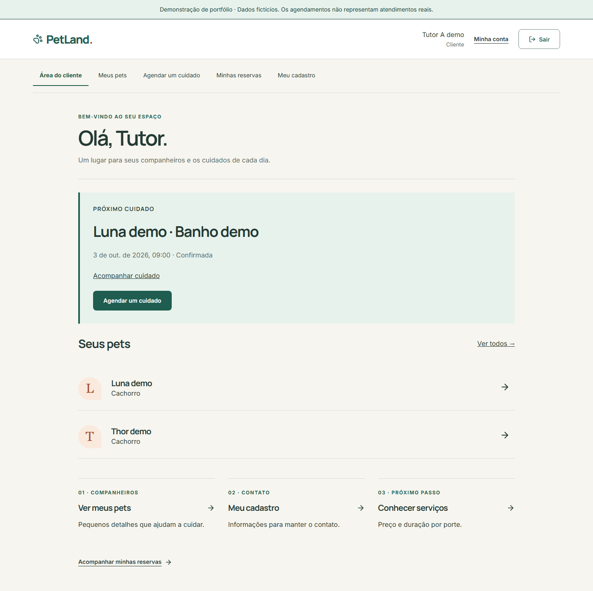
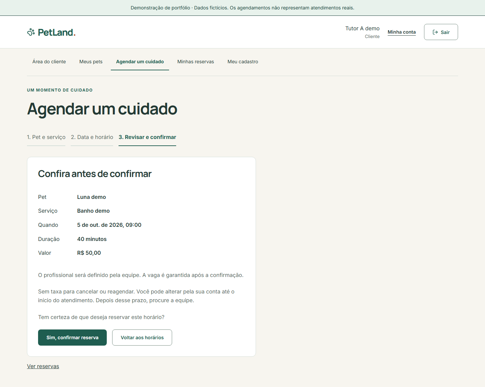
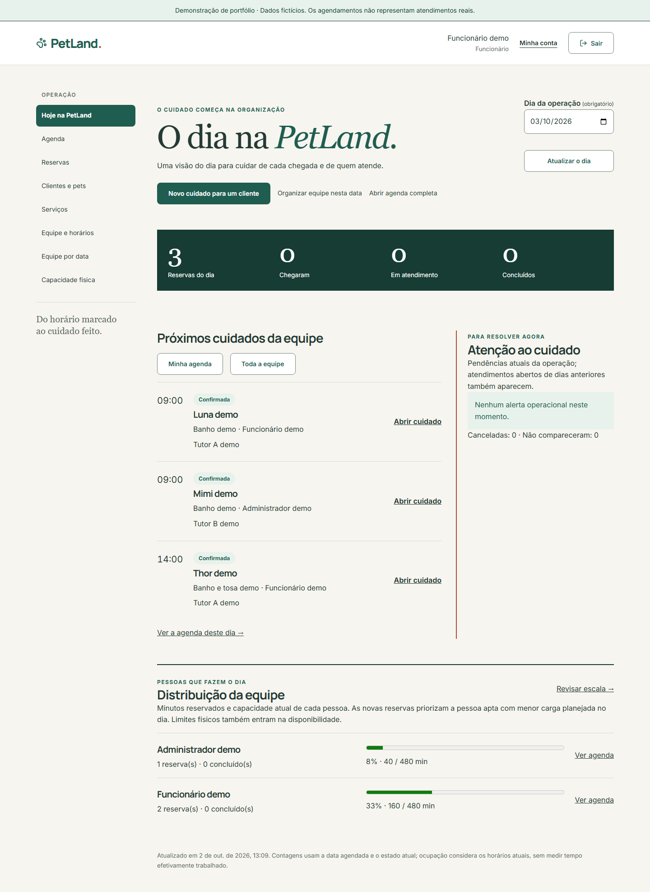
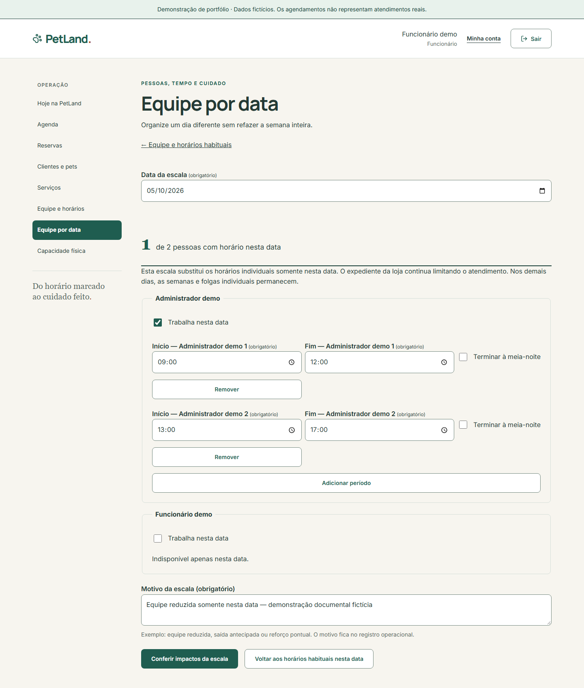
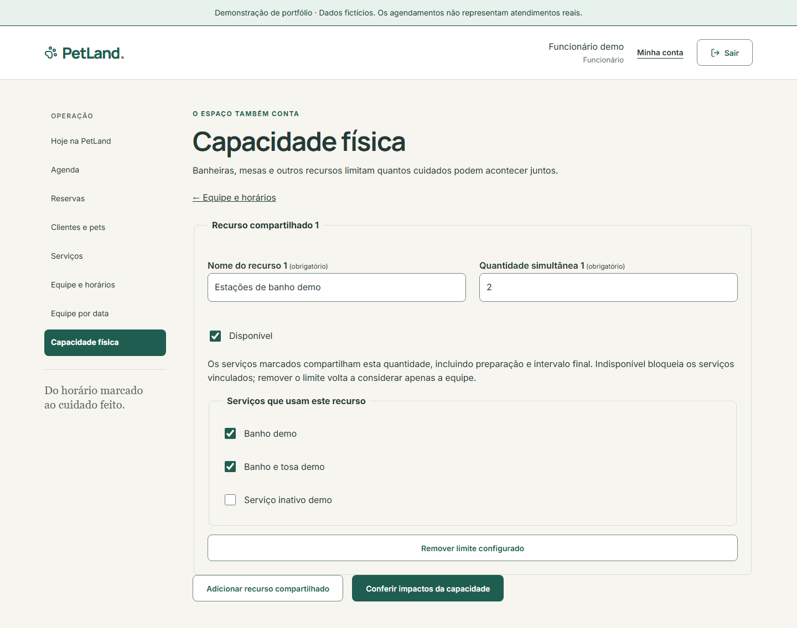
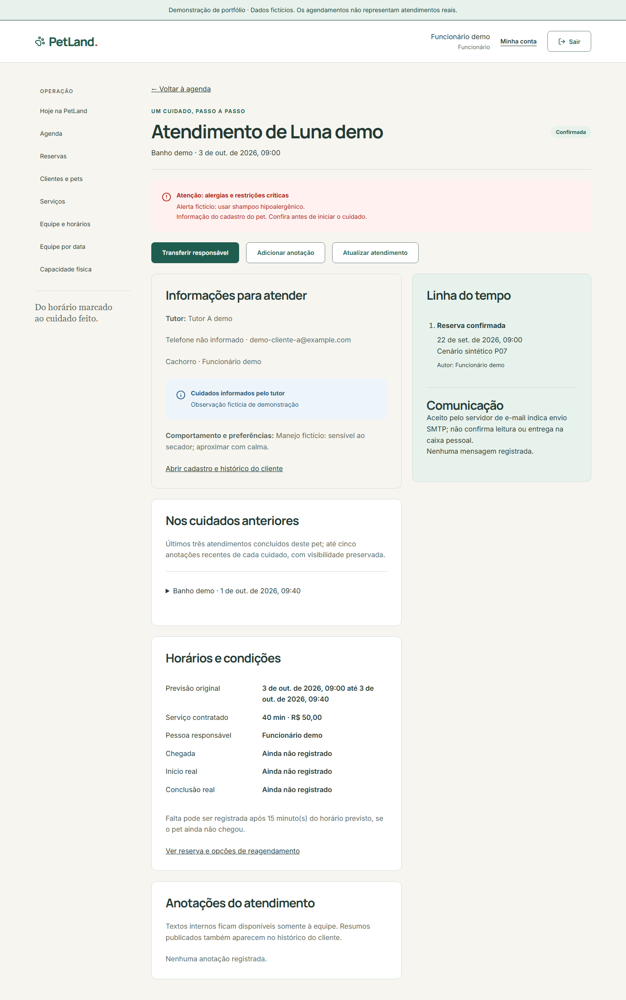
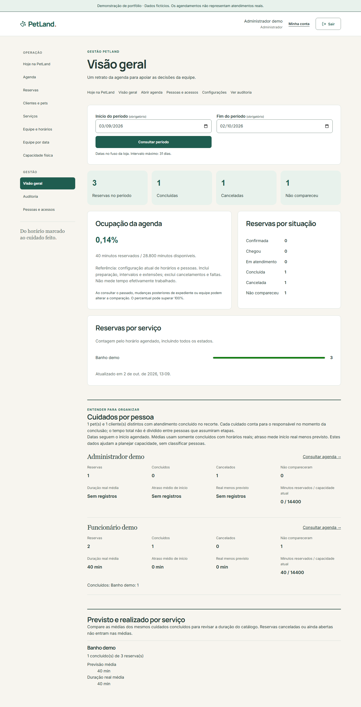

# PetLand 3.0 — UX implementada

**CURRENT STATE · referência funcional `2549523` · revisão documental de 02/10/2026.** Release de portfólio **3.0.0** na `main`. “Final” distingue este documento do discovery; não concede aceite humano nem prontidão comercial. O [Caderno UX original](PetLand_3.0_Caderno_UX.pdf) permanece intacto. Não existe gerador de PDF final no repositório: Markdown é a fonte de verdade.

## Princípios e identidade

Cuidado humano, preço/tempo claros, próximo passo explícito, operação legível e histórico preservado. Direção **editorial e acolhedora, com identidade de pet shop**: creme, verde profundo, terracota, Manrope/Inter locais e Georgia editorial. Retrato de pets em grande composição, números de jornada e linhas são assinaturas recorrentes. A imagem de marca é gerada, não fotografia de loja ou animal real; [proveniência](editorial-image.md).

A home combina hero assimétrico, palavra editorial, retrato amplo, sequência numerada e uma seção de apresentação que leva ao catálogo. As linhas de serviços/preços/duração pertencem à página `/servicos`, não à home. Contato e entrada têm composições próprias. Cards permanecem onde separam formulário/cuidado/estado. Não há pesquisa com usuários, teste A/B, biblioteca Figma ou personalização da marca por loja alegados.

## Navegação: topo, lateral e mobile

| Área     | Destinos                                                                                   | Comportamento                                                                   |
| -------- | ------------------------------------------------------------------------------------------ | ------------------------------------------------------------------------------- |
| Pública  | `/`, `/servicos`, `/entrar`, `/criar-conta`                                                | Topo com marca, serviços e acesso.                                              |
| Tutor    | `/app`, perfil, pets, agendar, reservas, conta                                             | Topo no desktop; início com próximos passos e dados reais.                      |
| Operação | `/operacao`, agenda, reservas, clientes/pets, serviços, configurações, escala e capacidade | Lateral agrupada e painel como entrada diária.                                  |
| Gestão   | `/gestao`, `/gestao/auditoria`, `/gestao/acessos`                                          | Grupo adicional para ADMIN. Não existe rota `/administracao`.                   |
| Mobile   | Mesmos destinos/permissões                                                                 | Atalhos principais + botão Menu, fechamento ao navegar, Escape/retorno de foco. |

Tutor tem poucas jornadas recorrentes: o topo libera espaço. Equipe alterna muitas áreas: a lateral oferece orientação persistente, agrupamento e destino ativo sem congestionar o header. No celular ela recolhe; atalhos conservam tarefas frequentes. É uma decisão de arquitetura de informação, não preferência universal validada com operadores. Ocultar link não concede autorização: API verifica papel/propriedade. [Código](../../apps/web/src/features/identity/AccountLayout.tsx).

## Primeiro acesso e tutor

```mermaid
flowchart LR
  A[Criar conta] --> B[Confirmação pendente e próximo passo]
  B --> C[Link de e-mail e confirmação]
  C --> D[Entrar / área do tutor]
  D --> E[Completar contato]
  E --> F[Cadastrar pet]
  F --> G[Pet, serviço e dia]
  G --> H[Horário disponível]
  H --> I[Revisar preço, duração e política]
  I --> J[Confirmar explicitamente]
  J --> K[Reserva e histórico]
```

Criar identidade não cria tutor comercial/pet. Confirmação explica reenvio e caixa local; Mailpit não envia a caixa externa. Contato mínimo e cadastro de pet são passos distintos; estados vazios orientam a ação seguinte. Conta sem papel apto recebe informação de acesso. Pets de terceiros não ficam acessíveis trocando identificador na URL.

Consultar vaga não a segura. Resumo apresenta pet/serviço/preço/duração/fuso/política; confirmação é separada. Conflito pede outro horário e conserva contexto. Falha de resposta permite repetir a mesma tentativa idempotente. Tutor não escolhe profissional. Histórico mostra estado/resumo público; comunicação é estado local, sem destinatário/corpo privado.

## Painel e agenda

Painel diário organiza contagens, próximos cuidados, pendências e carga; data explícita evita confundir uma captura de amanhã com “hoje”. Agenda pessoal por padrão, alternância equipe e filtros por período/estado/pessoa. Profissional sem recurso configurado recebe orientação, não agenda coletiva apresentada como sua.

Reservado → chegou → em atendimento → concluído; falta e cancelamento são distintos. Instantes reais preservam horários previstos. Extensão valida disponibilidade; não há formulário dedicado de motivo de atraso. Ações dependem do estado e das regras do servidor.

## Equipe por data e capacidade física

Escolher pessoas/períodos, motivo e prévia em **Equipe por data** configura apenas aquele dia; datas vizinhas conservam semana normal. Restaurar remove exceção, sem desativar pessoas globalmente. Reservas incompatíveis aparecem na prévia e impedem salvar até resolução individual. Sem férias por intervalo ou redistribuição em lote.

Pools compartilham quantidade simultânea por serviço durante todo o intervalo ocupado, inclusive buffers. Indisponível bloqueia serviços vinculados; remover limite volta à capacidade da equipe. Tela explica modelo conservador; não representa equipamentos específicos/etapas que não existem.

## Atendimento, contexto e transferência

Alergia/manejo precedem ações; alerta crítico requer reconhecimento da versão atual antes de iniciar. Três cuidados anteriores com pessoa/duração/notas orientam continuidade. Anotação interna é separada do resumo público. Transferir responsável pede pessoa/motivo e valida aptidão/período; preserva contrato e registra antes/depois. Sem trocar serviço em execução ou dividir esforço entre pessoas.

## Gestão e administração

Gestão mostra período, estados, pets/clientes únicos concluídos, previsto/real por serviço e indicadores por responsável final. Texto explica início previsto, estado atual e ocupação por calendários atuais. Não são faturamento, utilização física ou ranking. Auditoria é protegida; Pessoas e acessos controla convites/papéis/revogação e último admin.

## Componentes, feedback e estados

[Design system atual](design-system.md): Button, Input, Select, TextArea, Badge, Alert, Skeleton, EmptyState, LocalEmailNotice e PetPortrait. Labels/hints/erros associados, RHF/Zod e foco no erro; API valida regras/propriedade. Loading usa Skeleton; falha informa e permite tentativa pertinente; vazio orienta; sucesso diferencia persistência de comunicação pendente. Feedback de care/booking é específico. Galeria `/design-system` é ferramenta demonstrativa, sem cadastro funcional de pet ou catálogo completo de padrões.

## Responsividade e acessibilidade

Composição editorial/forms passam a uma coluna; ações/tabelas adaptam por área. Altura base de controles 48 px, foco visível, skip link, headings/landmarks e destino ativo. RouteFocus atualiza título/foco; resumo de reserva recebe foco. Menu usa `aria-expanded`/`aria-controls`, Escape/retorno de foco; reduced motion elimina movimentos não essenciais. Fontes/imagem locais.

Captura atual verifica axe/reflow a 1440/320 px; testes anteriores cobrem teclado, menu e falhas reais. Não comprova todos os estados, NVDA/VoiceOver, pesquisa de usabilidade ou conformidade WCAG integral. [RNFs](../architecture/non-functional-requirements.md) · [Roteiro humano](../runbooks/quality.md).

## Antes/depois e proveniência

| Material                                      | Classificação                                                                                   |
| --------------------------------------------- | ----------------------------------------------------------------------------------------------- |
| Plano/Caderno UX                              | **DISCOVERY** original preservado.                                                              |
| Case `before-*`                               | **HISTORICAL**: templates 2.0 isolados; sem execução do legado.                                 |
| Vídeo/case `after-*`                          | **HISTORICAL P08**: fluxo real daquela fase, visual anterior.                                   |
| `review-home.webp`/`visual-review.json`       | **HISTORICAL SNAPSHOT** da revisão visual pós-P08.                                              |
| `operations-dashboard.webp`/manifesto próprio | **HISTORICAL SNAPSHOT** operacional com data/hashes próprios.                                   |
| `media/current/*-current.webp`                | **CURRENT para código `2549523`**, aplicação real em projeto/banco separado, fixture sintético. |

[Manifesto atual](media/current/capture.json) registra SHA-256, viewport, rota, data, referência funcional e verificações. Conversão PNG→WebP não altera composição/dados. Uma captura prova uma tela/estado, não todos os casos de uso. [Case histórico](../case/README.md) continua íntegro.

## Limites e revisão

Recepção distribuída entre cliente/pet/reserva; menu lateral merece avaliação com operadores. Reserva em grupo, ações em lote e indicadores adicionais permanecem [lacunas](../product/functional-gap-analysis.md). Identidade foi implementada sem pesquisa de marca/aceite comercial. Revisão humana dos três perfis e leitor de tela continuam pendentes.
